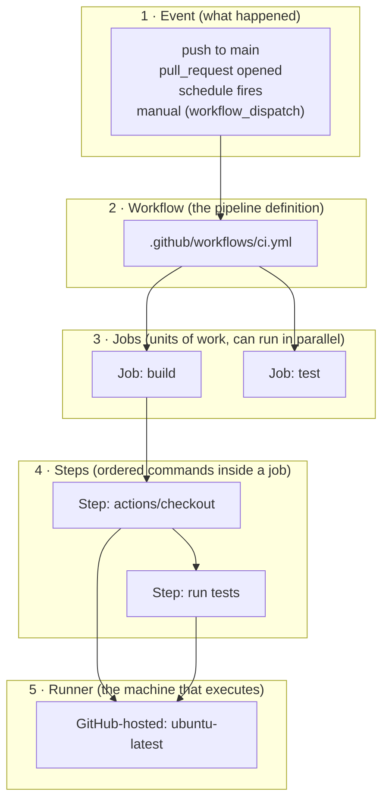
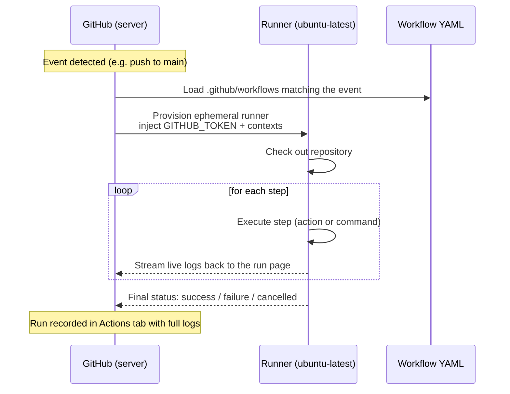
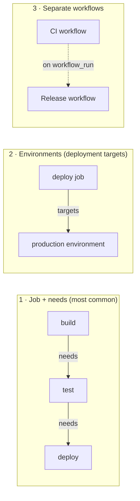
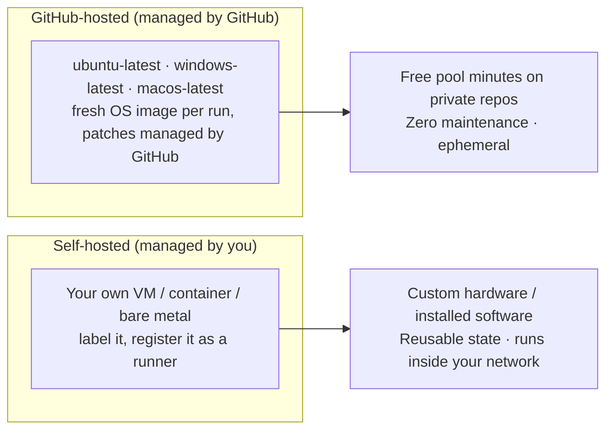

# Module 01 — GitHub Actions Architecture

> **Confidential · Stalwart Learning**
> GitHub Actions — CI/CD Enablement & Migration · Session 1 · Module 1
> Level: Beginner → Intermediate. You are already CI/CD-literate from Azure DevOps; this module teaches the GitHub Actions model from the ground up.

---

## 1. Overview

GitHub Actions is a CI/CD system built **into the GitHub repository itself**. Pipelines are described as YAML files committed to your repository under `.github/workflows/`. Every change to those files is versioned, reviewed, and audited just like application code — there is no separate "pipeline as a separate project" the way Azure DevOps keeps build/release definitions.

The mental model you already have from ADO carries over almost one-to-one:

| Azure DevOps concept | GitHub Actions concept |
|---|---|
| Pipeline / release definition | **Workflow** |
| Pipeline YAML (`azure-pipelines.yml`) | Workflow YAML (`.github/workflows/*.yml`) |
| Stage | — *(no direct equivalent; see Module 01 §5)* |
| Job | **Job** |
| Task | **Step** (and a reusable **Action**) |
| Agent (Microsoft-hosted / self-hosted) | **Runner** (GitHub-hosted / self-hosted) |
| Trigger (CI, PR, schedule, manual) | **Event** |
| `dependsOn` | `needs` |

---

## 2. The execution model

Five objects make up the whole system. Understanding their relationship is the single most important thing in this course.



Reading the diagram:

- **Event** — something happens on GitHub (a push, a PR, a cron tick, a manual click). Events are what *start* a workflow.
- **Workflow** — the YAML file that declares *what should happen* when an event fires.
- **Job** — one unit of work inside a workflow. Jobs share a runner instance, and each job runs on **its own fresh runner**. Jobs in the same workflow can run in **parallel** by default, or wait on each other with `needs`.
- **Step** — a single command (or a reusable **Action**) executed in order inside a job. If a step fails, the remaining steps in that job are skipped.
- **Runner** — a machine (real or virtual) that GitHub provisions, checks out your repo into, and runs the steps in. Runners are **ephemeral** — wiped clean after each run.

> **Key difference from ADO:** a step's working directory, env, and shell state are **per-job**, not shared across jobs. To pass data between jobs you must use **artifacts**, **job outputs**, or the **cache** — covered in Session 2.

---

## 3. Anatomy of a workflow file

Every workflow file has three top-level keys: `name`, `on`, and `jobs`.

```yaml
# .github/workflows/ci.yml
name: CI                       # display name shown in the Actions tab

on:                            # the event(s) that trigger this workflow
  push:
    branches: [main]
  pull_request:

jobs:                          # everything else lives here
  build:                       # job id (arbitrary, but keep it unique & descriptive)
    runs-on: ubuntu-latest     # which runner to use
    steps:
      - uses: actions/checkout@v4        # a reusable Action from the Marketplace
      - uses: actions/setup-node@v4
        with:
          node-version: 20
      - name: Install & test
        run: |
          npm ci
          npm test
```

Plain-ASCII view of the same structure:

```
workflow file
├── name      → "CI"                       (shown in the UI)
├── on        → push to main + pull_request (what starts it)
└── jobs
    └── build
        ├── runs-on → ubuntu-latest        (which runner)
        └── steps
            ├── uses: actions/checkout@v4   (action step)
            ├── uses: actions/setup-node@v4 (action step, with inputs)
            └── run: npm ci && npm test     (command step)
```

Rules worth internalising now:

- Files live in `.github/workflows/` and end in `.yml` or `.yaml`. Only the **default branch** is watched for workflow files — a workflow must exist on the default branch before it can run.
- `name` is optional; if omitted GitHub uses the file name. Keep it — the Actions tab is much easier to scan with good names.
- `on:` is required for every workflow.
- Steps run in order, top to bottom, on **one** runner.
- A failing step (non-zero exit code) fails the job and stops later steps in that job.

---

## 4. How a run is created and executed



Things to notice:

- The runner is provisioned *per run* and destroyed afterwards — never treat it as persistent.
- GitHub injects **contexts** (the `github`, `env`, `secrets`, etc. data you reference as `${{ github.* }}`) into every run.
- Logs stream live to the run page; you can download them, and they are the primary debugging surface (Session 4).

---

## 5. Where do "stages" go? (structural ADO mapping)

ADO's pipeline model is *stages → jobs → tasks*, and stages run sequentially by default. GitHub Actions has **no stages key**. Teams express the same idea in three ways:



1. **Chained jobs** — `build → test → deploy` using `needs` (Module 03).
2. **Environments** — when the "stage" is really a *deployment target* (dev/staging/prod) with approval gates (Session 3, Module 13).
3. **Separate workflows** — splitting CI (build/test) from CD (deploy) into different files, linked by events.

> For ADO migrations: don't try to force a 1:1 stage mapping. Re-think each ADO *stage* as either a **dependent job** or an **environment**.

---

## 6. Runners: GitHub-hosted vs self-hosted



| | GitHub-hosted | Self-hosted |
|---|---|---|
| Provisioning | Automatic, per-run | You register the machine (`./config.sh`) |
| Maintenance | GitHub manages patches | You manage |
| State | Ephemeral (wiped per run) | Persistent between runs |
| Network | Public internet only | Inside your network/VNet |
| Cost | Pooled minutes (billed per plan) | Your compute |
| Best for | Standard Linux/Windows/macOS builds | GPU, on-prem resources, special drivers, air-gapped |

Deciding factors for *this course's* AKS microservices scenario:

- GitHub-hosted is the default and should be used for CI (build, test, scan).
- Self-hosted only starts to matter when you need **private-network access**, **persistent caches**, or **specialised hardware** — and a self-hosted runner inside your cluster/VNet is a real candidate for the GitOps hand-off deployment job in Session 3.
- Self-hosted runners require **more security care**: any workflow that can run on your self-hosted runner can reach your network, so protect it (labels, environments, least-privilege token — Session 3).

> **ADO mapping:** GitHub-hosted ≈ Microsoft-hosted agents; self-hosted ≈ private agents. Unlike ADO's agent pools, GitHub self-hosted runners are registered *at the repository, organization, or enterprise level* and selected via a **label** in `runs-on`.

---

## 7. First workflow walkthrough (beginner checkpoint)

Create `.github/workflows/ci.yml` on your default branch:

```yaml
name: CI

on:
  push:
    branches: [main]
  pull_request:

jobs:
  build:
    runs-on: ubuntu-latest
    steps:
      - uses: actions/checkout@v4
      - uses: actions/setup-node@v4
        with:
          node-version: 20
      - run: npm ci
      - run: npm test
```

What happens, step by step:

1. Commit this file to `main` (or open a PR against it).
2. GitHub detects the `push` / `pull_request` event, loads the workflow, and starts a run.
3. Watch it under the **Actions** tab → **CI** → the current run.
4. Each step appears with its own log. Click a step to expand live output.
5. On a PR, the workflow result appears as a **check** — which you can then require via branch protection (Session 3).

---

## 8. Cheat sheet & references

**Key vocabulary:** workflow · event · job · step · action · runner · run · context · `GITHUB_TOKEN`.

**Rules of thumb:**

- One workflow file = one pipeline definition. You can have many files; each runs independently.
- `on:` is mandatory; `name:` and `jobs:` are what you'll use 90% of the time.
- Jobs run in parallel by default; order them with `needs`.
- Steps run sequentially inside a job; a failure short-circuits the rest.
- Runners are ephemeral and per-job — never rely on state across jobs.

**References**

- Understanding GitHub Actions — https://docs.github.com/en/actions/about-github-actions/understanding-github-actions
- Workflow syntax for GitHub Actions (full reference) — https://docs.github.com/en/actions/reference/workflow-syntax-for-github-actions
- Events that trigger workflows — https://docs.github.com/en/actions/reference/events-that-trigger-workflows
- About GitHub-hosted runners — https://docs.github.com/en/actions/using-github-hosted-runners/about-github-hosted-runners
- About self-hosted runners — https://docs.github.com/en/actions/hosting-your-own-runners/about-self-hosted-runners
- ADO equivalent: pipeline YAML schema — https://learn.microsoft.com/en-us/azure/devops/pipelines/yaml-schema/