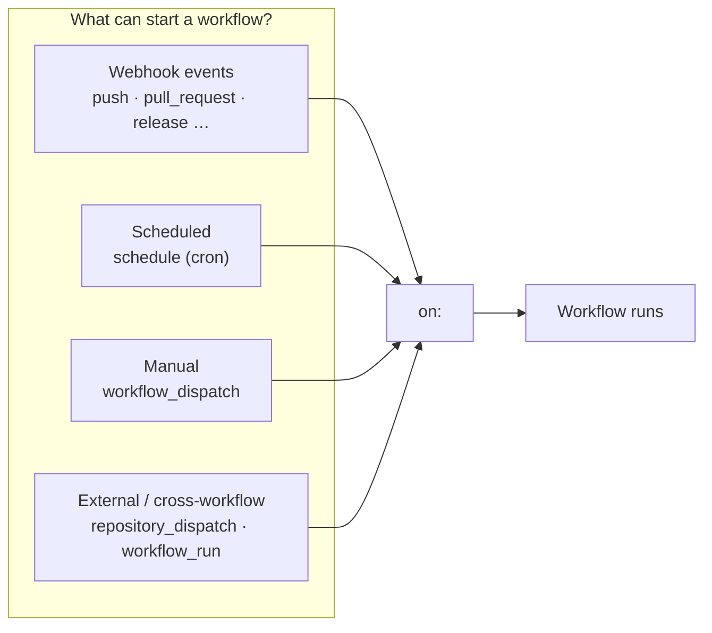
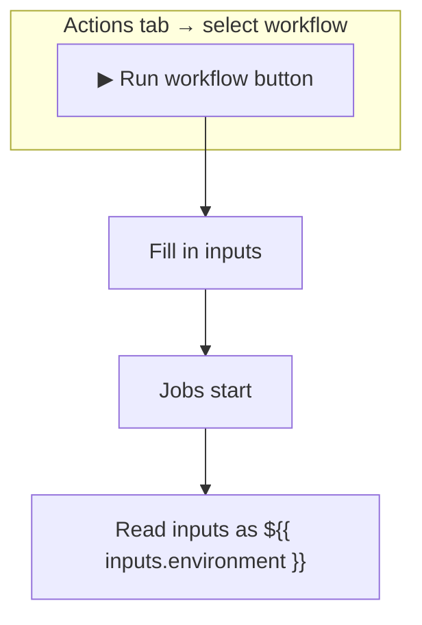
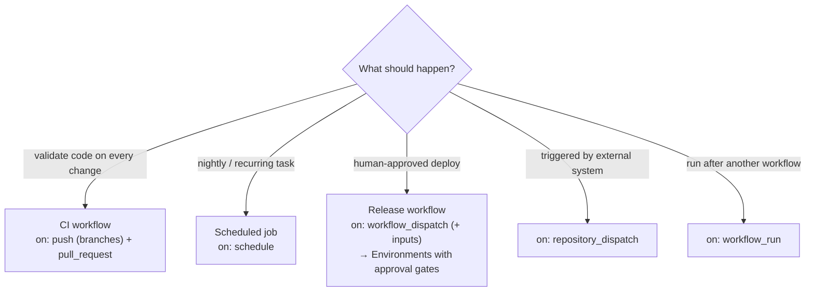

# Module 02 — Events & Triggers

> **Confidential · Stalwart Learning**
> GitHub Actions — CI/CD Enablement & Migration · Session 1 · Module 2
> Level: Beginner → Intermediate. Assumes you know ADO CI/PR/schedule triggers; this module maps them to the GitHub Actions event model.

---

## 1. Overview

In Azure DevOps you configure **triggers** on the pipeline: `trigger:` (CI), `pr:` (PR), `schedules:` (cron), and manual "Run pipeline". In GitHub Actions the same idea is the **event model**, declared under the `on:` key of the workflow.

A workflow can react to **many** event types. Some are *webhook* events (something happened on GitHub), some are *manual* (you clicked a button), some are *scheduled* (a cron tick), and some are *repository- or workflow-driven* (another tool or workflow told GitHub to run it).



> **Mental shift from ADO:** in ADO, *"the pipeline runs because a trigger fired"*. In Actions, *"the workflow reacts to an event"*. This matters because events carry **payloads** (which branch, which commit, which PR) that you can read in your steps via the `github` context.

---

## 2. The four trigger families you will use every day

### 2.1 `push` — CI on commits

```yaml
on:
  push:
    branches: [main, develop]        # only these branches
    tags: ['v*']                     # and version tags
    paths:                           # only when these paths change
      - 'src/**'
      - '!docs/**'
```

- `branches`, `tags`, and `paths` are all optional **filters** — leave them out to run on every push.
- `paths` is a killer feature for multi-service repos: each microservice can have its own workflow that only fires when *its* code changes (built on further in Session 2, Module 7).

### 2.2 `pull_request` — validation before merge

```yaml
on:
  pull_request:
    branches: [main]
    types: [opened, synchronize, reopened]   # synchronize = new commits pushed
```

- Default `types` already include `opened`, `synchronize`, `reopened`; add others (`labeled`, `closed`, `ready_for_review`, …) only when you have a specific need.
- `paths` filters also work here — e.g. run tests only when `src/` changed.
- `pull_request` workflows run **against a merge commit of base+head**, so they validate what *will* be merged, not the head alone.

> ⚠️ **Do not use `pull_request_target` casually.** It runs with a privileged token and the *base* branch's workflow file — a classic supply-chain attack vector (Session 3 covers safe alternatives).

### 2.3 `schedule` — cron-based

```yaml
on:
  schedule:
    - cron: '0 2 * * 1-5'    # Mon–Fri, 02:00 UTC
    - cron: '30 4 * * *'     # daily at 04:30 UTC
```

Cron rules (5 fields: minute hour day-of-month month day-of-week — the same as ADO schedules):

- Times are **UTC only**. Always annotate the intended local time in a comment.
- Minimum effective interval is **5 minutes** — GitHub throttles more frequent schedules.
- Scheduled runs are **queued and may be delayed or skipped** if GitHub is busy, and are disabled in a repo with no activity for 60 days. Never rely on `schedule` for hard SLAs.

### 2.4 `workflow_dispatch` — the manual "Run" button

```yaml
on:
  workflow_dispatch:
    inputs:
      environment:
        description: Target environment
        required: true
        type: choice
        options: [dev, staging, prod]
      version:
        description: Image tag to deploy
        required: false
        default: latest
        type: string
```



- Adds a **"Run workflow"** button on the Actions tab where a human fills in the `inputs`.
- Inputs are read in steps as `${{ inputs.environment }}`.
- This is the natural home for **manual release triggers** — e.g. "deploy image `v1.2.3` to staging now", and it pairs perfectly with Environments (Session 3).

### 2.5 `repository_dispatch` — external tools trigger the workflow

```yaml
on:
  repository_dispatch:
    types: [deploy, rollback]
```

Triggered by an API call (works for any external system — your own tooling, a webhook receiver, a chat bot):

```bash
curl -X POST -H "Authorization: token $GITHUB_TOKEN" \
  -H "Accept: application/vnd.github+json" \
  https://api.github.com/repos/<owner>/<repo>/dispatches \
  -d '{"event_type":"deploy","client_payload":{"env":"prod","tag":"v1.2.3"}}'
```

The `client_payload` arrives in the run as `${{ github.event.client_payload.tag }}`.

> **ADO mapping:** `repository_dispatch` is closest to ADO's *"Queue build/release from REST API"* (e.g. service hooks or a `curl` against the `builds` endpoint) — the ability to kick a pipeline from outside ADO.

---

## 3. Event payloads and the `github` context

Every event injects its **payload** into the run. You read it via the `github` context:

```yaml
steps:
  - name: Show what triggered us
    run: |
      echo "Event:      ${{ github.event_name }}"
      echo "Actor:      ${{ github.actor }}"
      echo "Ref:        ${{ github.ref }}"
      echo "SHA:        ${{ github.sha }}"
      echo "Branch:     ${{ github.ref_name }}"
      echo "PR number:  ${{ github.event.pull_request.number }}"
```

Common `github` context fields:

| Field | Meaning |
|---|---|
| `github.event_name` | which event started the run (`push`, `pull_request`, `schedule`, …) |
| `github.actor` | user/identity that triggered it |
| `github.ref` / `github.ref_name` | full ref / short branch or tag name |
| `github.sha` | commit SHA of the run |
| `github.event.*` | the full webhook payload (shape differs per event) |
| `github.repository` | `owner/repo` |
| `github.workflow` | workflow display name |

This is exactly how you write **one workflow that behaves differently** per trigger — e.g. CI on push/PR, deploy only on `workflow_dispatch`.

---

## 4. Choosing triggers: build vs release workflows

The decision is usually: **does this event need a build, or a release?**



Guidance for the AKS microservices scenario in this course:

- **Build + test** → `push` (and `pull_request` for PR validation). Keep CI fast and broad.
- **Nightly dependency / security scans, housekeeping** → `schedule`.
- **Deployments** → `workflow_dispatch` with an `environment` input, *not* a push trigger. Deploys need a human gate (Environments + required reviewers, Session 3). `repository_dispatch` is the escape hatch when a scheduler or external orchestrator must trigger the deploy.
- **Avoid** triggering deploy workflows off `push to main` unless your team deliberately wants build-to-prod on merge (rare for this audience).
- One workflow can be triggered by **several events** at once; combine them when the *behaviour* is the same, split them when it isn't.

---

## 5. ADO ↔ Actions trigger comparison

| Azure DevOps | GitHub Actions |
|---|---|
| `trigger:` (CI on branch/tag/path) | `on: push` with `branches`/`tags`/`paths` |
| `pr:` (PR builds) | `on: pull_request` |
| `schedules:` (cron) | `on: schedule` (5-field cron, UTC) |
| Manual "Run pipeline" button | `on: workflow_dispatch` (+ `inputs`) |
| Queue via REST API / service hooks | `on: repository_dispatch` (API `POST /dispatches`) |
| Pipeline resource triggers (pipeline → pipeline) | `on: workflow_run` |
| Conditions in YAML (`eq(variables['Build.Reason'], …)`) | `github.event_name` / `github.event.*` in `if:` |
| **CI vs PR distinction** (CI + PR are separate triggers) | Same — `push` vs `pull_request` are separate events |

---

## 6. Beginner pitfalls

1. **Workflow must be on the default branch** — if you add a trigger to a workflow file only on a feature branch, the run *silently won't happen* (the Actions tab often won't even list it).
2. **`paths` filters on `pull_request`** mean "paths in the diff", on `push` they mean "paths in the commit" — the two behave differently for the same-looking filter.
3. **`schedule` is best-effort**, not an SLA: times are UTC, minimum 5 min spacing, and runs can be delayed or skipped.
4. **`pull_request_target`** runs in the base branch's context with elevated permissions — don't use it without understanding the security implications (Session 3).
5. **Event payloads differ** — `${{ github.event.pull_request.number }}` is undefined on a `push` event. Guard with `if: github.event_name == 'pull_request'` or always print `github.event_name` first when debugging.
6. **PRs from forks** do **not** trigger workflows on your repo by default (they trigger on the fork). This is a security feature, and it changes how you handle third-party contributions.

---

## 7. Check your understanding

- Why can't `schedule` be your SLA mechanism?
- What three events would you wire up for a "CI + manual release" pattern?
- What's the difference between `workflow_dispatch` and `repository_dispatch`?
- How would you run a workflow only when the `src/` directory changes?

## 8. References

- Events that trigger workflows (full list + filters) — https://docs.github.com/en/actions/reference/events-that-trigger-workflows
- `workflow_dispatch` inputs reference — https://docs.github.com/en/actions/using-workflows/events-that-trigger-workflows#workflow_dispatch
- `repository_dispatch` reference — https://docs.github.com/en/actions/using-workflows/events-that-trigger-workflows#repository_dispatch
- `schedule` reference — https://docs.github.com/en/actions/using-workflows/events-that-trigger-workflows#schedule
- Cron helper — https://crontab.guru
- GitHub contexts (`github.*`) — https://docs.github.com/en/actions/reference/contexts
- ADO triggers (for comparison) — https://learn.microsoft.com/en-us/azure/devops/pipelines/build/triggers