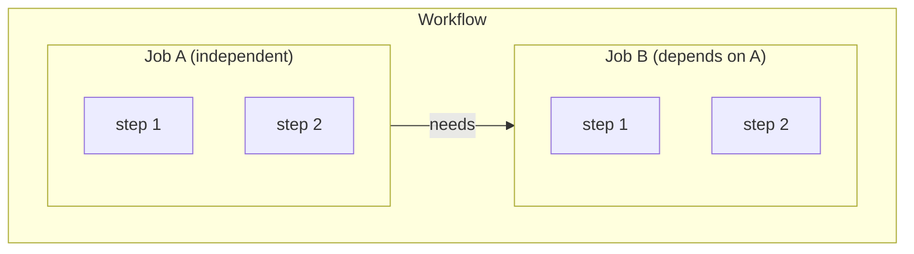
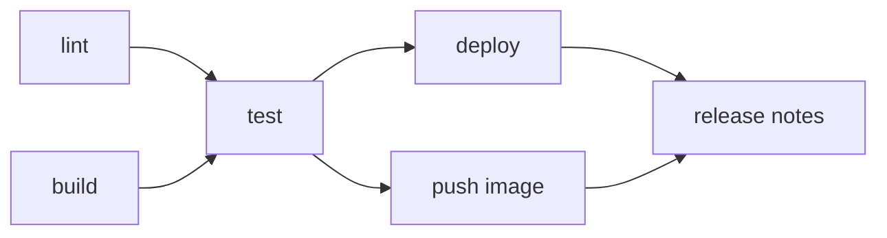
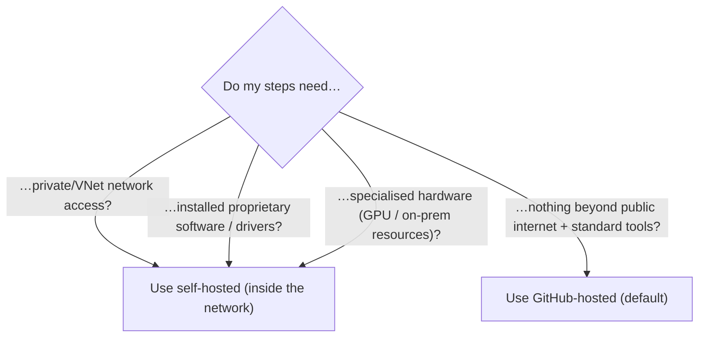

# Module 03 — Jobs, Steps & Execution Control

> **Confidential · Stalwart Learning**
> GitHub Actions — CI/CD Enablement & Migration · Session 1 · Module 3
> Level: Beginner → Intermediate. Covers defining jobs and steps, `needs` dependencies, parallel vs sequential execution, and runner selection.

---

## 1. Overview

A workflow is a container of **jobs**; each job is a container of **steps**. How you structure these two levels decides your pipeline's speed, reliability, and debuggability.



Rules that drive everything in this module:

- Jobs **without** `needs` run **in parallel** on **separate runners**.
- Jobs **with** `needs` wait for their dependencies to complete (all of them, or none of the dependents run if a dependency fails).
- Steps run **sequentially** within a job on **one** runner; a failure skips the rest of that job's steps.
- Nothing inside one job is visible inside another **unless you explicitly pass it** (job outputs, artifacts, or the cache).

> **ADO mapping:** job ≈ ADO job; `needs` ≈ `dependsOn`; parallel-by-default is the *opposite* of ADO's sequential-by-default jobs — this is the biggest structural difference to unlearn.

---

## 2. Defining jobs

```yaml
jobs:
  build:
    runs-on: ubuntu-latest
    timeout-minutes: 30           # hard cap for this job
    continue-on-error: false      # default; see §5
    env:                          # job-scoped env vars (also allow steps/whole-workflow level)
      REGISTRY: ghcr.io
    steps:
      - uses: actions/checkout@v4
      - run: make build
```

Key per-job settings (full list in the workflow-syntax reference):

| Setting | Purpose |
|---|---|
| `runs-on` | runner OS/image or self-hosted label (see §6) |
| `needs` | list of jobs this job depends on |
| `strategy` | matrix / fail-fast (see §7) |
| `timeout-minutes` | kill the job after N minutes (default 360) |
| `continue-on-error` | mark the job green even if it fails (default `false`) |
| `if` | conditional execution (see §4) |
| `env` | environment variables scoped to the job |
| `outputs` | values exported for dependent jobs |
| `concurrency` | cancel/replace in-flight runs (see §8) |
| `environment` | target environment + approval gate (Session 3) |

---

## 3. Job dependencies with `needs`

```yaml
jobs:
  lint:
    runs-on: ubuntu-latest
    steps:
      - uses: actions/checkout@v4
      - run: npm run lint

  test:
    needs: lint                    # only runs if 'lint' succeeds
    runs-on: ubuntu-latest
    steps:
      - uses: actions/checkout@v4
      - run: npm test

  deploy:
    needs: [lint, test]            # waits for BOTH
    runs-on: ubuntu-latest
    steps:
      - run: ./deploy.sh
```

Behavior to internalise:

- A job with `needs` **skips** if any listed job **fails** (unless the dependency had `continue-on-error: true`).
- `needs` supports **expressions**: `needs: [lint, test]`, `if: needs.lint.result == 'success'`, and checking `always()`/`cancelled()`/`failure()` status functions.
- You can fan out (`a` needs `[b, c]`) and fan in (`d` needs `[b, c]`) to build **DAG-shaped** pipelines.



---

## 4. Passing data between jobs: outputs, artifacts, cache

Because each job gets a **fresh runner**, the only ways data crosses a job boundary are:

1. **Job outputs** — small strings, consumed via `needs.<job>.outputs.<name>`:

```yaml
jobs:
  build:
    runs-on: ubuntu-latest
    outputs:
      image_tag: ${{ steps.tag.outputs.tag }}
    steps:
      - id: tag
        run: echo "tag=1.2.3" >> "$GITHUB_OUTPUT"

  deploy:
    needs: build
    runs-on: ubuntu-latest
    steps:
      - run: echo "Deploying ${{ needs.build.outputs.image_tag }}"
```

2. **Artifacts** — files, uploaded/downloaded between jobs (Session 2, Module 8):

```yaml
    steps:
      - uses: actions/upload-artifact@v4
        with:
          name: build-output
          path: dist/
# …later job…
      - uses: actions/download-artifact@v4
        with:
          name: build-output
```

3. **Cache** — dependency directories reused across runs (Session 2, Module 8). Not for passing *current* data; use artifacts for that.

> **Beginner rule:** if you find yourself tempted to "share a file between jobs" by path alone — stop. Each job checks out its own copy of the repo. Use outputs for scalars and artifacts for files.

---

## 5. Conditional execution and failure handling

`if:` evaluates a GitHub expression and decides whether a **job or a step** runs:

```yaml
jobs:
  deploy:
    needs: build
    if: github.event_name == 'workflow_dispatch'   # only manual deploys
    runs-on: ubuntu-latest
    steps:
      - run: ./deploy.sh
        if: github.ref == 'refs/heads/main'         # step-level condition

  notify:
    needs: deploy
    if: always()      # always runs, even if deploy failed
    runs-on: ubuntu-latest
    steps:
      - run: ./notify.sh ${{ needs.deploy.result }}
```

Useful status functions for `if:`:

| Expression | Meaning |
|---|---|
| `always()` | run regardless of prior results |
| `failure()` | true if any needed step/job failed |
| `success()` | true if all needed steps/jobs succeeded (default) |
| `cancelled()` | true if a prior step/job was cancelled |

Failure-control switches:

- `continue-on-error: true` — a failing step/job is reported as **neutral**, the run continues, and the overall check can still pass. Use for *optional* steps (e.g. best-effort telemetry, lints that shouldn't block).
- `timeout-minutes` — per-job cap to stop runaway runs. Set it on every job; the runner default (360 min) is almost always too generous.
- Expressions for failure-masking: `if: ${{ !cancelled() && always() }}`.

---

## 6. Runners: choosing the right one (and when self-hosted matters)

`runs-on` selects the machine. GitHub-hosted options change over time — always use the **major-version labels** (`ubuntu-latest`, `windows-latest`, `macos-latest`) or a specific major (`ubuntu-24.04`).

```yaml
jobs:
  linux-build:
    runs-on: ubuntu-latest
  windows-build:
    runs-on: windows-latest
  mac-build:
    runs-on: macos-14
  selfhosted-job:
    runs-on: [self-hosted, gpu]     # self-hosted runner labeled 'gpu'
```

**When does self-hosted actually matter?** (Decision guide)



- GitHub-hosted: zero maintenance, fresh per run, public-internet only, metered by minutes.
- Self-hosted: your machine, your maintenance, persistent state, inside your network — but **a bigger security surface** (Session 3: any code that runs on it can reach your network; restrict with labels + least-privilege permissions).
- For this course's scenario: CI on GitHub-hosted; the GitOps hand-off / image-push job is a candidate for self-hosted **if** it needs registry/network access that hosted runners can't reach.

---

## 7. Matrix builds (parallel fan-out)

Run the same job across a combination of inputs — the Actions equivalent of ADO's *matrix strategy*:

```yaml
jobs:
  test:
    runs-on: ubuntu-latest
    strategy:
      matrix:
        node: [18, 20, 22]
        os: [ubuntu-latest, windows-latest]
      fail-fast: false        # default true — stop all on first failure
    steps:
      - uses: actions/checkout@v4
      - uses: actions/setup-node@v4
        with:
          node-version: ${{ matrix.node }}
      - run: npm test
```

- GitHub creates one job per combination (6 here), all **in parallel**.
- Each combination is available as `${{ matrix.node }}`, `${{ matrix.os }}`.
- Add `include:`/`exclude:` to tweak the set; `fail-fast: false` keeps other combos running when one fails (good for long test matrices).
- The Actions UI shows each matrix cell as its own job with its own logs.

> **ADO mapping:** `strategy.matrix` ≈ ADO `strategy: matrix:` (parallel). Note ADO matrix also uses `matrix` key — the syntax is similar enough to be a quick jump.

---

## 8. Concurrency (replacing/cancelling overlapping runs)

`concurrency` groups runs and decides what happens when a new one starts while another is in flight:

```yaml
concurrency:
  group: ci-${{ github.ref }}   # group by branch/PR
  cancel-in-progress: true      # cancel the older run

jobs:
  build:
    runs-on: ubuntu-latest
    steps:
      - uses: actions/checkout@v4
      - run: npm ci && npm run build
```

- `cancel-in-progress: true` — the classic **"push again, cancel the old run"** behavior for CI on a branch.
- For **deploy** workflows, use a concurrency **group** without cancellation (or with), so two manual deploys can't race — pair it with Environments for real mutual exclusion (Session 3).
- Group names are strings with expressions; scope them to avoid two workflows cancelling each other's unrelated runs.

---

## 9. A full example tying it together

```yaml
name: CI
on:
  push:
    branches: [main]
  pull_request:

concurrency:
  group: ci-${{ github.ref }}
  cancel-in-progress: true

jobs:
  lint:
    runs-on: ubuntu-latest
    steps:
      - uses: actions/checkout@v4
      - run: npm ci && npm run lint

  test:
    needs: lint
    runs-on: ubuntu-latest
    strategy:
      matrix:
        node: [18, 20, 22]
      fail-fast: false
    steps:
      - uses: actions/checkout@v4
      - uses: actions/setup-node@v4
        with:
          node-version: ${{ matrix.node }}
      - run: npm ci && npm test

  package:
    needs: test
    runs-on: ubuntu-latest
    steps:
      - uses: actions/checkout@v4
      - run: npm ci && npm run build
      - uses: actions/upload-artifact@v4
        with:
          name: bundle
          path: dist/
```

---

## 10. ADO ↔ Actions execution-control comparison

| Azure DevOps | GitHub Actions |
|---|---|
| `dependsOn:` | `needs:` |
| Jobs in a stage run in parallel by default | Jobs run in parallel **by default** (opposite of ADO stage semantics) |
| `condition: succeeded()/failed()/always()` | `if:` with `success()`/`failure()`/`always()`/`cancelled()` |
| Job/task `continueOnError` | `continue-on-error` |
| `strategy: matrix:` | `strategy: matrix:` |
| `timeoutInMinutes` / `timeout-minutes` (task) | `timeout-minutes` |
| Variables published via `##vso[task.setvariable]` | Job `outputs` + `$GITHUB_OUTPUT` / `$GITHUB_ENV` |
| `pool:` / Microsoft-hosted vs private agents | `runs-on:` GitHub-hosted vs self-hosted labels |
| Pipeline `concurrency` (fewer) | `concurrency:` groups + `cancel-in-progress` |
| Stages (sequential by default) | No stages — model via `needs` chains or Environments |

---

## 11. Beginner pitfalls

1. **Don't assume sequential jobs.** The moment you write `needs:` everywhere "just to be safe", you've serialised the pipeline for no reason. Start parallel, add `needs` only for real dependencies.
2. **Fresh runner per job** — a file created in job A is not in job B. Use outputs/artifacts, not paths.
3. **`if:` vs `continue-on-error` confusion** — `if:` decides *whether* something runs; `continue-on-error` decides *how a failure is scored*.
4. **Missing `timeout-minutes`** on long jobs risks 6-hour default hangs (and billed minutes).
5. **Matrix + `needs`** — dependent jobs wait for **all** matrix cells; if you need per-cell chaining, reconsider the design.

## 12. References

- Workflow syntax for GitHub Actions (`jobs`, `needs`, `strategy`, `if`, `concurrency`) — https://docs.github.com/en/actions/reference/workflow-syntax-for-github-actions
- Using jobs in a workflow — https://docs.github.com/en/actions/using-jobs/using-jobs-in-a-workflow
- Expressions and status functions — https://docs.github.com/en/actions/reference/contexts-and-expression-syntax-for-github-actions
- Using concurrency — https://docs.github.com/en/actions/using-jobs/using-concurrency
- About GitHub-hosted runners / self-hosted runners — https://docs.github.com/en/actions/using-github-hosted-runners/about-github-hosted-runners
- ADO jobs reference (comparison) — https://learn.microsoft.com/en-us/azure/devops/pipelines/process/phases