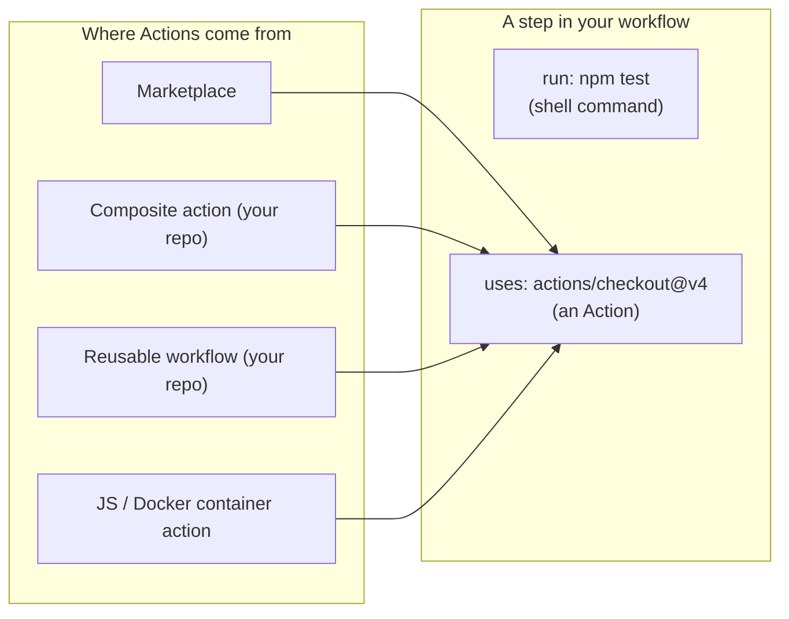
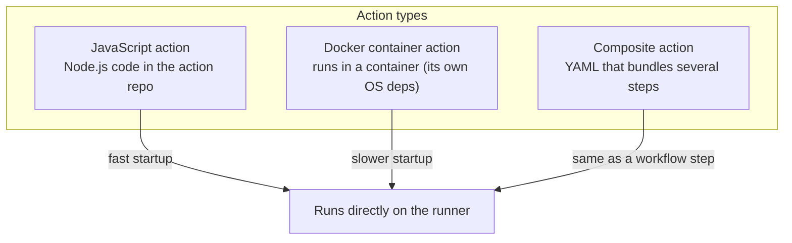
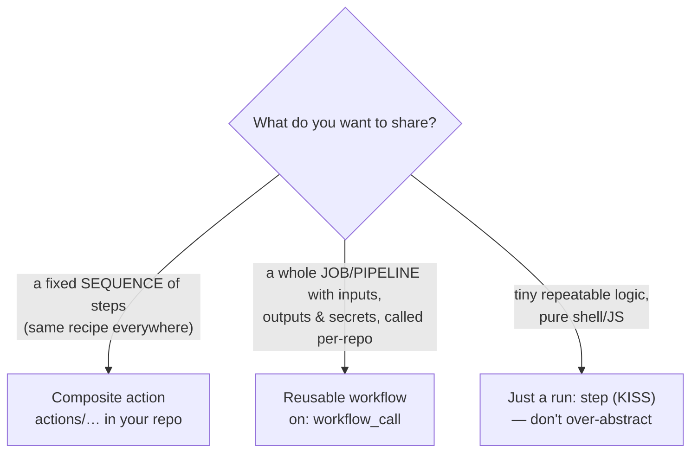

# Module 04 — Actions, Marketplace & Reuse

> **Confidential · Stalwart Learning**
> GitHub Actions — CI/CD Enablement & Migration · Session 1 · Module 4
> Level: Beginner → Intermediate. Using pre-built Marketplace actions safely, and the two reuse mechanisms: composite actions and reusable workflows.

---

## 1. Overview

A **step** in a workflow is either a shell command (`run:`) or an **Action** (`uses:`). An Action is a reusable, packaged unit of functionality — the Actions equivalent of an ADO **task** (or a marketplace extension).

Actions come from three places:

1. **The GitHub Marketplace** (`actions/checkout`, `actions/setup-node`, third-party publishers) — ready-made building blocks.
2. **Actions you write yourself** — composite actions (this module) and JavaScript/container actions (advanced, Session 2 builds on composite).
3. **Your own repo/org** — including *reusable workflows* (this module).



---

## 2. Anatomy of an Action step

```yaml
steps:
  - name: Check out source
    id: checkout
    uses: actions/checkout@v4        # <repo>@<ref> — see §4 on pinning
    with:                            # inputs to the action
      fetch-depth: 0
  - run: echo "${{ steps.checkout.outputs.commit }}"   # output of the action
```

Every action declares:

- **Inputs** (`with:`) — configuration the workflow passes in.
- **Outputs** (`steps.<id>.outputs.*`) — values the action returns to the workflow.
- A **ref** (`@v4`) — which version to use.

An action runs **inside a step**, exactly like a task. It can set job outputs, modify `$GITHUB_ENV`, and fail the step on error.

---

## 3. Action implementation types (what's running behind the scenes)



| Type | Implemented in | Start-up | Best for |
|---|---|---|---|
| **JavaScript** | Node.js (`index.js`) | Fast | General logic; most popular Marketplace actions |
| **Docker container** | Dockerfile + entrypoint | Slower (image pull) | Locking down exact OS/tooling, no Node runtime needed |
| **Composite** | YAML (wraps other steps) | Same as workflow steps | Sharing a *sequence of steps* without code; what *you* will most likely write |

> For this course you will almost always **consume** JS/container actions and **author** composite actions. Authoring JS/container actions is advanced and out of scope.

---

## 4. Using Marketplace actions safely

The Marketplace is powerful but a supply-chain risk: **every third-party action you pin is third-party code that runs inside your CI** with (by default) your repository's permissions. The safe usage pattern:

```yaml
# ✅ GOOD — pin the full commit SHA (immutable, tamper-proof)
- uses: actions/checkout@dcd71f6466800a0957f4ce5581548de3c7f0f0b7  # v4.x.y

# ✅ ACCEPTABLE — pin a major version tag (auto-updates within major; faster to read)
- uses: actions/checkout@v4

# ❌ AVOID — floating tag or branch; the publisher can change what 'v4' points to
- uses: some-user/some-action@main
```

The recommended policy (used widely in production and detailed in Session 3's *Securing the Workflow* module):

1. **Pin by full SHA** for anything third-party.
2. Keep the tag in a **comment** next to the SHA so humans can read it.
3. **Trusted publishers / verified creators** — prefer actions from `github.com/*/actions`, official orgs, and Marketplace "verified creator" badges.
4. **Dependabot** (or Renovate) updates these pins automatically, so pinning by SHA doesn't mean manual upgrades.
5. **Audit** what an action does before adopting it: check its `action.yml`/`package.json`, star count, and publish frequency. One bad dependency can read your `GITHUB_TOKEN` and push to your repo.
6. Set **least-privilege `permissions:`** on the workflow (Session 3, Module 15) so even a compromised action can do little damage.

**Most-used first-party actions** (all from GitHub, in `actions/` org):

| Action | Purpose |
|---|---|
| `actions/checkout` | check out your repository onto the runner |
| `actions/setup-node` / `setup-java` / `setup-python` / … | install a language toolchain |
| `actions/upload-artifact` / `download-artifact` | move files between jobs (Module 3/8) |
| `actions/cache` | persist dependency caches (Module 8) |
| `actions/configure-pages` | Pages deployment |
| `aws-actions/configure-aws-credentials`, `azure/login` | cloud auth (Session 3 OIDC) |

> **ADO mapping:** Marketplace actions ≈ ADO marketplace extensions/tasks. Same idea, same caution — you wouldn't install an unvetted extension into your ADO org either.

---

## 5. Reuse mechanism 1 — Composite actions

A composite action bundles **a sequence of steps** into one reusable action using YAML only. Perfect for a step-group you repeat across many workflows (e.g. "checkout + install + lint").

File layout:

```
actions/build-push/
├── action.yml          ← composite action definition
└── (optional helper scripts / Dockerfile)
```

```yaml
# actions/build-push/action.yml
name: 'Build & Push'
description: 'Build the container image and push to the registry'
inputs:
  image-name:
    description: 'Full image name'
    required: true
  tag:
    description: 'Image tag'
    required: false
    default: 'latest'
runs:
  using: 'composite'
  steps:
    - uses: actions/checkout@v4
    - name: Build
      run: docker build -t ${{ inputs.image-name }}:${{ inputs.tag }} .
      shell: bash
    - name: Push
      run: docker push ${{ inputs.image-name }}:${{ inputs.tag }}
      shell: bash
```

Used in a workflow like any Marketplace action:

```yaml
steps:
  - uses: ./actions/build-push        # local path (or owner/repo/@ref once published)
    with:
      image-name: myapp
      tag: ${{ github.sha }}
```

Composite action gotchas:

- **Every `run:` step must declare `shell:`** — composites don't inherit the workflow's shell default.
- Uses **inputs/outputs**, not full expression contexts — the `github`/`secrets` contexts are available, but the action can't use `env:` at the top level.
- Cannot use `continue-on-error`, `timeout-minutes`, or `if:` **at the composite's own top level** (you can inside its steps).
- Great for sharing a *fixed recipe*; if you need *different* jobs callable with full inputs/outputs/secrets, reach for reusable workflows.

---

## 6. Reuse mechanism 2 — Reusable workflows

A reusable workflow (`on: workflow_call`) is a **whole workflow** that other workflows can invoke as if it were a job. This is the Actions answer to "one shared pipeline definition used by many repos", and the natural tool for **standardising CI across your microservices** (Session 2, Module 10).

**The shared workflow** (e.g. `.github/workflows/build-ci.yml` in the org's shared repo):

```yaml
name: Shared CI
on:
  workflow_call:
    inputs:
      node-version:
        type: string
        default: '20'
        required: false
    secrets:
      REGISTRY_PASSWORD:            # named secret the caller must pass
        required: false

jobs:
  build:
    runs-on: ubuntu-latest
    steps:
      - uses: actions/checkout@v4
      - uses: actions/setup-node@v4
        with:
          node-version: ${{ inputs.node-version }}
      - run: npm ci && npm run build
```

**Calling it** from another repo's workflow:

```yaml
jobs:
  ci:
    uses: your-org/shared-workflows/.github/workflows/build-ci.yml@main
    with:
      node-version: '22'
    secrets: inherit              # or list specific secrets
```

Rules to remember:

- The called workflow must declare `on: workflow_call`. Both files must be in the **same or a public/accessible repo**.
- Pass data with `with:` (inputs, strings/booleans/numbers/enums) and `secrets:` (`secrets: inherit` forwards the caller's org/repo secrets — convenient but be deliberate).
- Caller **cannot** override the callee's jobs — the callee is a fixed contract. Version it by **ref** (`@main`, `@v1`, or a SHA).
- Reusable workflows can be **nested** (a reusable workflow can call another), but a job `uses:` a reusable workflow — the reusable workflow's jobs become jobs in your run.
- Environments and permissions must be declared **inside the callee**; the caller controls the event/trigger.

---

## 7. Composite action vs reusable workflow — decision guide



| | Composite action | Reusable workflow |
|---|---|---|
| Shares | Steps | Jobs (a whole workflow) |
| Declared with | `runs.using: composite` | `on: workflow_call` |
| Called via | `uses: ./path` or `uses: owner/repo@ref` | `uses: owner/repo/.github/workflows/file.yml@ref` |
| Accepts secrets | Indirectly (via its own inputs/env) | Explicit `secrets:` or `secrets: inherit` |
| Per-step control (`if`, `timeout`, `continue-on-error`) | Only inside its steps | Full job-level control at the caller |
| Typical use | Shared recipe (build+push step group) | One standardised CI/CD pipeline across many microservice repos |

For **this course's multi-microservice codebase**: a **reusable workflow per pipeline type** (CI, build+push, hand-off) that every service's repo calls with `with:` inputs is the standard pattern you'll build in Session 2, Module 10.

---

## 8. ADO ↔ Actions reuse comparison

| Azure DevOps | GitHub Actions |
|---|---|
| Task / marketplace extension | Action (Marketplace) |
| Task group | Composite action |
| Template (`.yml` include/extends) | Reusable workflow (`workflow_call`) |
| YAML template expressions/parameters | `inputs`/`with` on reusable workflows |
| Pipeline resources (pipeline → pipeline) | `workflow_run` / reusable workflow `uses` |
| Library / variable groups | Org-level variables & secrets + `secrets: inherit` |

---

## 9. Beginner pitfalls

1. **Floating refs in production** (`@main`, `@latest`) — pin the SHA (or at least a major tag) for third-party actions.
2. **`secrets: inherit` everywhere** — convenient, but it forwards *every* org secret to the reusable workflow. Explicitly list secrets when the callee is lower-trust.
3. **Composite actions missing `shell:`** on `run:` steps — the #1 composite-authoring error.
4. **Treating reusable workflows as templates you can override** — you can't; version by ref and design the input contract up front.
5. **Over-abstracting** — a two-line `run:` repeated twice is not a composite action yet. Abstract when a recipe is genuinely shared and stable.

## 10. References

- About GitHub Actions / finding & customising actions — https://docs.github.com/en/actions/learn-github-actions/finding-and-customizing-actions
- GitHub Marketplace — https://github.com/marketplace
- Creating a composite action — https://docs.github.com/en/actions/creating-actions/creating-a-composite-action
- Reusing workflows — https://docs.github.com/en/actions/using-workflows/reusing-workflows
- Security hardening for GitHub Actions (pinning, permissions) — https://docs.github.com/en/actions/security-guides/security-hardening-for-github-actions
- The `actions/` first-party org — https://github.com/actions
- ADO marketplace extensions (comparison) — https://marketplace.visualstudio.com/azuredevops