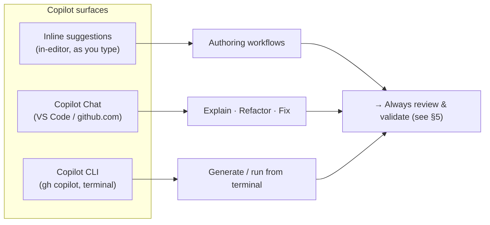
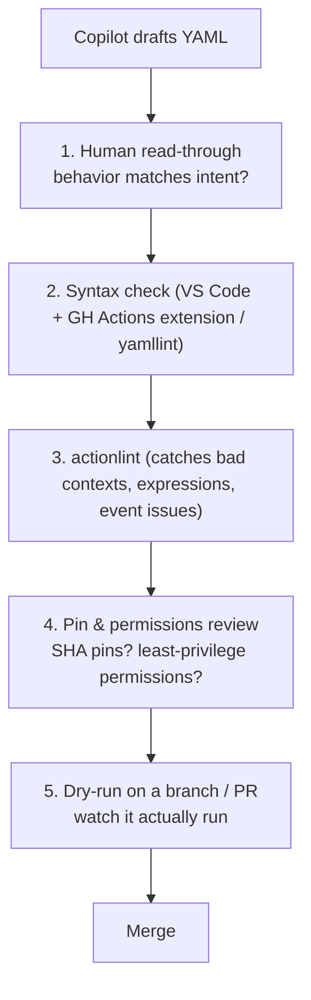

# Module 05 — AI-Assisted Workflow Design with GitHub Copilot

> **Confidential · Stalwart Learning**
> GitHub Actions — CI/CD Enablement & Migration · Session 1 · Module 5
> Level: Beginner → Intermediate. Using GitHub Copilot (Chat, inline suggestions, CLI) to scaffold, explain, and refactor workflows — with the guardrails that keep AI-generated YAML safe.

---

## 1. Overview

GitHub Copilot is a pair-programmer for your entire repo — including your `.github/workflows/*.yml`. For workflow authoring, three surfaces matter:



- **Inline suggestions** — as you type YAML, Copilot proposes the next chunk; Tab to accept.
- **Copilot Chat** — ask questions in natural language: "generate a CI workflow for a Node.js service that pushes to GHCR", "explain this step", "refactor step 3 into a composite action".
- **Copilot CLI** (`gh copilot suggest`) — describe a workflow in the terminal and get a ready-to-paste result.

> **Pre-requisite from the lab setup:** Copilot requires a **Business or Enterprise licence** enabled for your GitHub account, plus the GitHub Copilot and GitHub Actions extensions in VS Code.

---

## 2. Scaffolding a workflow from a plain-language description

The highest-value pattern: **give Copilot a complete, specific prompt** and iterate. The quality of the result tracks the quality of the description.

**Weak prompt (too vague):**
> "Create a CI workflow for my project."

**Strong prompt (specific, production-shaped):**
> "Create a GitHub Actions workflow for a Node.js 20 microservice in a monorepo. Trigger on push to main and on pull_request. Use actions/checkout@v4 and actions/setup-node@v4. Run npm ci, npm run lint, and npm test in parallel jobs. Upload test results as an artifact. Pin third-party actions by commit SHA with the version tag in a comment. Set least-privilege permissions with contents: read."

Example of what a scaffold looks like (always review — see §5):

```yaml
name: CI
on:
  push:
    branches: [main]
  pull_request:
permissions:
  contents: read
jobs:
  lint:
    runs-on: ubuntu-latest
    steps:
      - uses: actions/checkout@v4
      - uses: actions/setup-node@v4
        with: { node-version: 20 }
      - run: npm ci && npm run lint
  test:
    needs: lint
    runs-on: ubuntu-latest
    steps:
      - uses: actions/checkout@v4
      - uses: actions/setup-node@v4
        with: { node-version: 20 }
      - run: npm ci && npm test
```

**Prompt ingredients that improve output:**

1. **Event triggers** — be explicit (`push to main`, `pull_request`, `schedule`, `workflow_dispatch`).
2. **Toolchain and versions** — Node 20, Go, Docker, etc.
3. **Steps you know you need** — lint, test, build, scan, push, deploy.
4. **Constraints & conventions** — pinning policy, least-privilege `permissions:`, matrix versions, concurrency behavior.
5. **Repo context** — monorepo/paths, multi-service, existing registry.

> **Be honest about your unknown:** if you're unsure which action to use for something (e.g. "an action that scans secrets"), ask Copilot to **suggest options** first: *"list 3 well-known actions for X with their refs, and tell me which are from verified publishers"* — then verify in the Marketplace.

---

## 3. Explaining an unfamiliar workflow or action

Copilot is an excellent **documentation reader** for code you didn't write. Two patterns:

**Pattern A — "Explain this file":** open the workflow, ask in Copilot Chat:
> "Explain this workflow to me section by section. For each job, say what it runs on, what it needs, and what it does. Flag anything unusual or risky, like floating refs, missing permissions, or secrets being passed."

**Pattern B — "Explain this action":** for a Marketplace action you're about to adopt:
> "What does `softprops/action-gh-release` do? What inputs does it take, what does it write, what permissions does it need, and what should I pin it to? Check whether it's from a verified publisher."

Use Copilot to **build a mental model** before you build a pipeline — a cheap way to de-risk unfamiliar building blocks, and the same skill transfers to explaining ADO pipelines you're migrating.

---

## 4. Refactoring a workflow (e.g. extract a step into a reusable action)

Copilot shines at mechanical refactors. The classic Session-1 refactor is **extracting a repeated step group into a composite action** (Module 04 §5):

**Prompt:**
> "In this workflow, steps 2–4 (checkout, npm ci, run lint) are repeated in every job. Extract them into a composite action at `actions/setup-lint/action.yml` and replace the repeated steps with a single `uses` step. Preserve inputs and behavior exactly."

**Review the diff carefully** — Copilot sometimes changes behavior while changing structure:

- ✔️ Same `with:` inputs, same action refs, same order of operations.
- ⚠️ Every composite `run:` must get an explicit `shell:` (a classic Copilot omission).
- ⚠️ Composite actions can't inherit workflow-level `env:` — Copilot may silently drop env vars. Confirm they're passed as inputs.

Similarly, you can ask Copilot to **convert an ADO pipeline to GitHub Actions** as a migration starting point:
> "Convert this azure-pipelines.yml stage/job structure to a GitHub Actions workflow using jobs + needs. Keep the same steps. Flag anything that has no direct Actions equivalent."

> **Expect a rough draft, not a finished migration.** Use Copilot output as a *starting point*, then apply the ADO→Actions mapping tables from Modules 1–3 yourself.

---

## 5. Guardrails — reviewing and validating Copilot-generated YAML (mandatory)

**Copilot is an accelerator, not a reviewer.** AI can produce confident, syntactically-valid YAML that is subtly wrong or insecure. Before merging, run this checklist:



**Checklist:**

1. **Read it.** Does it do what you asked? (People skip this.)
2. **Syntax + schema validation.**
   - VS Code **GitHub Actions extension** — red-squiggles invalid YAML/schema as you type.
   - `yamllint` for strict YAML linting.
   - The workflow editor on **github.com** (Actions tab → new workflow) also validates.
3. **`actionlint`** (a standalone linter) — catches the sneaky ones: bad expressions, `steps`/`needs` typos, invalid `on:` events, unknown properties. Run it locally or in CI: `actionlint .github/workflows/ci.yml`.
4. **Security pass (Session 3 depth, apply the basics now):**
   - No **floating refs** (`@main`, `@latest`) for third-party actions — pin SHA/tag.
   - **Least-privilege `permissions:`** — Copilot often *omits* the block entirely, which means broad default permissions. Add `permissions: { contents: read }` explicitly.
   - No secrets echoed to logs; no `pull_request_target` without a real reason.
5. **Watch it run.** Merge to a feature branch, open a PR, and confirm the run behaves as expected before you trust it in your mainline.
6. **Test the failure path too.** Break something deliberately once to confirm `if:`/`continue-on-error`/`needs` behave as you assumed.

> **Team convention worth adopting:** "Copilot-authored workflows require a human 'code review' just like app code — and the reviewer's first question is *would I have written this step myself?*"

---

## 6. Copilot troubleshooting (preview of Session 4)

The same Copilot used for authoring is your **first-line debugger** when a run fails:

- Paste a failed step's log into Copilot Chat and ask: *"Here's a failing GitHub Actions run — what's the root cause and what should the fix be?"*
- Ask for a **PR-ready fix**: *"Propose the corrected workflow YAML as a diff, explaining each change."*
- Use Copilot to explain error text you don't recognise (e.g. `Error: Process completed with exit code 1`).
- Always **re-validate the proposed fix** with the same checklist in §5 — Copilot's "fix" may introduce a new problem.

(Session 4, Module 17 covers this in depth with real log examples.)

---

## 7. ADO ↔ Copilot comparison (context)

| Azure DevOps | GitHub Actions |
|---|---|
| GitHub Copilot for Azure DevOps (YAML in `azure-pipelines.yml`) | Copilot inline + Chat on `.github/workflows/*.yml` |
| ADO task marketplace search | Copilot Chat can *recommend* actions from the Marketplace |
| ADO YAML editor (limited AI) | GitHub Actions VS Code extension + workflow editor on github.com |

The Copilot *workflow you're learning here* transfers directly: the same "describe → generate → review → validate" loop works for any pipeline format, including the ADO pipelines you're migrating from.

---

## 8. Prompt cheat sheet (keep this)

**Scaffold**
> "Create a GitHub Actions workflow that <event>. It should <jobs/steps>. Use <action@ref>. Pin third-party actions by SHA, set least-privilege permissions, and add <your conventions>."

**Explain**
> "Explain this workflow job by job. What runs, on what, and why? Flag anything insecure or risky."

**Action research**
> "What does <owner/repo> do? Inputs, outputs, required permissions, latest stable ref, verified publisher?"

**Refactor**
> "Extract steps X–Y into a composite action at <path>. Preserve inputs/behavior exactly. Add `shell:` to every `run:` step."

**Migrate**
> "Convert this azure-pipelines.yml to a GitHub Actions workflow using jobs + needs. Map stages to needs-chains. Flag steps with no direct Actions equivalent."

**Debug**
> "Here is a failed run log: <paste>. Root cause + a PR-ready YAML fix, with each change explained."

---

## 9. References

- GitHub Copilot documentation — https://docs.github.com/en/copilot
- Copilot Chat in your IDE — https://docs.github.com/en/copilot/github-copilot-chat/start-a-copilot-chat-session
- GitHub Copilot CLI — https://docs.github.com/en/copilot/using-github-copilot/using-github-copilot-cli
- GitHub Actions VS Code extension — https://marketplace.visualstudio.com/items?itemName=GitHub.vscode-github-actions
- `actionlint` — https://github.com/rhysd/actionlint
- `yamllint` — https://github.com/adrienverge/yamllint
- Workflow syntax (to double-check Copilot's output) — https://docs.github.com/en/actions/reference/workflow-syntax-for-github-actions