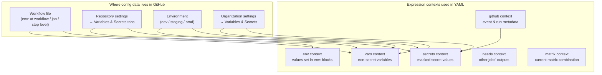
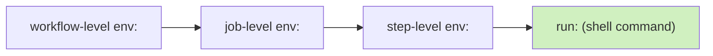
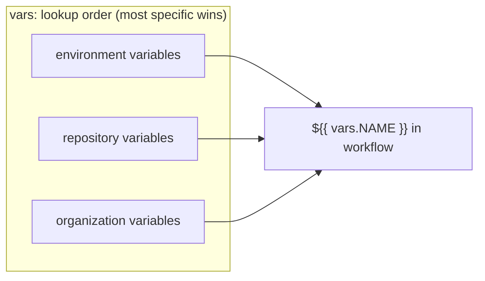
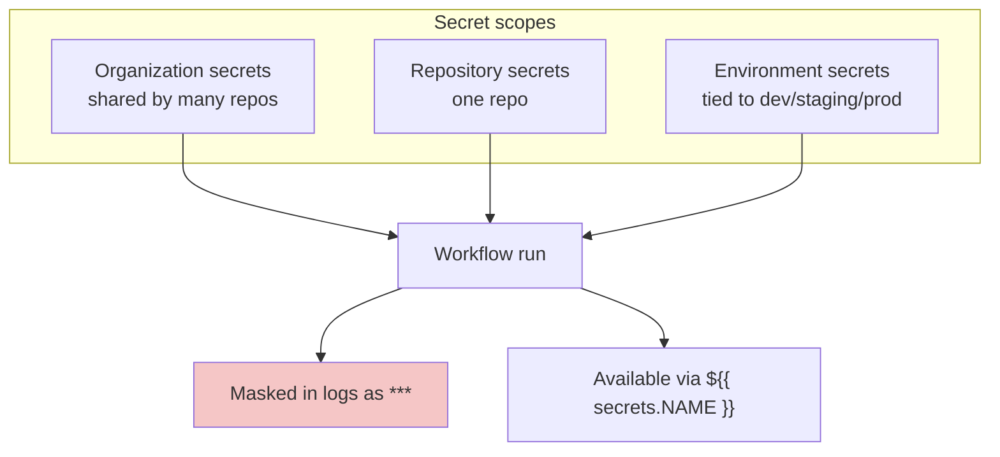

# Module 06 — Variables, Secrets & Contexts

> **Confidential · Stalwart Learning**
> GitHub Actions — CI/CD Enablement & Migration · Session 2 · Module 6
> Level: Beginner → Intermediate. How configuration data flows into your workflows: environment variables, variables, secrets (repo / environment / org), and the expression contexts that reference them all.

---

## 1. Overview

In Azure DevOps you reach for **variables**, **variable groups**, and **secret variables** when a pipeline needs configuration. GitHub Actions has a parallel but *more granular* model, and it's the source of most "why won't my pipeline build" confusion in a migration. The mental model:

| Azure DevOps | GitHub Actions |
|---|---|
| Pipeline variable (`variables:` / UI) | **Workflow variable** (`env:` or `vars:` context) |
| Variable group (Library) | **Org-level variables** (+ repo-level variables) |
| Secret variable / secret library group | **Secrets** (repo / environment / org) |
| Agent-level env var (e.g. `Build.SourcesDirectory`) | **Predefined context** (`github`, `env`, `vars`, `secrets`, `needs`, `matrix`, `runner`) |
| `$(Build.BuildNumber)` etc. | `${{ github.run_number }}`, `${{ github.run_id }}` etc. |
| Macro syntax `$(var)` / template `${{ var }}` | **Expression syntax** `${{ ... }}` (only) |



Three rules define everything in this module:

1. **`env:` blocks set environment variables** on the runner's shell — visible to `run:` commands and to actions.
2. **`vars` and `secrets` are *read-only* data** — you reference them with expressions, you never set them in YAML (you set them in the UI / API / `gh`).
3. **Contexts are evaluated at the right time**: `vars`/`secrets`/`github` are resolved *when the workflow is triggered*, but a step's `env:` is resolved *just before that step runs* — see §5 for the timing trap.

---

## 2. Environment variables (`env:`) — the per-job shell environment

`env:` can be declared at **four scopes**; inner scopes override outer ones.



| Scope | Overrides | Visible to |
|---|---|---|
| `env:` at workflow top level | — | all jobs and steps |
| `env:` on a job | workflow-level | that job's steps |
| `env:` on a step | job-level | that one step |
| `env:` passed to an action via `with:` (inputs) | n/a | the action only |

```yaml
name: Env demo
on: [push]

env:                              # workflow-level
  BUILD_MODE: release
  REGISTRY: ghcr.io

jobs:
  build:
    runs-on: ubuntu-latest
    env:                          # job-level (overrides for this job)
      REGISTRY: localhost:5000
    steps:
      - name: Job-level env
        run: echo "$BUILD_MODE $REGISTRY"      # → "release localhost:5000"
        env:                                    # step-level (overrides just here)
          BUILD_MODE: debug
      - name: Default step env
        run: echo "$BUILD_MODE $REGISTRY"      # → "release localhost:5000"
```

> **ADO mapping:** `env:` blocks ≈ setting pipeline variables scoped to a job/task, or the `variables:` block scoped to a stage. ADO's global agent variables have no exact equivalent — use the `github` and `runner` contexts instead.

**Predefined environment variables** (capitalised, set by GitHub automatically): `GITHUB_WORKSPACE`, `GITHUB_SHA`, `GITHUB_REF`, `GITHUB_RUN_ID`, `GITHUB_ACTOR`, `GITHUB_REPOSITORY`, `RUNNER_OS`, `RUNNER_TEMP`, `CI=true`. Use `$GITHUB_ENV` (see §4) to *persist* a value to later steps in the same job.

---

## 3. Variables (`vars`) — non-secret configuration

Variables are **non-secret** values stored in GitHub settings and read via the `vars` context. They're the direct replacement for ADO **variable groups** when nothing about the value is sensitive.



**Where to manage them (UI):**
- Repo: *Settings → Secrets and variables → Actions → Variables*
- Org: *Organization settings → Secrets and variables → Actions → Variables*
- Environment: *Repo Settings → Environments → <env> → Variables*

**Via `gh` CLI** (great for scripting and migrations):
```
gh variable set IMAGE_REGISTRY --body ghcr.io/myorg
gh variable list --repo myorg/myservice
```

```yaml
jobs:
  build:
    runs-on: ubuntu-latest
    steps:
      - run: echo "Registry is ${{ vars.IMAGE_REGISTRY }}"
```

Rules:

- Values are **plaintext** — visible to anyone with repo read access and in logs. Never store passwords/tokens here.
- 48,000 character **size limit** per variable; 1,000 variables per repo/org/environment (Enterprise limits differ).
- Environment variables **override** repo variables, which **override** org variables of the same name.
- Org-level variables are a great migration target for ADO **variable groups** that were shared across projects.

---

## 4. Secrets — the `secrets` context

Secrets are the same idea as ADO **secret variables**: values stored outside the workflow, injected only when the run starts, **never shown in logs** (masked as `***`).



**Referencing a secret:**

```yaml
steps:
  - name: Login to registry
    run: docker login ${{ vars.REGISTRY }} -u ${{ github.actor }} -p "${{ secrets.REGISTRY_TOKEN }}"
```

**Rules and gotchas:**

- Reference only inside expressions: `${{ secrets.NAME }}` — **do not** echo secrets to logs or write them to files that survive the job.
- Referencing a secret that **doesn't exist** yields an **empty string**, not an error. An *unset* secret can silently become an empty password — guard with `if: secrets.NAME != ''` or default inputs.
- Values are masked (replaced by `***`) in logs only **after** first use; if a secret appears in the log before its first reference, it can leak — avoid printing raw config.
- Secrets are **not** available to `if:` conditions at the *workflow or job* level in some configurations — use `${{ vars.NAME != '' }}`-style guards or a dedicated job `env:` step for complex logic.
- **Org secrets** can be restricted to specific repos ("Selected repositories"); environment secrets only resolve when the run targets that environment (Session 3).

> **ADO mapping:** repo secrets ≈ pipeline secret variables; **org secrets** ≈ Library **variable groups** bound to multiple pipelines; **environment secrets** ≈ environment-scoped variables/approval-backed secrets in ADO environments. The two-step "set in UI → reference in YAML" flow is identical to ADO.

**Secret management via `gh`:**
```
gh secret set REGISTRY_TOKEN --repo myorg/myservice
gh secret set ACR_PASSWORD --env production --repo myorg/myservice   # environment-scoped
gh secret set SHARED_CRED --org myorg --visibility selected --repos myorg/service-a,myorg/service-b
```

---

## 5. The `env` context vs `$GITHUB_ENV` — the persistence trick

There are **two different `env` things**, and confusing them is a classic migration bug:

| | `env:` block | `$GITHUB_ENV` file |
|---|---|---|
| What it is | YAML keyword that *sets* env vars for a scope | A file path that *persists* a variable to all **later steps in the same job** |
| Syntax | `env: FOO: bar` | `echo "FOO=bar" >> $GITHUB_ENV` |
| When available | That step/job/workflow scope | All subsequent steps of the job |

```yaml
jobs:
  build:
    runs-on: ubuntu-latest
    steps:
      - run: echo "IMAGE_TAG=${{ github.sha }}" >> "$GITHUB_ENV"
      - run: echo "$IMAGE_TAG"     # ← now available here, as an env var
```

**Why this matters:** each `run:` step is its own shell process. A plain `export FOO=bar` dies with the step. `$GITHUB_ENV` is how a value computed in step 1 survives into step 3 — the Actions equivalent of ADO's `##vso[task.setvariable]` logging command.

> **ADO mapping:** `$GITHUB_ENV` ≈ `echo "##vso[task.setvariable variable=FOO]$VALUE"`.

---

## 6. Contexts you'll use every day

A **context** is a named bag of data you read with `${{ context.key }}`. The ones that matter for Session 2:

| Context | What it holds | Typical usage |
|---|---|---|
| `github` | Everything about the event & repo: `github.ref`, `github.sha`, `github.repository`, `github.event_name`, `github.actor`, `github.run_number`, `github.workflow` | Tagging images, `if:` conditions, run metadata |
| `env` | Values from `env:` blocks | Current step's env vars in expressions |
| `vars` | Non-secret variables from settings | Registry names, versions, thresholds |
| `secrets` | Secret values from settings | Auth tokens, registry passwords |
| `needs` | Outputs and results of jobs declared in `needs:` | Pass job outputs down a chain (Module 03/07) |
| `matrix` | The current combination of a matrix job (Module 07) | `matrix.service`, `matrix.node-version` |
| `steps` | Outputs of earlier steps (`steps.<id>.outputs.<key>`) | Values produced by actions (`actions/setup-*`, `docker/metadata-action`) |
| `inputs` | Inputs passed to a **reusable workflow** (Module 10) | `${{ inputs.node-version }}` |
| `runner` | Facts about the runner: `runner.os`, `runner.temp`, `runner.arch` | Conditional OS behaviour |

**Context precedence gotcha:** some contexts can be accessed at *any* time, but **`secrets` and `inputs` cannot be used inside `if:` at the workflow level** in all situations, and `env` values are *not* available inside `if:` for the step that defines them. The safe pattern: do complex conditional logic *inside* a step's `run:`, or expose the value via an earlier step / `vars`.

**Expression syntax quick reference** (vs ADO):

| ADO | GitHub Actions |
|---|---|
| `$(Build.BuildNumber)` | `${{ github.run_number }}` |
| `$(Build.SourceBranch)` | `${{ github.ref }}` |
| `$(System.DefaultWorkingDirectory)` | `${{ github.workspace }}` |
| `$(Build.Repository.Name)` | `${{ github.repository }}` |
| `$(Build.RequestedFor)` | `${{ github.actor }}` |
| `${{ parameters.nodeVersion }}` | `${{ inputs.node-version }}` (reusable workflow) |

**Operators you'll actually use:** `==`, `!=`, `&&`, `||`, `!`, `contains()`, `startsWith()`, `endsWith()`, `format()`, `join()`, `fromJSON()`, `toJSON()`, `hashFiles()` (Module 08).

```yaml
if: github.event_name == 'pull_request' && startsWith(github.head_ref, 'feature/')
```

---

## 7. Putting it together — a realistic CI workflow (microservices context)

```yaml
name: CI
on:
  push:
    branches: [main]
  pull_request:

env:
  REGISTRY: ${{ vars.IMAGE_REGISTRY }}        # e.g. ghcr.io or acrname.azurecr.io
  APP_NAME: checkout-service

permissions:
  contents: read
  packages: write                              # needed to push GHCR images (Module 09)

jobs:
  build:
    runs-on: ubuntu-latest
    outputs:
      image-tag: ${{ steps.tag.outputs.tag }}  # expose to later jobs via needs
    steps:
      - uses: actions/checkout@v4

      - name: Compute image tag
        id: tag
        run: echo "tag=${GITHUB_SHA::7}" >> "$GITHUB_OUTPUT"

      - name: Build image
        run: docker build -t "$REGISTRY/${{ github.repository }}/$APP_NAME:${{ steps.tag.outputs.tag }}" .

      - name: Authenticate to registry
        if: github.event_name == 'push' && github.ref == 'refs/heads/main'
        run: docker login "$REGISTRY" -u "${{ github.actor }}" -p "${{ secrets.REGISTRY_TOKEN }}"

  deploy-handoff:
    needs: build
    runs-on: ubuntu-latest
    if: github.event_name == 'push' && github.ref == 'refs/heads/main'
    steps:
      - run: echo "Handing off image tag ${{ needs.build.outputs.image-tag }} to Flux"
```

> **What to notice:** secrets are *pulled in only where needed*; the auth step is gated by `if:`; non-secret config lives in `vars`; and the computed tag is passed between jobs via **job outputs** — not by trying to share `env:` across jobs (which is impossible; each job is a fresh runner).

---

## 8. Beginner pitfalls

1. **Trying to share `env:` across jobs.** Each job is a new runner. Use **job outputs + `needs`**, artifacts (Module 08), or a cache.
2. **`${{ secrets.X }}` vs `${{ env.X }}` in `if:`** — `secrets` isn't available in some `if:` positions; compute in a step and expose via `$GITHUB_OUTPUT`.
3. **Setting secrets in YAML.** Secrets are *managed* in settings/CLI; writing `secrets:` in a workflow file is wrong (you only *read* them via expressions).
4. **Unset secret → empty string.** Guard empty secret references to avoid building with blank credentials.
5. **Using `vars` for secrets.** If a reviewer can see it, it's not a secret. Non-secret → `vars`, sensitive → `secrets`.
6. **Forgetting org-level variable override order** (env > repo > org) when the same name exists at multiple levels.
7. **`echo`-ing secrets to logs** — including in debugging steps. Masking only kicks in after first reference.

---

## 9. Copilot checkpoint (from Module 05)

When scaffolding with Copilot, explicitly ask it to separate config from credentials:

> "Create a CI workflow for a Docker microservice. Use `${{ vars.REGISTRY }}` for the registry name, `${{ secrets.REGISTRY_TOKEN }}` for login, compute the image tag from `${{ github.sha }}` via `$GITHUB_OUTPUT`, and expose it as a job output. Add least-privilege `permissions:`."

Then review: are all non-secret values in `vars`? Are secrets referenced but never printed? Is the tag passed by output, not by env?

---

## 10. References

- GitHub Actions variables — https://docs.github.com/en/actions/learn-github-actions/variables
- Using secrets in GitHub Actions — https://docs.github.com/en/actions/security-guides/using-secrets-in-github-actions
- Contexts — https://docs.github.com/en/actions/learn-github-actions/contexts
- Context availability table (when each context can be used) — https://docs.github.com/en/actions/learn-github-actions/contexts#context-availability
- Expressions and operators — https://docs.github.com/en/actions/learn-github-actions/expressions
- Setting env vars with `$GITHUB_ENV` — https://docs.github.com/en/actions/using-workflows/workflow-commands-for-github-actions#setting-an-environment-variable
- `gh secret` / `gh variable` CLI reference — https://cli.github.com/manual/gh_secret
- ADO equivalent: variables and secret variables — https://learn.microsoft.com/en-us/azure/devops/pipelines/process/variables
- ADO equivalent: library variable groups — https://learn.microsoft.com/en-us/azure/devops/pipelines/library/variable-groups