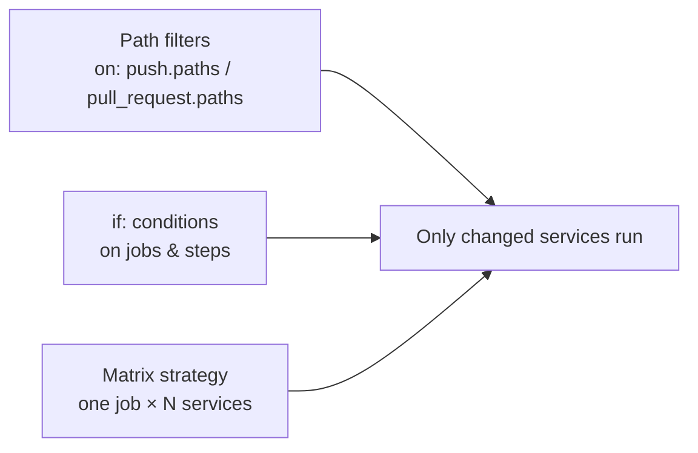
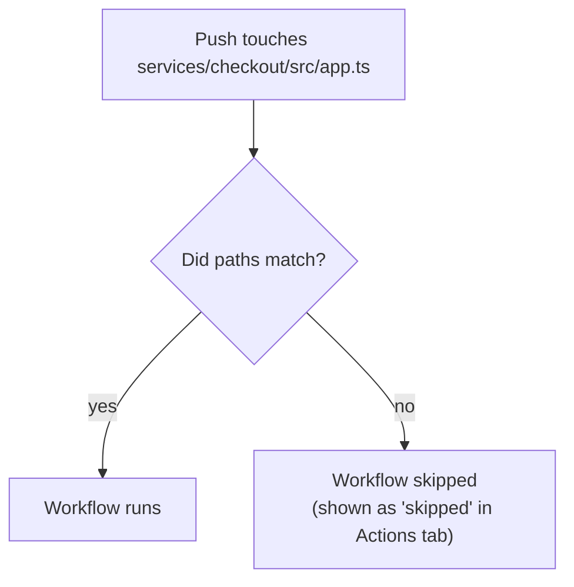
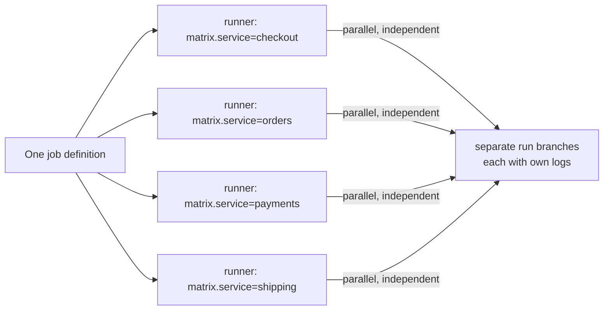
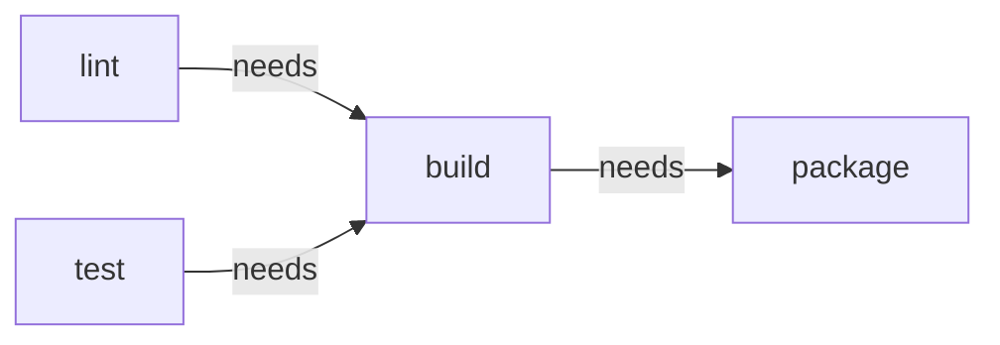

# Module 07 — Workflow Control for Multi-Service Repos

> **Confidential · Stalwart Learning**
> GitHub Actions — CI/CD Enablement & Migration · Session 2 · Module 7
> Level: Beginner → Intermediate. Conditional execution, matrix builds, path filters, and job-level controls for repositories that hold many microservices.

---

## 1. Overview

A **multi-service repository** — a monorepo, or a repo that holds several microservices (each with its own Dockerfile, tests, and deployment manifest) — creates a classic CI problem: *you don't want every service rebuilt and retested when you touch one*. GitHub Actions solves this with three tools, used together:



| Azure DevOps | GitHub Actions |
|---|---|
| `paths` trigger filter on a pipeline | `on: push.paths` / `on: pull_request.paths` |
| Stage `condition:` / `dependsOn` + `customcondition` | `if:` on jobs, using `needs` and `github` context |
| `strategy: matrix` (multi-config) | `strategy: matrix` |
| Job `timeoutInMinutes` | `timeout-minutes` on jobs / steps |
| `cancelTimeoutInMinutes` | `timeout-minutes` on steps (mainly for cancellation) |

---

## 2. Path filters — run only for the services you touched

Path filters are declared on the **trigger**, before anything runs. GitHub compares the changed files against the glob patterns and only starts the workflow if there's a match.

```yaml
name: Checkout-Service CI
on:
  push:
    branches: [main]
    paths:
      - 'services/checkout/**'          # only files under this directory
      - '!services/checkout/docs/**'    # ...except docs (ignore rule)
  pull_request:
    paths:
      - 'services/checkout/**'
```



Rules and gotchas:

- Patterns use **glob syntax** (`*`, `**`, `?`, `+`, `[]`, `!`). `**` matches nested directories.
- A **negation** (`!`) re-includes files; patterns are evaluated in order, last match wins.
- On `pull_request`, paths are evaluated against the **files changed in the PR**.
- Only `.yml`/`.yaml` file changes in `.github/workflows/` **always** trigger every workflow regardless of paths (so you can fix a workflow).
- A **push that matches no paths skips the workflow silently** — users often think CI is broken when it's actually "nothing matched". For *build* workflows that's correct behaviour; for a required *status check* it creates a "no status posted" situation you must design around (see §5).
- **Directories matter:** if your services live in `services/<name>`, always use the full prefix `services/checkout/**` — a bare `checkout/**` would also match a repo-level `checkout/` folder and misbehave.

> **ADO mapping:** `paths` ≈ the "paths" filter on an ADO CI trigger. One difference: ADO matches whole subdirectories more bluntly; GitHub Actions gives you full glob control including `!` exclusions.

**Multi-path — one workflow per service vs one workflow for all:**

```mermaid
flowchart TB
    subgraph OptA["Option A · one workflow per service"]
        A1[checkout-ci.yml<br/>paths: services/checkout/**]
        A2[orders-ci.yml<br/>paths: services/orders/**]
    end
    subgraph OptB["Option B · one workflow, path-conditioned jobs"]
        B1[ci.yml<br/>job checkout: if: contains(paths,'checkout')]
        B2[ci.yml<br/>job orders: if: contains(paths,'orders')]
    end
```

- **Option A** is simpler and is what most teams start with: each service owns its pipeline file. Downside: the pattern is copied per service → drift, which is exactly what Module 10's reusable workflows fix.
- **Option B** centralises everything but needs the **changed-files detection** trick (§3) since the workflow-level trigger can't tell *which* service changed once it's running.

---

## 3. Detecting *which* service changed inside a running workflow

Path filters only decide *whether the workflow starts*. To condition jobs **inside** a workflow on *which* paths changed, you need the changed-file list. The idiomatic way is a tiny job using `dorny/paths-filter` (or compute it with a `git diff` step):

```yaml
jobs:
  detect:
    runs-on: ubuntu-latest
    outputs:
      checkout: ${{ steps.filter.outputs.checkout }}
      orders:   ${{ steps.filter.outputs.orders }}
    steps:
      - uses: actions/checkout@v4
      - uses: dorny/paths-filter@v3
        id: filter
        with:
          filters: |
            checkout:
              - 'services/checkout/**'
            orders:
              - 'services/orders/**'
```

Then each service's job consumes the output:

```yaml
  build-checkout:
    needs: detect
    if: needs.detect.outputs.checkout == 'true'
    runs-on: ubuntu-latest
    steps:
      - run: echo "Building checkout service"
```

> **Why `dorny/paths-filter` and not `if: contains(github.event.commits.*.modified, ...)`?** `paths-filter` is battle-tested, handles PR base-vs-head diffs and pushes correctly, and returns booleans you can gate `needs:` on. The raw context approach is fragile for merge commits and squashes.

---

## 4. Matrix builds — build & test N services with one job

A **matrix** runs the same job definition once per *combination* in the matrix — each combination on its own fresh runner, in parallel. This is the Actions equivalent of ADO's **multi-configuration** strategy, and it's the natural fit for "build and test every microservice".

```yaml
jobs:
  build-services:
    runs-on: ubuntu-latest
    strategy:
      fail-fast: false        # don't cancel other services if one fails
      matrix:
        service: [checkout, orders, payments, shipping]
        include:
          - service: checkout
            dockerfile: services/checkout/Dockerfile
          - service: orders
            dockerfile: services/orders/Dockerfile
    steps:
      - uses: actions/checkout@v4
      - run: echo "Building ${{ matrix.service }}"
        # matrix.service and matrix.dockerfile are now in scope
```



**Key controls:**

| Keyword | Effect |
|---|---|
| `strategy.matrix.<name>: [a, b]` | The combinations (one per value, or Cartesian product for multiple keys) |
| `strategy.include:` | Add extra combinations with extra fields (e.g. a per-service Dockerfile path or a version) |
| `strategy.exclude:` | Remove combinations (e.g. skip `node-22` on a legacy service) |
| `fail-fast: true` | Default: if one combination fails, cancel the others. Set `false` to let all finish (useful to see every service's result) |
| `max-parallel: N` | Cap simultaneous runners |
| `${{ matrix.* }}` | Reference the current combination inside steps/if/env |

**Practical patterns for microservices:**

- **Build matrix per service** (above) — one job, N builds. Fastest to write; all services share the same recipe.
- **Test matrix across runtimes/versions** — combine service with a runtime dimension:

```yaml
strategy:
  matrix:
    service: [checkout, orders]
    node-version: [18, 20, 22]   # Cartesian product: 2 × 3 = 6 runners
```

- **`include` with custom per-combination data** — when each service needs different inputs (Dockerfile path, port, package name), use `include` rather than duplicating the job.

**Handling failures and reruns:**

- With `fail-fast: true` a single failing service cancels siblings. For a *build all services* job, prefer `fail-fast: false` so you see every service's result in one run.
- **Matrix rerun:** on the run page you can re-run **all** jobs or **failed jobs only**; re-run failed jobs only re-runs the failed *combinations* — cheaper than a full re-run, and it's the Session 4 topic you'll use constantly.
- Matrix combinations appear as **distinct job instances** in the UI (`build-services (checkout)`, `build-services (orders)`, …).

> **ADO mapping:** `strategy: matrix` ≈ ADO **strategy matrix/multi-config**. `include` ≈ `matrix.values` + `matrix` variables in a job strategy. `fail-fast` ≈ a per-job timeout/cancel strategy — ADO doesn't have a direct `fail-fast` for matrix.

---

## 5. Conditional execution with `if:`

`if:` gates a job or step. The most useful patterns for a multi-service repo:

```yaml
jobs:
  # 1. Gate on branch/event
  deploy-dev:
    if: github.ref == 'refs/heads/develop' && github.event_name == 'push'

  # 2. Gate on the results of a needed job
  deploy-prod:
    needs: [build, test]
    if: always() && needs.build.result == 'success' && needs.test.result == 'success'

  # 3. Gate on a detected-changes output (from §3)
  build-checkout:
    needs: detect
    if: needs.detect.outputs.checkout == 'true'

  # 4. Step-level condition (e.g. only on main, after a step that sets an output)
  push-image:
    if: github.event_name == 'push' && github.ref == 'refs/heads/main'
```

**Functions and status expressions you'll use:**

| Expression | Meaning |
|---|---|
| `success()` | All prior steps in the job succeeded (implicit default of every step) |
| `failure()` | A prior step failed (classic for a "notify on failure" step) |
| `cancelled()` | The run was cancelled |
| `always()` | Always run — override the default skip |
| `contains()`, `startsWith()`, `endsWith()`, `!`, `&&`, `\|\|` | String/logic helpers |

**Critical rule:** a step without an explicit `if:` runs only if all previous steps *succeeded*. To run a step even after a failure you must write `if: always() && ...`. This trips up ADO migrants who expect a "always run" default.

```yaml
steps:
  - run: docker push ...   # fails
  - run: notify-slack      # ❌ SKIPPED (previous step failed)
    if: failure()          # ✅ now runs only on failure
  - run: upload-logs
    if: always()           # ✅ runs whether the build passed or failed
```

---

## 6. Parallel jobs, `needs`, and timeout settings

**Parallelism default:** jobs in a workflow run **in parallel** unless they declare `needs:`. `needs` makes a job wait for the outputs/results of others — the ADO equivalent of `dependsOn`.

```yaml
jobs:
  lint:            # runs immediately
    runs-on: ubuntu-latest
  test:            # runs immediately
    runs-on: ubuntu-latest
  build:           # waits for lint AND test
    needs: [lint, test]
    runs-on: ubuntu-latest
  package:         # waits only for build
    needs: build
    runs-on: ubuntu-latest
```



**Timeout controls — set them or your CI hangs forever:**

| Azure DevOps | GitHub Actions | Default | Where |
|---|---|---|---|
| Job `timeoutInMinutes` | `timeout-minutes` (job) | **360 min** (GitHub-hosted) | on a job |
| — | `timeout-minutes` (step) | 360 min | on a step |
| Pipeline-level | `jobs.<id>.timeout-minutes` per job | 360 | per job |
| `strategy` cancel | `strategy.fail-fast` | true | on strategy |

```yaml
jobs:
  build:
    runs-on: ubuntu-latest
    timeout-minutes: 15            # kill the job after 15 minutes
    steps:
      - run: npm ci
        timeout-minutes: 5         # even a single hung step gets capped
      - run: npm test
```

**`continue-on-error`:** marks a job/step as "nice to have" — the workflow continues and the step is marked orange (failed-but-tolerated). Useful for optional lint or a flaky integration probe; do **not** use it to hide real failures.

> **ADO mapping:** `needs` ≈ `dependsOn`; `timeout-minutes` ≈ `timeoutInMinutes` (ADO has no per-task timeout; you simulate it with `cancelTimeoutInMinutes`). `continue-on-error` ≈ ADO task `continueOnError: true`.

---

## 7. `concurrency` — don't pile up runs

Multi-service repos get noisy fast when the same workflow fires repeatedly. The `concurrency` key cancels/serialises runs:

```yaml
concurrency:
  group: ci-${{ github.ref }}      # one active run per branch
  cancel-in-progress: true         # a new push supersedes the running one
```

This is the Actions answer to ADO's "cancel previous pipeline runs" and is essential on busy monorepos.

---

## 8. Putting it together — multi-service CI with everything

```yaml
name: Microservices CI
on:
  push:
    branches: [main]
  pull_request:

concurrency:
  group: ci-${{ github.ref }}
  cancel-in-progress: true

env:
  REGISTRY: ${{ vars.IMAGE_REGISTRY }}

permissions:
  contents: read

jobs:
  detect:
    runs-on: ubuntu-latest
    outputs:
      checkout: ${{ steps.filter.outputs.checkout }}
      orders:   ${{ steps.filter.outputs.orders }}
    steps:
      - uses: actions/checkout@v4
      - uses: dorny/paths-filter@v3
        id: filter
        with:
          filters: |
            checkout:
              - 'services/checkout/**'
            orders:
              - 'services/orders/**'

  build-services:
    needs: detect
    if: needs.detect.outputs.checkout == 'true' || needs.detect.outputs.orders == 'true'
    runs-on: ubuntu-latest
    timeout-minutes: 15
    strategy:
      fail-fast: false
      matrix:
        include:
          - service: checkout
            dockerfile: services/checkout/Dockerfile
          - service: orders
            dockerfile: services/orders/Dockerfile
    steps:
      - uses: actions/checkout@v4
      - name: Build ${{ matrix.service }}
        run: docker build -f "${{ matrix.dockerfile }}" -t "$REGISTRY/${{ github.repository }}/${{ matrix.service }}:ci" .

  notify-failure:
    needs: build-services
    if: always() && needs.build-services.result == 'failure'
    runs-on: ubuntu-latest
    steps:
      - run: echo "One or more services failed — notify the team"
```

---

## 9. Beginner pitfalls

1. **Silent skips from path filters.** A push that matches no `paths` never starts the workflow — and never posts a status. For required status checks, prefer a job that always runs (detection) and gates *service jobs* with `if:` on its outputs.
2. **`if:` on a job that declares `needs:` but you don't check `needs.X.result`.** A job whose dependency failed is skipped by default — you must add `always()` if you want it to run regardless.
3. **Forgetting `needs:` means parallel.** Reordering jobs does nothing; ordering comes from `needs`.
4. **Matrix explosion.** Service × node-version × os = many runners and minutes. Use `include`/`exclude` and `max-parallel` deliberately.
5. **`fail-fast: true` default hiding failures.** When one of many services fails, the rest are cancelled and you re-run repeatedly. Set `fail-fast: false` for build-all workflows.
6. **No `timeout-minutes`.** A hung `npm test` holds a runner for up to 6 hours. Always set job timeouts.
7. **Path filters with a bare folder name** (`checkout/**`) that accidentally match repo-level folders — always scope to `services/<name>/**`.

---

## 10. Copilot checkpoint

Use Copilot to generate the detection + matrix scaffolding, then review carefully:

> "Create a GitHub Actions workflow for a monorepo with services under `services/`. Add a `dorny/paths-filter` detection job with outputs per service, a matrix build job gated on those outputs, `fail-fast: false`, `timeout-minutes: 15`, and a failure-notification job using `needs` + `always()`."

Check the output: does the matrix `include` list every service with the right Dockerfile path? Are all service jobs gated on the detect job's outputs? Is `concurrency` set? (Copilot frequently forgets `concurrency` and `timeout-minutes`.)

---

## 11. References

- Workflow syntax — `on.<event>.paths` / `if` / `needs` / `strategy` / `timeout-minutes` — https://docs.github.com/en/actions/reference/workflow-syntax-for-github-actions
- Expressions (status check functions `success()` / `failure()` / `always()`) — https://docs.github.com/en/actions/learn-github-actions/expressions
- Using a matrix for your jobs — https://docs.github.com/en/actions/using-jobs/using-a-matrix-for-your-jobs
- Re-running workflows and jobs (incl. failed matrix re-runs) — https://docs.github.com/en/actions/managing-workflow-runs/re-running-workflows-and-jobs
- `dorny/paths-filter` — https://github.com/dorny/paths-filter
- Using `concurrency` to control runs — https://docs.github.com/en/actions/using-jobs/using-concurrency
- ADO equivalent: triggers/path filters — https://learn.microsoft.com/en-us/azure/devops/pipelines/build/triggers
- ADO equivalent: job conditions (`dependsOn`, conditions) — https://learn.microsoft.com/en-us/azure/devops/pipelines/process/phases