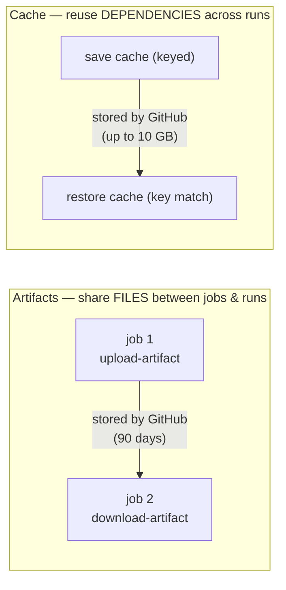
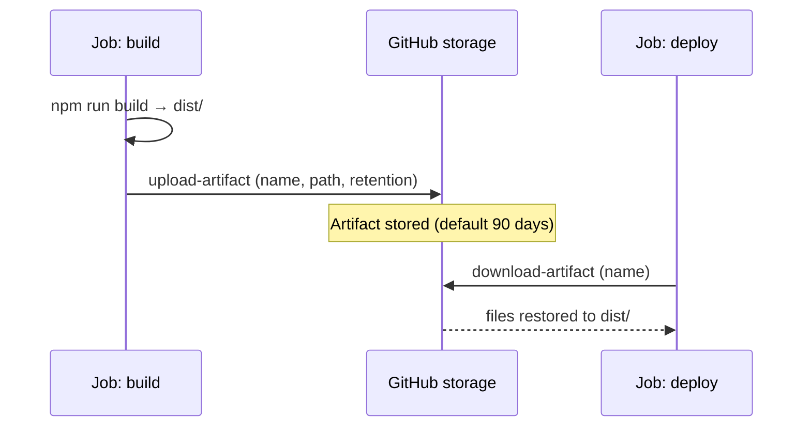
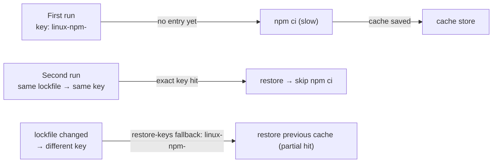
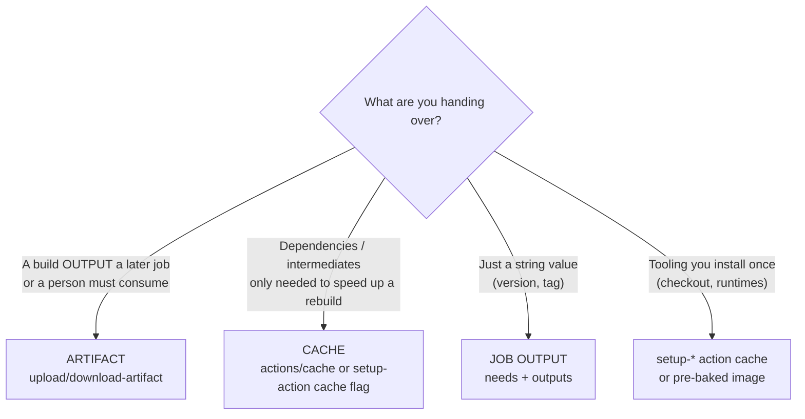

# Module 08 — Artifacts & Caching

> **Confidential · Stalwart Learning**
> GitHub Actions — CI/CD Enablement & Migration · Session 2 · Module 8
> Level: Beginner → Intermediate. Passing files between jobs with **artifacts**, and speeding up builds with **dependency caching** — and knowing when each is the right tool.

---

## 1. Overview

Every job runs on its own **fresh, ephemeral runner** — nothing persists between jobs. When a workflow needs to move files from one job to another, or avoid re-downloading/re-compiling the same dependencies on every run, you use two different mechanisms:



| | **Artifacts** | **Cache** |
|---|---|---|
| Purpose | Hand off build **outputs** (binaries, test reports, images, manifests) | Reuse **dependency downloads / build intermediates** |
| Granularity | Files & folders | Keyed entries |
| Direction | Job → job (also to the user, via the run page) | Run → run (within same repo/branch context) |
| Persistence | 90 days default (configurable) | Up to 10 GB/repo, evicted by LRU; no SLA |
| Best for | "Pass the jar from build to deploy", "attach test report to PR" | "`npm ci` / `go mod download` / Maven `.m2` — don't re-download every run" |
| ADO equivalent | Pipeline **artifacts** / `PublishPipelineArtifact` | ADO **pipeline caching** task (`Cache@2`) |

> **Rule of thumb:** *outputs → artifacts; inputs/dependencies → cache.* Artifacts are for things a later job *consumes as work product*; the cache is an accelerator that must never be required for correctness (a cache miss must not break the build).

---

## 2. Artifacts — moving files between jobs

Two first-party actions do the work: `actions/upload-artifact@v4` and `actions/download-artifact@v4`.

```yaml
jobs:
  build:
    runs-on: ubuntu-latest
    steps:
      - uses: actions/checkout@v4
      - run: npm ci && npm run build
      - name: Upload build output
        uses: actions/upload-artifact@v4
        with:
          name: webapp-dist
          path: dist/
          retention-days: 14       # override the 90-day default
          if-no-files-found: error # warn | ignore | error

  deploy:
    needs: build
    runs-on: ubuntu-latest
    steps:
      - name: Download build output
        uses: actions/download-artifact@v4
        with:
          name: webapp-dist
          path: dist/
      - run: ls dist/
```



**Key facts & gotchas:**

- **Retention:** default **90 days** (Enterprise: configurable org-wide). Set `retention-days` for sensitive or bulky artifacts.
- **Names:** unique per run; later uploads with the same name overwrite.
- **Path patterns:** `path:` accepts a glob or a list (`dist/`, `build/*.tar.gz`). Artifacts are **uploaded as a single zip** — the downloader unzips automatically.
- **`if-no-files-found`:** default is `warn` — a missing directory can silently produce an empty artifact. Set `error` for things a downstream job genuinely needs.
- **Size limits:** 4 GB per artifact (per run, ~ totals count against storage minutes). Huge artifacts are a smell — prefer caches for dependencies and keep artifacts lean.
- **Matrix interplay:** with a matrix, upload each combination under a *different* artifact name or the run overwrites (`name: ${{ matrix.service }}`). Downloading all artifacts of a run: omit `name:`.
- **PR UI nicety:** `actions/upload-artifact` plus the Actions tab lets users **download artifacts from the run page** — handy for handing a build to a tester. Test-report artifacts also surface in the PR checks UI.

> **ADO mapping:** upload/download-artifact ≈ `PublishPipelineArtifact` / `DownloadPipelineArtifact`, and the run-page download ≈ the ADO "artifacts" tab of a build. Artifact expiry in ADO is org-controlled; here it's per-upload (`retention-days`).

**Passing small values instead of files:** if you only need to pass a *string* (an image tag, a version number) between jobs, don't upload an artifact — use **job outputs** (Module 06 §7):

```yaml
jobs:
  build:
    outputs:
      image-tag: ${{ steps.tag.outputs.tag }}
    steps:
      - id: tag
        run: echo "tag=$(echo $GITHUB_SHA | cut -c1-7)" >> "$GITHUB_OUTPUT"
  deploy:
    needs: build
    steps:
      - run: echo "deploying ${{ needs.build.outputs.image-tag }}"
```

---

## 3. Caching — make builds faster by reusing dependencies

The cache stores **keyed entries** of files (usually your dependency directory) and restores them on subsequent runs when the key matches. Two ways to use it:

### 3.1 `actions/cache` (manual, explicit keys)

```yaml
steps:
  - uses: actions/checkout@v4

  - name: Cache npm dependencies
    id: npm-cache
    uses: actions/cache@v4
    with:
      path: ~/.npm
      key: ${{ runner.os }}-npm-${{ hashFiles('**/package-lock.json') }}
      restore-keys: |
        ${{ runner.os }}-npm-

  - name: Install dependencies
    run: npm ci          # if cache hit (step id output 'cache-hit' = true), it's fast
```



**How the key logic works:**

- `key:` — exact match restores the cache. `hashFiles('**/package-lock.json')` makes the key change whenever dependencies change and stay identical otherwise — the canonical pattern for **lockfile-driven** ecosystems.
- `restore-keys:` — when no exact key matches, GitHub tries each prefix in order and restores the **most recent** entry whose key starts with it. Use it so a `package.json` bump (new hash) still restores the old cache and only the *diff* needs re-downloading.
- Check the outcome via the step output `steps.<id>.outputs.cache-hit` (`'true'`/`'false'`), then conditionally skip the install.

**Common cache paths:**

| Ecosystem | Path | Key ingredient |
|---|---|---|
| npm | `~/.npm` | `**/package-lock.json` |
| Go | `~/go/pkg/mod` | `**/go.sum` |
| Maven | `~/.m2/repository` | `**/pom.xml` |
| Gradle | `~/.gradle/caches` | `**/*.gradle*` |
| pip | `~/.cache/pip` | `**/requirements*.txt` |

### 3.2 Built-in setup-action caching (recommended for most teams)

`actions/setup-node@v4` (and `setup-java`, `setup-python`, `setup-go`) cache dependencies **for you** — one flag instead of the manual action:

```yaml
- uses: actions/setup-node@v4
  with:
    node-version: 20
    cache: npm            # 'npm' | 'pnpm' | 'yarn' | (leave unset to manage manually)
    cache-dependency-path: services/checkout/package-lock.json   # for monorepos!
```

> **Monorepo trap:** the setup-action default looks for `package-lock.json` at the repo root. In a multi-service repo, point `cache-dependency-path` at each service's lockfile (or rely on a per-service workflow).

### 3.3 Cache rules and hard limits

- **Scope:** caches are shared across branches but not across different repo (or private/org boundaries without config). A cache created on `main` is readable by feature branches (with `actions/actions-toolkit`-style restrictions on which *caches* branch paths can *write*).
- **Size:** up to **10 GB** per repository, evicted LRU. No hard SLA — **a cache miss must never fail your build** (that's why caches are "save if you can").
- **Keys are immutable & append-only:** you cannot overwrite a key. To invalidate, change the key (bump a version prefix, e.g. `${{ runner.os }}-npm-v2-...`).
- **Secrets in cache:** the cache is **not encrypted** for secrets — never cache credentials or tokens. (Runner secrets are env-scoped, not cached.)
- **Unused cache eviction:** GitHub may evict caches that haven't been used for a long time; a *restore* keeps an entry alive.

> **ADO mapping:** `actions/cache` ≈ the `Cache@2` pipeline caching task (`key`, `path`, `restoreKeys` — the mapping is almost 1:1). ADO's `npmAuthenticate`/`.npmrc` integration ≈ `setup-node` + `registry-url`/`scope` inputs.

---

## 4. Artifact vs cache — the decision checklist



**Quick guide:**

1. **Deploy job needs the built container manifest / binary** → artifact.
2. **Test job needs the same compile output as build** → artifact (or rebuild — artifacts are for when rebuilding is expensive).
3. **Every job needs `npm ci` without re-downloading** → cache.
4. **You want to download a build to inspect it** → artifact (run page → download).
5. **Version string flows between jobs** → job output, *not* an artifact.

---

## 5. Combining both in a realistic multi-service workflow

```yaml
jobs:
  build:
    runs-on: ubuntu-latest
    outputs:
      version: ${{ steps.version.outputs.version }}
    steps:
      - uses: actions/checkout@v4

      - uses: actions/setup-node@v4
        with:
          node-version: 20
          cache: npm
          cache-dependency-path: services/checkout/package-lock.json

      - run: npm ci

      - name: Compute version
        id: version
        run: echo "version=$(git describe --tags --always)" >> "$GITHUB_OUTPUT"

      - run: npm run build --prefix services/checkout

      - name: Upload dist as artifact
        uses: actions/upload-artifact@v4
        with:
          name: checkout-dist
          path: services/checkout/dist/
          if-no-files-found: error

  test:
    needs: build
    runs-on: ubuntu-latest
    steps:
      - uses: actions/checkout@v4
      - uses: actions/setup-node@v4
        with:
          node-version: 20
          cache: npm
          cache-dependency-path: services/checkout/package-lock.json
      - run: npm ci
      - uses: actions/download-artifact@v4
        with:
          name: checkout-dist
          path: services/checkout/dist/
      - run: npm test --prefix services/checkout
```

Notice the design choices:

- **Cache is per-job** — both build and test restore the same `~/.npm` from the shared cache store; that's fine, caches are shared across jobs within the repo.
- **Artifact is the *hand-off*** — the built `dist/` travels from build to test via upload/download, not via the cache (the cache is for dependencies, not outputs).
- **Version string** flows via job output, avoiding an artifact round-trip.

---

## 6. Beginner pitfalls

1. **Using the cache for build outputs.** The cache has no retention SLA, is LRU-evicted, and is shared across branches — never put the *only copy* of something important in it.
2. **Cache key that never changes.** `key: ${{ runner.os }}-npm` never invalidates — stale dependencies forever. Always include `hashFiles()` of your lockfile.
3. **Monorepo lockfile path.** Default `cache: npm` looks at the root; pass `cache-dependency-path` per service.
4. **Secret in a cached file.** The cache is not a secrets vault.
5. **`if-no-files-found: warn` silently swallowing a missing output.** Flip to `error` for critical artifacts.
6. **Matrix overwriting artifacts.** Unique `name:` per combination, or download-all with no name.
7. **Believing a cache hit is guaranteed.** Design workflows so a cache miss still succeeds — the cache accelerates; it never defines correctness.
8. **Uploading giant artifacts unnecessarily.** Each artifact counts against storage; use `retention-days` and keep them lean.

---

## 7. Copilot checkpoint

> "Add `actions/setup-node@v4` with `cache: npm` and `cache-dependency-path` pointing at `services/checkout/package-lock.json`. Add an `actions/cache@v4` step for `~/.npm` in the build job with a `hashFiles` key and a `restore-keys` fallback, and gate `npm ci` on `cache-hit`."

Review Copilot's output for the three classic errors: a bare `hashFiles('**/package-lock.json')` without a runner OS prefix, a missing `restore-keys`, and a cache key that doesn't include the lockfile.

---

## 8. References

- Storing workflow data as artifacts — https://docs.github.com/en/actions/using-workflows/storing-workflow-data-as-artifacts
- `actions/upload-artifact` — https://github.com/actions/upload-artifact
- `actions/download-artifact` — https://github.com/actions/download-artifact
- Caching dependencies to speed up workflows — https://docs.github.com/en/actions/using-workflows/caching-dependencies-to-speed-up-workflows
- `actions/cache` — https://github.com/actions/cache
- Caching dependencies with `setup-node` and friends — https://docs.github.com/en/actions/using-workflows/caching-dependencies-to-speed-up-workflows#using-the-cache-action
- Job outputs (`needs.<id>.outputs`) — https://docs.github.com/en/actions/using-jobs/defining-outputs-for-jobs
- ADO equivalent: publish/download pipeline artifacts — https://learn.microsoft.com/en-us/azure/devops/pipelines/artifacts/pipeline-artifacts
- ADO equivalent: pipeline caching — https://learn.microsoft.com/en-us/azure/devops/pipelines/release/caching