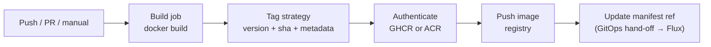
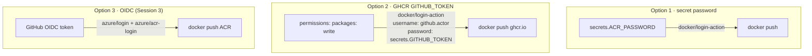
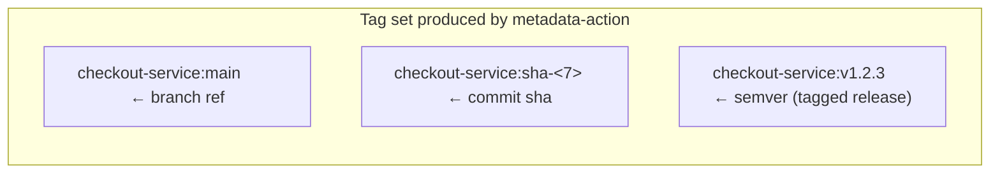
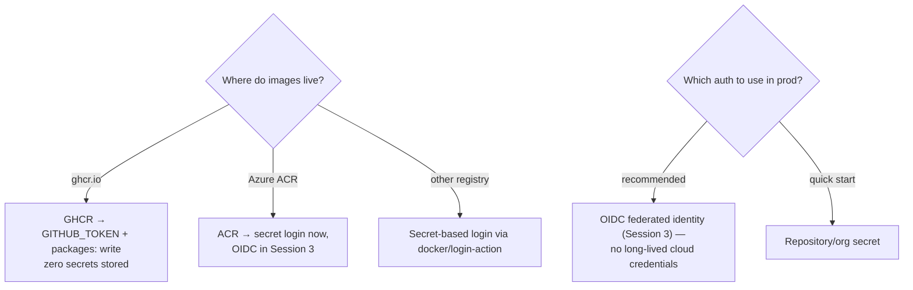

# Module 09 — Container Build Pipelines

> **Confidential · Stalwart Learning**
> GitHub Actions — CI/CD Enablement & Migration · Session 2 · Module 9
> Level: Beginner → Intermediate. Building Docker images in a workflow, choosing a tagging strategy, and pushing to a container registry (GHCR / ACR) — with registry authentication covered here at overview level (deep-dive via OIDC is Session 3).

---

## 1. Overview

This is the module that connects GitHub Actions to your **AKS microservices deployment**. In this team's architecture GitHub Actions' job ends with a push to a registry and an update to a GitOps manifest reference — Flux takes over from there (out of scope, covered only as the hand-off boundary).



| Azure DevOps | GitHub Actions |
|---|---|
| `Docker@2` task (build + push) | `docker/build-push-action` (or plain `docker build`/`docker push` steps) |
| Azure Container Registry service connection | Registry auth via **secrets** (this module) or **OIDC federated credentials** (Session 3, Module 12) |
| `Build.BuildId`-style tags | `github.sha`, `github.run_number`, `docker/metadata-action` |
| ADO variable `$(Build.Repository.Name)` | `${{ github.repository }}` |

> **The two-pattern story:** teams either use the first-party `docker/build-push-action` (with BuildKit, caching, metadata), or plain `docker build`/`docker push` shell steps. Both are shown below; the recommended default is **`build-push-action`** because it gives you cache + provenance + metadata for free.

---

## 2. Registry authentication — the overview (deep dive in Session 3)

Every push to a registry needs credentials. There are **three options**, in increasing order of production-readiness:

| Approach | How | Credential lifetime | Best for |
|---|---|---|---|
| **1. Password/token secret** | `docker/login-action` with `username`/`password` from `secrets` | Long-lived (rotated manually) | Quick labs, low-risk private registries |
| **2. GHCR with the built-in token** | `permissions: packages: write` — GitHub's own token authenticates automatically | Per-run, auto-rotated | Images hosted on `ghcr.io` |
| **3. OIDC federated credentials (Azure)** | GitHub exchanges a short-lived token for an Azure credential; no secret at all | Minutes, automatically refreshed | Production ACR pushes (Session 3, Module 12) |



> **ADO mapping:** Option 1 ≈ an ACR service connection with a username/password stored in a variable group; Option 3 ≈ a Workload Identity federation connection. The migration story is *replace the service connection with an OIDC trust relationship* — Session 3, Module 12.

---

## 3. Pattern A — `docker/build-push-action` (recommended)

The modern, feature-complete path. It handles BuildKit, `--cache-from/to`, provenance, and metadata itself.

```yaml
name: Build & Push
on:
  push:
    branches: [main]

env:
  REGISTRY: ${{ vars.IMAGE_REGISTRY }}        # ghcr.io/myorg  OR  myacr.azurecr.io
  IMAGE_NAME: ${{ github.repository }}         # e.g. myorg/checkout-service

permissions:
  contents: read
  packages: write                               # GHCR push needs this (Option 2)

jobs:
  build-push:
    runs-on: ubuntu-latest
    steps:
      - uses: actions/checkout@v4

      - name: Set up Docker Buildx
        uses: docker/setup-buildx-action@v3

      - name: Login to GHCR
        uses: docker/login-action@v3
        with:
          registry: ghcr.io
          username: ${{ github.actor }}
          password: ${{ secrets.GITHUB_TOKEN }}

      - name: Extract metadata (tags, labels)
        id: meta
        uses: docker/metadata-action@v5
        with:
          images: ${{ env.REGISTRY }}/${{ env.IMAGE_NAME }}
          tags: |
            type=ref,event=branch
            type=semver,pattern={{version}}
            type=sha

      - name: Build and push
        uses: docker/build-push-action@v6
        with:
          context: .
          file: ./services/checkout/Dockerfile
          push: true
          tags: ${{ steps.meta.outputs.tags }}
          labels: ${{ steps.meta.outputs.labels }}
          cache-from: type=gha
          cache-to: type=gha,mode=max
```

What each piece does:

- **`docker/setup-buildx-action`** — installs BuildKit. Gives you parallel layer builds, better cache, provenance.
- **`docker/login-action`** — authenticates; with GHCR + `packages: write` no secret is stored (the run-scoped `GITHUB_TOKEN` is the password).
- **`docker/metadata-action`** — the *tagging engine*; emits `tags`/`labels` outputs so you don't hand-roll tag logic (§4).
- **`docker/build-push-action`** — builds and (optionally) pushes; `cache-from/to: type=gha` reuses layers across runs via the Actions cache (Module 08) instead of rebuilding every layer.

---

## 4. Tagging strategy — do this right, it's your traceability

A good tag set answers three questions forever: *which version*, *which commit*, *which branch*. The `metadata-action` emits all of them from the event:



**Strategy guidance:**

| Tag type | When | Why |
|---|---|---|
| `sha` (short) | every push | immutable traceability — always know the exact commit |
| branch (`main`) | every push to main | simple "what's the latest" pointer |
| semver (`v1.2.3`) | on a tag push | release cadence, matches how Flux/Helm consume versions |
| `latest` | push to main | convenience only — **avoid as a deployment target** (non-immutable) |

**Recommended matrix-style tagging block:**

```yaml
tags: |
  type=ref,event=branch                # main
  type=sha,format=short                # sha-abc1234
  type=semver,pattern={{version}}      # v1.2.3
  type=semver,pattern={{major}}.{{minor}}
```

**Why this matters for your GitOps hand-off:** Flux watches your manifest repository for a *changed image reference*. If you tag by `sha`, every push produces a unique immutable reference; Flux sees `checkout-service:sha-abc1234` change and reconciles. Tagging everything `latest` makes the hand-off ambiguous and rollbacks impossible.

> **ADO mapping:** ADO `Docker@2` usually tags with `$(Build.BuildId)` or semver from `Build.BuildNumber`. The Actions equivalent is `github.run_number`/`github.sha` + `metadata-action` semver rules. Set your ADO `Build.BuildNumber` pattern as a `metadata-action` semver rule and the mapping is direct.

---

## 5. Pattern B — plain `docker build` / `docker push` (simple, explicit)

For small cases (or when you want every step visible and no action dependency):

```yaml
jobs:
  build:
    runs-on: ubuntu-latest
    steps:
      - uses: actions/checkout@v4
      - name: Build image
        run: |
          docker build \
            -f services/checkout/Dockerfile \
            -t $REGISTRY/${{ github.repository }}:${{ steps.tag.outputs.tag }} .
        env:
          REGISTRY: ${{ vars.IMAGE_REGISTRY }}
      - name: Push image
        run: docker push $REGISTRY/${{ github.repository }}:${{ steps.tag.outputs.tag }}
```

> Prefer Pattern A once a workflow grows: `build-push-action` gives you Buildx, layer caching, provenance, and metadata handling that raw `docker build` steps force you to re-implement.

---

## 6. Building in a monorepo / multi-service repo

Bring Modules 07 + 08 together. Path-trigger per service, matrix build, cache, tag by sha, push, and hand off.

```yaml
name: Checkout Service — Build & Push
on:
  push:
    branches: [main]
    paths: ['services/checkout/**']

permissions:
  contents: read
  packages: write

env:
  REGISTRY: ${{ vars.IMAGE_REGISTRY }}

jobs:
  build-push:
    runs-on: ubuntu-latest
    timeout-minutes: 20
    steps:
      - uses: actions/checkout@v4
      - uses: docker/setup-buildx-action@v3
      - uses: docker/login-action@v3
        with:
          registry: ghcr.io
          username: ${{ github.actor }}
          password: ${{ secrets.GITHUB_TOKEN }}
      - uses: docker/metadata-action@v5
        id: meta
        with:
          images: ${{ env.REGISTRY }}/${{ github.repository }}/checkout-service
          tags: |
            type=ref,event=branch
            type=sha,format=short
      - uses: docker/build-push-action@v6
        with:
          context: ./services/checkout
          file: ./services/checkout/Dockerfile
          push: true
          tags: ${{ steps.meta.outputs.tags }}
          cache-from: type=gha
          cache-to: type=gha,mode=max

  gitops-handoff:
    needs: build-push
    runs-on: ubuntu-latest
    steps:
      - run: |
          echo "Hand-off to Flux: bump services/checkout/deploy/base/image"
          echo "new ref: ${{ env.REGISTRY }}/${{ github.repository }}/checkout-service:sha-${{ github.sha }}"
```

---

## 7. Container build + AKS microservices — decision points



**Hand-off boundary reminder (from the outline):** GitHub Actions builds and pushes the image and updates the manifest reference in your GitOps repo. Flux then reconciles the AKS cluster. This course's scope ends at the manifest update — do **not** have Actions `kubectl apply` directly (that would bypass your GitOps model).

---

## 8. Beginner pitfalls

1. **Forgetting `permissions: packages: write`** for GHCR — you get `denied: installation not allowed` until you add it.
2. **Using `latest` as a deployment tag** — non-immutable, breaks rollbacks and Flux diffing. Tag by `sha` + semver.
3. **Building without Buildx cache** — every run rebuilds every layer. Add `cache-from/to: type=gha`.
4. **Wrong context.** `docker/build-push-action` `context:` should be the directory with the source the Dockerfile needs (e.g. `./services/checkout`), not the repo root — otherwise `.dockerignore`/`COPY` paths break.
5. **Logging the password** via `docker login` echo in a debug step — masked only after first reference; never print registry credentials.
6. **Pushing on PR runs.** Gate `push: true` (or the whole job) with `if: github.event_name == 'push' && github.ref == 'refs/heads/main'`.
7. **No `timeout-minutes`** on image builds — a slow layer can pin a runner for hours.
8. **Bypassing GitOps** by applying manifests directly with `kubectl` — keep the Actions→Flux boundary clean (Session 3).

---

## 9. Copilot checkpoint

> "Create a Docker build-and-push workflow for `services/checkout` using `docker/setup-buildx-action@v3`, `docker/login-action@v3`, `docker/metadata-action@v5` with branch + sha tags, and `docker/build-push-action@v6` with `type=gha` cache. Use `vars.IMAGE_REGISTRY` for the registry, set `permissions: packages: write`, and gate the push to `push` on `main`."

Verify Copilot's output: does it set `permissions`? Is the build context correct for your service directory? Does the tag set include a `sha` tag (traceability)? Is the cache block present?

---

## 10. References

- `docker/setup-buildx-action` — https://github.com/docker/setup-buildx-action
- `docker/login-action` — https://github.com/docker/login-action
- `docker/metadata-action` (tagging rules) — https://github.com/docker/metadata-action
- `docker/build-push-action` — https://github.com/docker/build-push-action
- About GHCR (GitHub Container Registry) — https://docs.github.com/en/packages/working-with-a-github-packages-registry/working-with-the-container-registry
- Pushing packages / `packages: write` permission — https://docs.github.com/en/packages/learn-github-packages/about-permissions-for-github-packages
- ADO equivalent: `Docker@2` task — https://learn.microsoft.com/en-us/azure/devops/pipelines/tasks/reference/docker-v2
- Session 3 preview — keyless auth / OIDC: https://docs.github.com/en/actions/security-guides/security-hardening-for-github-actions#using-openid-connect-oidc