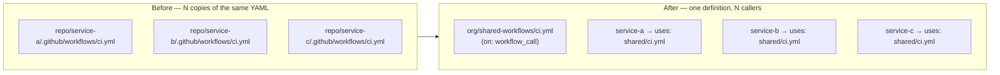
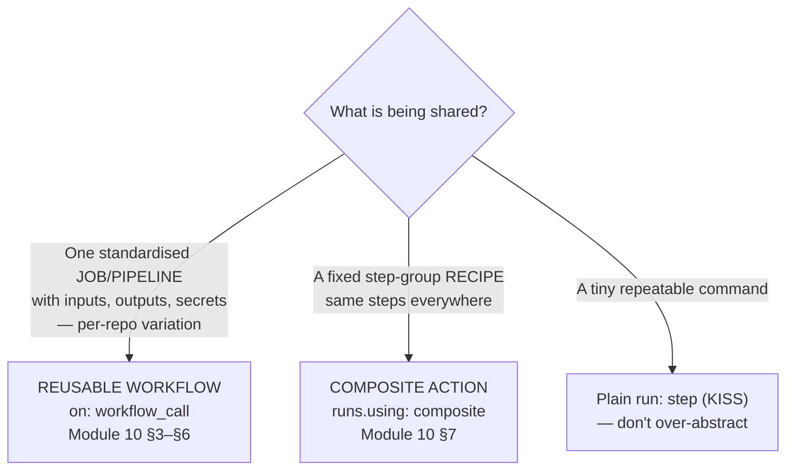
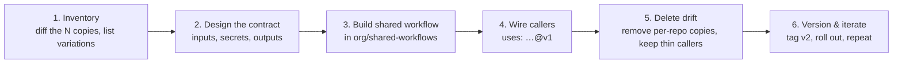

# Module 10 — Standardising Pipelines: Reusable Workflows & Composite Actions (with GitHub Copilot)

> **Confidential · Stalwart Learning**
> GitHub Actions — CI/CD Enablement & Migration · Session 2 · Module 10
> Level: Beginner → Intermediate. Extracting the common build pattern across your microservices into a **reusable workflow**, choosing when a **composite action** is the right tool instead, and using GitHub Copilot to do the extraction safely.

---

## 1. Overview

You have N microservice repos, each with a copy of the same CI workflow. They drift — one gets `timeout-minutes`, another doesn't; one pins actions, one floats `@main`; one pushes to ACR, one still points at `latest`. Module 10 is how you **stop copying and start calling**.



| Azure DevOps | GitHub Actions |
|---|---|
| YAML **template** (`extends` / `steps` template include) | **Reusable workflow** (`on: workflow_call`, called via `uses:`) |
| Task group | **Composite action** |
| Template parameters | `inputs` (`with:`) and `secrets:` |
| ADO variable group + template | `vars`/`secrets` + reusable workflow inputs |
| Shared repo for templates | A central **workflows repo** (`org/shared-workflows`) referenced by ref |

> **Refresher (from Module 04):** a **reusable workflow** is a *whole workflow* that other workflows call as if it were a job; a **composite action** is a *fixed sequence of steps* packaged as a reusable action. Module 10 builds on Module 04 with the full microservices design: input contracts, versioning, secrets, and Copilot-assisted extraction.

---

## 2. The two abstractions — when to use which



| | Reusable workflow | Composite action |
|---|---|---|
| Shares | A **job** (or several jobs) | A **sequence of steps** |
| Declared with | `on: workflow_call` | `runs: using: composite` |
| Called with | `uses: org/shared/.github/workflows/ci.yml@v1` | `uses: ./actions/build` or `uses: owner/repo@ref` |
| Inputs / secrets | `inputs:` + `secrets:` (or `secrets: inherit`) | `inputs:` only (secrets reachable via context) |
| Outputs | Job outputs, exposed via `workflow_call.outputs` | `outputs` in the composite definition |
| Can be nested | Yes (a reusable workflow can call another) | Yes (a composite can call another composite) |
| Per-step controls (`if`, `timeout`, `continue-on-error`) | Full job-level control at the caller | Only *inside* the composite's own steps |
| Versioning | By **ref** in the `uses:` line (`@v1`, `@main`, SHA) | By ref on the action path |

**This course's standard:** for a fleet of microservice repos, the *CI pipeline* is a **reusable workflow** (`org/shared-workflows/ci.yml`); a repeated *step recipe* inside it (e.g. "build + tag + push") can be a **composite action** (`org/shared-workflows/actions/build-push/`). Both live in the shared repo so every service references the same code.

---

## 3. The reusable workflow — a complete, production-shaped example

The shared repo `org/shared-workflows` holds `.github/workflows/ci.yml`:

```yaml
name: Shared CI
on:
  workflow_call:
    inputs:
      service:
        type: string
        required: true
        description: 'Service directory under services/, e.g. checkout'
      node-version:
        type: string
        default: '20'
        required: false
      dockerfile:
        type: string
        required: true
        description: 'Path to the service Dockerfile'
    outputs:
      image-tag:
        description: 'Immutable image tag built for this run'
        value: ${{ jobs.build.outputs.image-tag }}
    secrets:
      REGISTRY_TOKEN:
        required: true

jobs:
  build:
    runs-on: ubuntu-latest
    timeout-minutes: 20
    outputs:
      image-tag: ${{ steps.meta.outputs.tags }}
    steps:
      - uses: actions/checkout@v4
      - uses: actions/setup-node@v4
        with:
          node-version: ${{ inputs.node-version }}
          cache: npm
          cache-dependency-path: services/${{ inputs.service }}/package-lock.json
      - run: npm ci --prefix services/${{ inputs.service }}
      - run: npm test --prefix services/${{ inputs.service }}
      - uses: docker/setup-buildx-action@v3
      - uses: docker/login-action@v3
        with:
          registry: ${{ vars.IMAGE_REGISTRY }}
          username: ${{ github.actor }}
          password: ${{ secrets.REGISTRY_TOKEN }}
      - uses: docker/metadata-action@v5
        id: meta
        with:
          images: ${{ vars.IMAGE_REGISTRY }}/${{ github.repository }}/${{ inputs.service }}
          tags: |
            type=ref,event=branch
            type=sha,format=short
      - uses: docker/build-push-action@v6
        with:
          context: services/${{ inputs.service }}
          file: ${{ inputs.dockerfile }}
          push: true
          tags: ${{ steps.meta.outputs.tags }}
          cache-from: type=gha
          cache-to: type=gha,mode=max
```

**Design rules to notice:**

- **`inputs` are the contract.** Every per-service variation flows through `with:` — there is *no way* for the caller to inject custom steps. Design the input set up front (service, toolchain version, dockerfile path) and extend it deliberately.
- **Secrets are explicit.** `secrets:` names what the callee needs. The caller either lists them or uses `secrets: inherit` (be deliberate — `inherit` forwards *all* org/repo secrets).
- **The callee owns environment & permissions.** `permissions:`, environments, and job structure live *inside* the reusable workflow. The caller owns the **trigger** and the `with:`/`secrets:` values.
- **Outputs** flow back to the caller via `workflow_call.outputs` → `jobs.<id>.outputs`, consumed by later jobs.

### The caller (each microservice repo — now ~15 lines)

```yaml
name: CI
on:
  push:
    branches: [main]
    paths: ['services/checkout/**']
  pull_request:
    paths: ['services/checkout/**']

jobs:
  shared-ci:
    uses: myorg/shared-workflows/.github/workflows/ci.yml@v1
    with:
      service: checkout
      dockerfile: services/checkout/Dockerfile
      node-version: '20'
    secrets:
      REGISTRY_TOKEN: ${{ secrets.REGISTRY_TOKEN }}
```

**Versioning by ref** is how you roll out changes: `@v1` (tag) for stable, `@main` for canary, a full SHA for audit-pinned rollouts. When you improve the shared workflow, *every caller picks it up on their next run* — that's the win and the risk.

---

## 4. Reusable workflow — rules, gotchas & limits

1. **Same-or-accessible repo.** The caller and callee can be in the same repo, or the callee in a **public** repo, or in **the same org/enterprise** with fine-grained access (private shared workflows need enterprise/org configuration).
2. **`on:` must be exactly `workflow_call`** (a reusable workflow has no direct triggers — it *is* called).
3. **Inputs typing:** `string`, `boolean`, `number`, `choice`, `environment`. Defaults are optional; `required: true` enforces the contract.
4. **No `if:`/`concurrency`/`env` at the caller's job level for the callee** — some of these are set *inside* the callee, others (like the caller's `env:`) are not passed unless you forward them via inputs or the callee uses `${{ vars.* }}` (shared org vars do resolve inside the callee).
5. **Nesting is allowed** — a reusable workflow can call another reusable workflow, and that's a good way to layer "CI" on top of "build+push" on top of "deploy hand-off".
6. **Secrets precedence:** caller-listed secrets override nothing — the callee reads the names it declared. `secrets: inherit` is the convenience escape hatch; prefer explicit lists.
7. **Matrix inside a reusable workflow** works normally (declare `strategy.matrix` inside the callee).
8. **`uses:` needs a ref that resolves at call time** — branch/tag/SHA, and the callee file must exist on that ref. Don't point at a branch that lags your callers.

> **ADO mapping:** reusable workflow ≈ ADO **template** (`extends:`/includes) but with a cleaner contract: templates in ADO merge YAML into the caller; GitHub reusable workflows *execute a fixed workflow* and only pass data via `with:`/`secrets:`. Migration note: ADO template parameters map to `inputs`; ADO `variables` set in the template map to callee-internal `env:`/`vars`.

---

## 5. The `secrets: inherit` decision

```yaml
jobs:
  ci:
    uses: myorg/shared-workflows/.github/workflows/ci.yml@v1
    with: { service: checkout }
    secrets: inherit        # ⚠️ convenience vs. least privilege
```

| | Explicit list | `secrets: inherit` |
|---|---|---|
| Forwards | Only the names you list | Every org/repo secret the caller can access |
| Audit trail | Clear | Opaque |
| Risk | Low | Higher — a bug in the shared workflow touches more secrets |
| Recommendation | **Default** | Only when the callee is same-trust and you want zero-maintenance forwarding |

> For a *standardised* pipeline fleet, an explicit list of the 2–3 registry secrets is the right default; `inherit` is the pragmatic choice once the shared workflow is trusted and stable.

---

## 6. Migration playbook — from N copied workflows to one reusable workflow



1. **Inventory:** run a diff across `service-*/ci.yml` — capture every variation (node version, dockerfile path, cache paths, push gating).
2. **Design the contract:** every variation becomes an `input`. If a variation is *conditional behaviour*, make it an `input` (boolean) rather than a copied `if:` line.
3. **Build the shared workflow** in a dedicated `org/shared-workflows` repo (its own CODEOWNERS, pinned actions, its own CI).
4. **Wire callers:** each service's workflow shrinks to trigger + `uses:` + `with:` + `secrets:`.
5. **Delete drift:** keep the caller thin so there's nothing left to drift.
6. **Version & iterate:** tag `v1`; test changes on `@main` canary; promote to `v2`; update callers deliberately (renovate-style PRs work for `uses:` refs).

---

## 7. When a composite action is the right tool

Not everything is a whole pipeline. When the *same fixed step-group* repeats inside your shared workflow (or across workflows), extract it into a **composite action** in the same shared repo:

```
shared-workflows/
├── .github/workflows/ci.yml
└── actions/
    └── build-push/
        ├── action.yml
        └── (optional scripts)
```

```yaml
# actions/build-push/action.yml
name: 'Build & Push'
description: 'Build, tag and push a service image (Buildx + metadata + GHCR)'
inputs:
  service:
    description: 'Service directory under services/'
    required: true
  dockerfile:
    description: 'Path to the Dockerfile'
    required: true
  registry:
    description: 'Container registry'
    required: true
  username:
    description: 'Registry username'
    required: true
  password:
    description: 'Registry password/token'
    required: true
outputs:
  tags:
    description: 'Generated image tags'
    value: ${{ steps.meta.outputs.tags }}
runs:
  using: 'composite'
  steps:
    - uses: docker/setup-buildx-action@v3
    - uses: docker/login-action@v3
      with:
        registry: ${{ inputs.registry }}
        username: ${{ inputs.username }}
        password: ${{ inputs.password }}
    - uses: docker/metadata-action@v5
      id: meta
      with:
        images: ${{ inputs.registry }}/${{ inputs.service }}
        tags: |
          type=ref,event=branch
          type=sha,format=short
    - uses: docker/build-push-action@v6
      with:
        context: services/${{ inputs.service }}
        file: ${{ inputs.dockerfile }}
        push: true
        tags: ${{ steps.meta.outputs.tags }}
        cache-from: type=gha
        cache-to: type=gha,mode=max
```

Then the reusable workflow's build job collapses to:

```yaml
steps:
  - uses: actions/checkout@v4
  - name: Build & push ${{ inputs.service }}
    id: build-push
    uses: ./actions/build-push        # local path; publish as owner/repo@ref for cross-repo
    with:
      service: ${{ inputs.service }}
      dockerfile: ${{ inputs.dockerfile }}
      registry: ${{ vars.IMAGE_REGISTRY }}
      username: ${{ github.actor }}
      password: ${{ secrets.REGISTRY_TOKEN }}
```

**Composite action gotchas (repeat of Module 04):**

- Every `run:` step inside a composite **must** declare `shell:`.
- No workflow-level `env:` is inherited — pass values as inputs.
- The composite's own top level can't take `if:`, `timeout-minutes`, or `continue-on-error` (its *steps* can).
- Composite actions don't see `needs`/`steps` contexts the way workflow steps do — keep them pure: inputs in, outputs/effects out.

**Decision rule:** *share a pipeline → reusable workflow; share a step recipe → composite action.* And before either: if it's one `run:` line repeated twice, leave it as a `run:`.

---

## 8. Standardising with GitHub Copilot — the extraction workflow

Copilot is the perfect assistant for steps 3–4 of the migration playbook. Three high-value prompts:

**Prompt 1 — extract the shared workflow:**
> "Compare these three CI workflows (paste them). They're per-service copies that have drifted. Design a single reusable workflow at `.github/workflows/ci.yml` with `on: workflow_call`. List every variation as an `input` (service name, dockerfile path, node version, cache path), declare `REGISTRY_TOKEN` in `secrets:`, and expose the image tag as an `output`. Keep buildx + metadata + build-push with `type=gha` cache."

**Prompt 2 — generate the callers:**
> "For service `checkout`, generate the caller workflow: trigger on `push` to `main` and `pull_request` with `paths: ['services/checkout/**']`, one job that `uses: myorg/shared-workflows/.github/workflows/ci.yml@v1` with `with: { service: checkout, dockerfile: services/checkout/Dockerfile }` and `secrets: { REGISTRY_TOKEN: ${{ secrets.REGISTRY_TOKEN }} }`."

**Prompt 3 — review the drift you just removed:**
> "Given the shared workflow above, tell me which per-service files are now redundant, and what a new service repo needs to add to opt in (thin caller). Flag anything in the shared workflow that still assumes a specific service."

**Then apply the Module 05 guardrails:** read the output, run `actionlint` on both the shared workflow and a caller, confirm `secrets`/`inputs` are only read (never printed), verify the `uses:` ref exists, and dry-run on a branch before promoting the tag.

> **Copilot's known blind spots in this module:** it may (a) omit `secrets:` declarations in `workflow_call`, (b) forget `shell:` in composite `run:` steps, (c) leave `uses:` floating refs (`@main`), or (d) miss that the callee can't use caller `env:`. All four are caught by the review checklist — that's why the guardrails matter.

---

## 9. Beginner pitfalls

1. **Copy-paste CI.** The very thing this module eliminates — if you're editing the same workflow in 5 repos, you've already outgrown it.
2. **Underspecified `inputs`.** Every per-service variation must be an input or a shared `vars`; leaving them as *conventions* ("just remember to change the path") recreates drift.
3. **`secrets: inherit` everywhere** — forwards all org secrets; prefer explicit lists.
4. **Versioning by `@main` in callers.** Pin `@v1` (or SHA) so shared-workflow changes don't silently break all services; canary on `@main` deliberately.
5. **Composite actions missing `shell:`** and trying to use caller `env:`.
6. **Forgetting the callee owns permissions/env** — callers can't add `permissions:` to a reusable workflow; fix permissions inside the shared workflow.
7. **Calling a reusable workflow from a private repo it can't access** — the same-org / public access rules apply.
8. **Over-abstracting tiny recipes** — a one-line `run:` doesn't need a composite action (or even a reusable workflow).

---

## 10. What you can now do (end of Session 2)

You have the complete CI toolkit for containerised microservices:

- **Module 6:** variables, secrets, contexts — config without hardcoding.
- **Module 7:** path filters, matrix, `if:`, timeouts, concurrency — multi-service control.
- **Module 8:** artifacts + caching — hand off outputs, reuse dependencies.
- **Module 9:** Docker build/push with a real tagging strategy and registry auth.
- **Module 10:** one shared, versioned CI workflow every service calls — the migration end-state.

Session 3 layers on the production concerns this module pointed at: **OIDC** (replacing the `REGISTRY_TOKEN` secret with keyless auth), **environments & approval gates** (deploy hand-off), and **least-privilege permissions** for the workflow itself.

---

## 11. References

- Reusing workflows (caller/callee, inputs, secrets, outputs) — https://docs.github.com/en/actions/using-workflows/reusing-workflows
- Workflow syntax — `on.workflow_call` / `uses` — https://docs.github.com/en/actions/reference/workflow-syntax-for-github-actions
- Creating a composite action — https://docs.github.com/en/actions/creating-actions/creating-a-composite-action
- Sharing workflows & actions in your enterprise — https://docs.github.com/en/actions/using-workflows/sharing-workflows-secrets-and-runners-with-your-organization
- Pinning actions / versioning by ref — https://docs.github.com/en/actions/security-guides/security-hardening-for-github-actions#using-third-party-actions
- Module 05 Copilot guardrails (revisit for extraction) — `guides/module-05-ai-assisted-workflow-design-copilot.md`
- ADO equivalent: YAML templates — https://learn.microsoft.com/en-us/azure/devops/pipelines/process/templates
- ADO equivalent: task groups — https://learn.microsoft.com/en-us/azure/devops/pipelines/library/task-groups