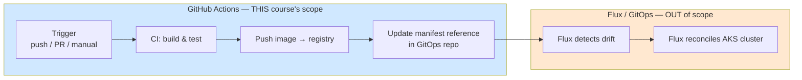
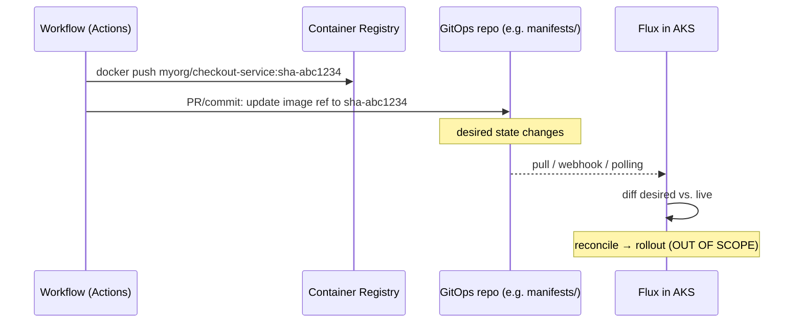
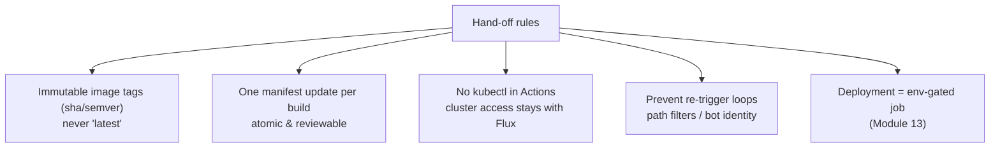
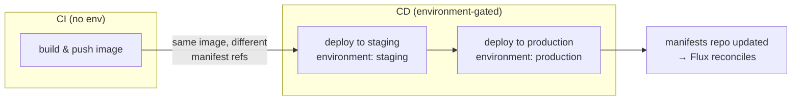

# Module 11 — Deployment Integration (Overview)

> **Confidential · Stalwart Learning**
> GitHub Actions — CI/CD Enablement & Migration · Session 3 · Module 11
> Level: Beginner → Intermediate. Where GitHub Actions' responsibility ends in a GitOps model — the clean hand-off boundary from workflow → registry → manifest reference → Flux. Flux reconciliation and AKS deployment mechanics are intentionally out of scope.

---

## 1. Overview

In an Azure DevOps world, a Release Pipeline commonly runs the deployment itself: a `Kubernetes@1` or `AzureWebApp@1` task talks to AKS/Azure App Service and makes the change happen. In **this team's architecture** that job belongs to **Flux (GitOps)**, not to the CI/CD platform. GitHub Actions does the *integration* work — build, push, and declare the new image reference — and then **stops**. Flux watches the declared state and reconciles the cluster.

That boundary is the single most important concept in this module:



> **Why it matters:** if Actions *applies* manifests with `kubectl`, you now have **two sources of truth** (Actions and Flux) fighting over the cluster. The outline is explicit: GitHub Actions' job ends at **build → push image → update manifest reference**. Flux reconciliation is out of scope — but you must make the hand-off *clean* enough that Flux can act on it.

| Azure DevOps | GitHub Actions + Flux |
|---|---|
| Release pipeline runs `kubectl apply` / `AzureWebApp@1` | Actions pushes image + updates GitOps manifest; **Flux applies** |
| Release stages = deployment environments | Environment-gated job updates a manifest reference (Module 13) |
| `Kubernetes@1` task with service connection | No direct cluster access — the GitOps repo *is* the interface |
| Manual approval gates on stages | Environment **required reviewers** (Module 13) |

---

## 2. The hand-off point — what "deployment integration" actually means

For a containerised microservice on AKS the Actions side of the hand-off is three steps:

1. **Build & push** an immutable image (tagged by `sha`/semver — Module 09).
2. **Decide the target** (which environment / which cluster the image is destined for) — done via *environments* (Module 13).
3. **Update the image reference** in the GitOps repository so Flux has new desired state.



The key mental shift for ADO veterans: **your pipeline no longer needs cluster credentials at all.** The only thing it writes to is a *git repository*. This is why OIDC (Module 12) can be scoped to a registry/cloud, and why secret exposure risk plummets — the "deploy" credential is just the GitOps repo's write token.

---

## 3. Mechanisms for updating the manifest reference

You're changing one line in a YAML (e.g. `image: myorg/checkout-service:sha-abc1234`) inside a GitOps repo. Three mechanisms, in increasing order of how commonly they're used with Flux:

| Mechanism | How it works | Best for | Risk |
|---|---|---|---|
| **1. Git commit/PR from the workflow** | Workflow clones `manifests` repo, edits the image line, pushes a commit (or opens a PR) | Explicit, auditable, keeps GitOps "git as source of truth" | Needs a write token for the manifests repo; must not loop (`on: push` re-trigger) |
| **2. `repository_dispatch` / webhook to Flux** | Actions signals "new image available"; Flux Image Automation or a webhook-receiver reconciles | Decoupling, avoiding git-write from Actions | Requires extra Flux config (out of scope here) |
| **3. Flux Image Automation (`ImagePolicy`/`ImageRepository`)** | Flux *polls* the registry and bumps its own manifest automatically | Fully GitOps-native, zero Actions involvement | Flux mechanics — out of scope; just know it exists as an alternative |

The recommended default for this course is **mechanism 1 — a controlled commit**, because it keeps the "who changed what" trail in git and it's the pattern participants will replicate:

```yaml
name: Bump GitOps manifest
on:
  workflow_dispatch: {}
  push:
    branches: [main]

jobs:
  build-push:
    runs-on: ubuntu-latest
    outputs:
      image: ${{ steps.tag.outputs.image }}
    permissions:
      contents: read
      packages: write
    steps:
      - uses: actions/checkout@v4
      - uses: docker/login-action@v3
        with:
          registry: ghcr.io
          username: ${{ github.actor }}
          password: ${{ secrets.GITHUB_TOKEN }}
      - id: tag
        run: echo "image=${{ vars.IMAGE_REGISTRY }}/${{ github.repository }}:sha-${{ github.sha }}" >> "$GITHUB_OUTPUT"
      - uses: docker/build-push-action@v6
        with:
          push: true
          tags: ${{ steps.tag.outputs.image }}

  update-manifests:
    needs: build-push
    runs-on: ubuntu-latest
    permissions:
      contents: write            # only this job needs write — least privilege
    steps:
      - uses: actions/checkout@v4
        with:
          repository: myorg/aks-manifests      # the GitOps repo
          token: ${{ secrets.GITOPS_APP_TOKEN }}
      - name: Update image reference
        run: |
          sed -i "s|image: .*checkout-service:.*|image: ${{ needs.build-push.outputs.image }}|" \
            apps/checkout-service/base/deployment.yaml
      - name: Commit & push
        run: |
          git config user.name "ci-bot"
          git config user.email "ci-bot@users.noreply.github.com"
          git add apps/checkout-service/base/deployment.yaml
          git commit -m "ci: bump checkout-service to ${{ needs.build-push.outputs.image }}"
          git push
```

> **ADO mapping:** this job ≈ a *release pipeline that triggers a GitOps repository update* instead of deploying. The old ADO `kubectl apply` step simply does not exist on the Actions side. If you previously kept a "deployment repo" that release pipelines pushed to, the pattern is near-identical — only the target of the git write changed (manifests repo instead of an app-spec repo).

---

## 4. Hand-off hygiene — rules that keep GitOps working



1. **Immutable tags.** Flux diffs `desired vs live`; if the tag is `latest`, every reconciliation is ambiguous and rollbacks break. Tag by `sha`/semver (Module 09 §4).
2. **One atomic change per build.** Commit exactly the image-line bump, not a pile of unrelated edits.
3. **No `kubectl` in Actions.** If you find yourself writing `kubectl apply`, stop — that bypasses Flux and creates split-brain. The GitOps repo is the only deployment interface.
4. **No trigger loops.** If the manifests repo is the *same* repo as the app repo, a push trigger on the manifest commit re-runs the build. Fix with `paths:` filters, or put manifests in a **separate repository** (recommended) so `on: push` to the app repo never fires.
5. **Bot identity.** Commit manifest changes as a dedicated CI bot/App token (`GITOPS_APP_TOKEN`), never a human's personal token — audit trail is cleaner and the bot can be a CODEOWNER target (Module 14).

---

## 5. Deployment Integration + Environments — the shape of a production hand-off

The hand-off *target* (which environment the image is for) is decided by **environments** — the topic of Module 13. The integration pattern to hold onto now:



The *same* immutable image flows through every environment; only the manifest reference (and the environment-gated job) changes. This is the direct structural successor to ADO **stages** — but where ADO stages *execute* deployment, here each stage is a *declaration* hand-off that Flux consumes.

---

## 6. Copilot checkpoint

Ask Copilot to build the hand-off correctly and guard the boundary:

> "Create a job that runs after a build-push job, checks out `myorg/aks-manifests`, replaces the image reference for `checkout-service` using the `needs.build-push.outputs.image` value, and commits it with a bot identity. Add a `paths:` filter or separate-repo note so the manifest commit does not re-trigger the workflow. Do **not** add any kubectl/cluster steps."

Then review: does the output *only* write to git? Is `permissions: contents: write` scoped to this one job? Is the image tag immutable (sha/semver), never `latest`? Would Flux actually pick up the change?

---

## 7. Beginner pitfalls

1. **Applying manifests directly with `kubectl`** — bypasses Flux, creates two sources of truth. Don't.
2. **Tagging `latest`** — breaks Flux diffing, rollbacks, and audit. Tag by `sha`/semver.
3. **Manifest commit re-triggering the build** — an infinite build loop if manifests live in the app repo without `paths:` filters.
4. **Using a personal token for GitOps writes** — no audit isolation; use a bot/App token.
5. **Updating the wrong reference** — always target the exact service/deployment YAML; a `sed` without a scoped path can bump the wrong image.
6. **Skipping the PR/branch-protection path** — direct pushes to the manifests repo bypass review. Use a PR + CODEOWNERS (Module 14) for production manifests.

---

## 8. What's next

The deployment hand-off assumes you can *prove identity* (push to ACR, write to manifests repo) without storing long-lived cloud credentials — that's exactly what **Module 12 (OIDC)** solves. And the "which environment does this deploy to" decision is **Module 13 (Environments & Approval Gates)**.

---

## 9. References

- GitHub Actions and GitOps integration patterns — https://docs.github.com/en/actions/security-guides/security-hardening-for-github-actions
- Triggering workflows with `repository_dispatch` — https://docs.github.com/en/actions/using-workflows/events-that-trigger-workflows#repository_dispatch
- Restricting workflow triggers with `paths:` — https://docs.github.com/en/actions/using-workflows/workflow-syntax-for-github-actions#onpushpull_requestpull_request_targetpathspaths-ignore
- Building CI/CD with GitOps (GitHub docs, Flux context) — https://docs.github.com/en/actions/deployment/deploying-with-github-actions
- Session 3 boundary note (outline §Scope Notes): Flux/GitOps mechanics are out of scope — this module covers only the Actions→GitOps hand-off.