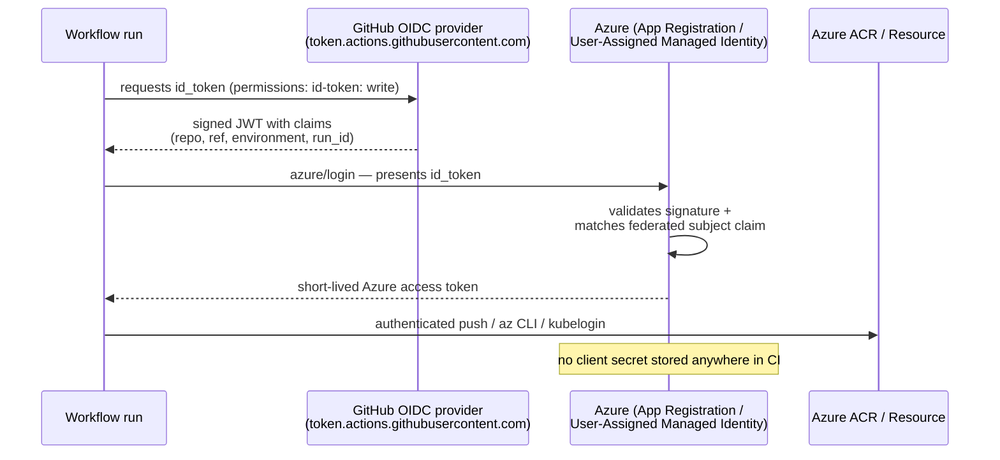
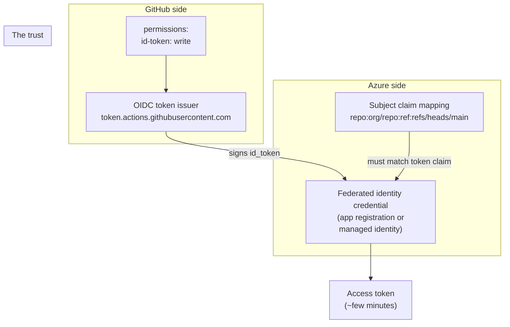
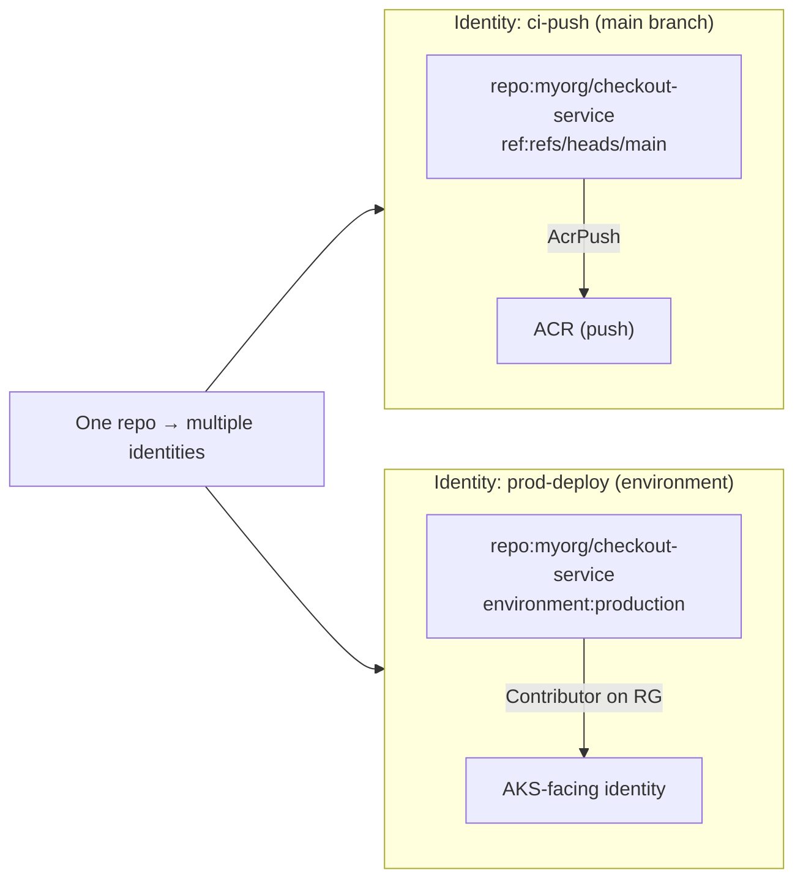
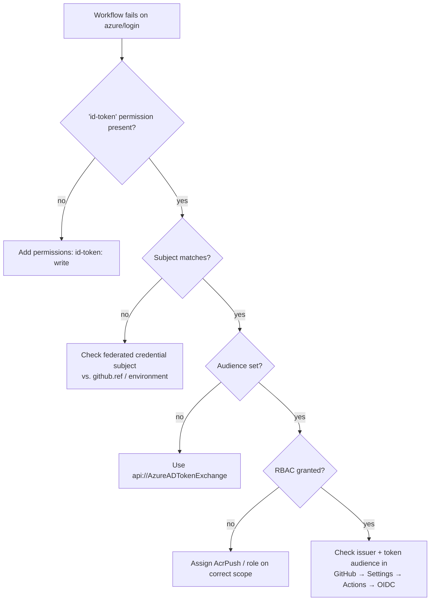

# Module 12 — Keyless Cloud Authentication (OIDC)

> **Confidential · Stalwart Learning**
> GitHub Actions — CI/CD Enablement & Migration · Session 3 · Module 12
> Level: Beginner → Intermediate. Why OpenID Connect (OIDC) federation replaces long-lived cloud credentials in workflows, how the trust works, and how to configure it between GitHub Actions and Azure (ACR push + AKS-facing identity).

---

## 1. Overview

Until now, authenticating to Azure from a pipeline meant storing a **service principal secret** (or a shared key) in a secret store and passing it to a login task. Every time a workflow runs it uses the *same* long-lived credential. If that secret leaks — a log line, a mis-scoped secret, a compromised repo — an attacker holds a key to your entire cloud subscription until someone rotates it manually.

**OIDC (OpenID Connect) federation replaces the shared secret with a short-lived, per-run identity.** GitHub issues a signed token that says *"this specific workflow run, from this specific repo, on this specific branch/environment, is running"*. Azure verifies that token against a **federated identity credential** you configure once, and issues an access token valid for minutes. No cloud secret ever sits in your workflow.



| Azure DevOps | GitHub Actions |
|---|---|
| Service connection (username/password or SPN secret) | **OIDC federated credential** + `azure/login-action` |
| `AzureCLI@2` task using the service connection | `azure/login-action@v2` with `client-id`/`tenant-id`/`subscription-id` |
| Service principal key rotation (manual, onerous) | **No key to rotate** — token is minted per run |
| Workload Identity federation (newer ADO) | Equivalent trust model, natively supported |

> **The one-line promise:** "The workflow is trusted because it *is* who it says it is" — not because it holds a password. This is the production-grade replacement for the ACR secret login shown in Module 09 §2 (Option 3).

---

## 2. How the trust works — the three pieces



1. **`permissions: id-token: write`** — the workflow asks GitHub to mint an OIDC token for it. Without this, the `id_token` is not available.
2. **Federated identity credential** — Azure object (App Registration or User-Assigned Managed Identity) configured to accept tokens *only* from GitHub's OIDC issuer, and *only* when the token's **subject** matches a pattern you define.
3. **Subject claim** — the *condition* that scopes the trust. GitHub sends claims like:

   - `repo:myorg/checkout-service:ref:refs/heads/main` — any workflow in that repo on `main`
   - `repo:myorg/checkout-service:environment:production` — only when the run targets the `production` environment
   - `repo:myorg/checkout-service:ref:refs/tags/*` — tag pushes only

> **Security rule:** the narrower the subject, the safer. A subject of `repo:myorg/*:ref:*` trusts *every* branch in *every* repo under the org. Prefer branch- or environment-scoped subjects for anything that touches production.

---

## 3. Step 1 — Configure the Azure side (one-time setup)

You need an identity Azure will trust. Two options:

| Option | Best for | Creation path |
|---|---|---|
| **App Registration** (service principal) | Workflows that need RBAC as an application | `az ad app create` + assign RBAC |
| **User-Assigned Managed Identity** | Same identity reused across resources / simpler RBAC | `az identity create` + assign RBAC |

Then add a **federated identity credential** and grant the identity the RBAC role it needs (e.g. `AcrPush` on the registry, `Contributor` on a resource group for `az` tasks).

```bash
# 1) Create app registration (or managed identity)
az ad app create --display-name gh-actions-oidc

# 2) Add the federated credential (GitHub → Azure trust)
az ad app federated-credential create \
  --id <app-id> \
  --parameters '{
    "name": "checkout-service-main",
    "issuer": "https://token.actions.githubusercontent.com",
    "subject": "repo:myorg/checkout-service:ref:refs/heads/main",
    "audiences": ["api://AzureADTokenExchange"]
  }'

# 3) Grant RBAC — example: push access to ACR
az role assignment create \
  --assignee <app-id-or-object-id> \
  --role AcrPush \
  --scope /subscriptions/<sub>/resourceGroups/<rg>/providers/Microsoft.ContainerRegistry/registries/<acr>
```

> **`audiences` matters:** `api://AzureADTokenExchange` is GitHub's convention and must match — Azure uses it to accept GitHub's token as a federated credential.

---

## 4. Step 2 — Use it in the workflow (`azure/login-action`)

The login action exchanges the GitHub `id_token` for an Azure access token. You only supply the **identity's identifiers and the subscription** — never a secret.

```yaml
name: Build, Push & Publish (OIDC)
on:
  push:
    branches: [main]

permissions:
  contents: read
  id-token: write          # ← REQUIRED for OIDC token

jobs:
  build-push-acr:
    runs-on: ubuntu-latest
    steps:
      - uses: actions/checkout@v4

      - name: Azure login (keyless)
        uses: azure/login@v2
        with:
          client-id: ${{ secrets.AZURE_CLIENT_ID }}       # NOT a secret — app/client id
          tenant-id: ${{ vars.AZURE_TENANT_ID }}           # tenant id
          subscription-id: ${{ vars.AZURE_SUBSCRIPTION_ID }}
          enable-AzPSSession: false

      - name: Login to ACR (uses the federated identity, no password)
        uses: azure/docker-login@v2
        with:
          login-server: ${{ vars.ACR_NAME }}.azurecr.io
          username: ${{ vars.AZURE_CLIENT_ID }}            # federated identity client id
          password: ${{ secrets.AZURE_CLIENT_ID }}         # ← the OIDC *token*, injected as password
```

Wait — **what is `password` here?** Under the hood `azure/docker-login` (or `az acr login`) uses the identity that `azure/login` established. There is **no static password**. If a plain `docker/login-action` is preferred for ACR, you would first `az acr login --name <acr>` then `docker pull/push` — the access token is short-lived and local to the run.

> **ADO mapping:** this replaces the **ACR service connection** (username/password) entirely. The ADO equivalent of the federated credential is *Workload Identity federation* — same model, different portal. Migration: create the GitHub-side federated credential, add `azure/login` to the workflow, delete the stored SPN secret.

---

## 5. The claims you can (and should) pin

The subject claim is how you make "keyless" *also* "scoped". Example federated credentials for the same repo:

| Subject | Effect |
|---|---|
| `repo:myorg/checkout-service:ref:refs/heads/main` | CI from `main` only |
| `repo:myorg/checkout-service:environment:production` | **only the production environment job** (best for prod identity) |
| `repo:myorg/checkout-service:ref:refs/tags/v*` | release tag pushes |
| `repo:myorg/checkout-service:*` | any ref — too broad, avoid for prod |



**Environment-scoped subjects are the intersection of Modules 12 + 13:** pair the `environment:` on the job (Module 13) with a matching subject claim, and production deployments require *both* an approval gate *and* an identity that only exists for that environment.

---

## 6. Using the identity for AKS / kubectl (without breaking GitOps)

If a workflow legitimately needs to read cluster state (not deploy — that's Flux), use `azure/login` + `kubelogin`:

```yaml
      - name: Azure login
        uses: azure/login@v2
        with:
          client-id: ${{ secrets.AZURE_CLIENT_ID }}
          tenant-id: ${{ vars.AZURE_TENANT_ID }}
          subscription-id: ${{ vars.AZURE_SUBSCRIPTION_ID }}

      - name: Set AKS context
        uses: azure/aks-set-context@v3
        with:
          cluster-name: ${{ vars.AKS_CLUSTER }}
          resource-group: ${{ vars.AKS_RG }}
          admin: false

      - name: Read cluster state (read-only)
        run: kubectl get nodes -o wide
```

> **Boundary reminder (Module 11):** reading state is fine; *applying* manifests from Actions is not part of this team's GitOps model. Keep OIDC-powered cluster access read-only.

---

## 7. Troubleshooting OIDC



Common failure modes and fixes:

1. **`Error: No OIDC token found`** — forgot `permissions: id-token: write`, or the job is calling the login without it.
2. **`AADSTS700211` / subject mismatch** — the federated credential's `subject` doesn't match the token's actual `repo:...:ref:...` or `environment:` claim. Look at the run's claimed `actor`/`ref` and fix the subject.
3. **Audience error** — `aud` on the GitHub token must be `api://AzureADTokenExchange`.
4. **`Authorization failed: ... not found in the service principal`** — RBAC not assigned, or you assigned it to the wrong object (app vs. managed identity).
5. **Works on `main`, fails on PR** — the subject pins `refs/heads/main`; a PR ref (`refs/pull/N/merge`) can't match. Use `environment:` subjects or add a PR-specific credential.

---

## 8. Copilot checkpoint

Use Copilot to both *write* the login block and *audit* the subject security:

> "Add an Azure OIDC login step to this workflow using `azure/login@v2` with `client-id`, `tenant-id`, `subscription-id`, and `permissions: id-token: write`. Then generate the `az ad app federated-credential create` command for a subject that only allows the `production` environment of `myorg/checkout-service`."

Review Copilot's output: is `id-token: write` present but *scoped* (`contents: read` alongside)? Is the subject claim environment-specific rather than `*`? Are the Azure IDs passed as `vars`/`secrets` and never hard-coded or logged?

---

## 9. Beginner pitfalls

1. **`id-token: write` at workflow level when only one job needs it** — put `permissions:` on the *job* for least privilege.
2. **Broad subjects (`repo:org/*:ref:*`)** — one leaked repo's workflow can impersonate every identity. Pin ref/environment.
3. **Keeping the old SPN secret "just in case"** — that's a long-lived key still in rotation; delete it after OIDC is validated.
4. **Hard-coding tenant/subscription IDs in YAML** — use `vars`; IDs are non-secret but should still be config.
5. **Thinking `secrets.AZURE_CLIENT_ID` is a secret** — client ids are public identifiers, not credentials; the *token* is the credential and it's minted per-run.
6. **Forgetting the audience** in the federated credential — the whole exchange fails with a confusing AADSTS error.

---

## 10. What's next

OIDC proves *which identity* the run has. **Module 13** adds the human decision on top — environment protection rules and approval gates — and the environment-specific subject claims above become the bridge between the two modules.

---

## 11. References

- About security hardening with OIDC — https://docs.github.com/en/actions/security-guides/security-hardening-for-github-actions
- Configuring OIDC in Azure — https://docs.github.com/en/actions/security-guides/configuring-openid-connect-in-azure
- Azure OIDC deployment example — https://docs.github.com/en/actions/security-guides/using-openid-connect-with-azure
- `azure/login-action` — https://github.com/Azure/login
- `azure/docker-login` (ACR via OIDC) — https://github.com/Azure/docker-login
- Microsoft: workload identity federation (ADO equivalent) — https://learn.microsoft.com/en-us/azure/devops/pipelines/release/configure-workload-identity
- Federated credentials on App Registration — https://learn.microsoft.com/en-us/entra/identity-platform/workload-identity-federation