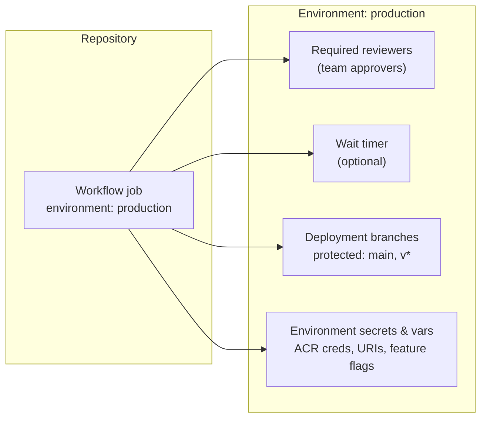
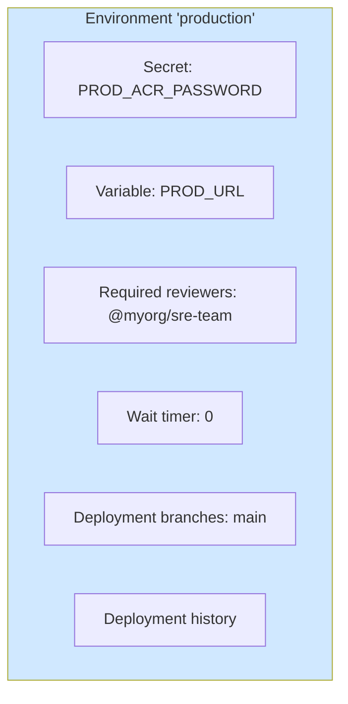
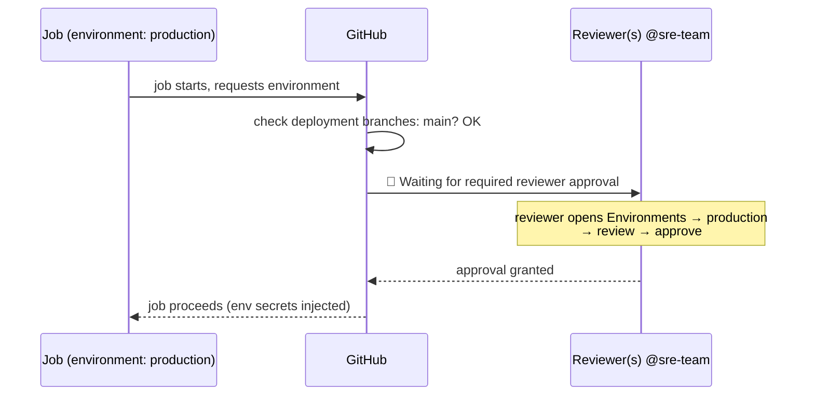
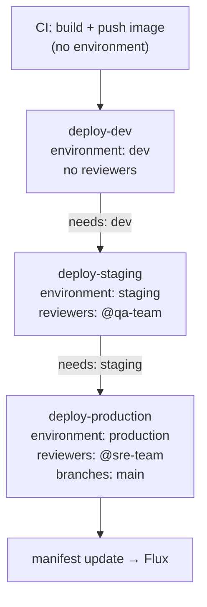
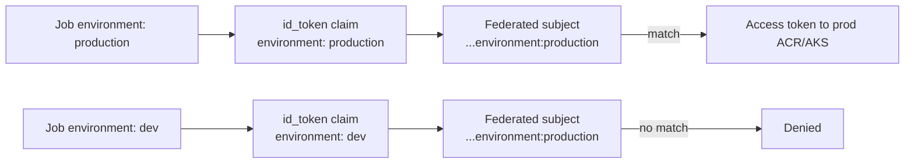

# Module 13 — Environments & Approval Gates

> **Confidential · Stalwart Learning**
> GitHub Actions — CI/CD Enablement & Migration · Session 3 · Module 13
> Level: Beginner → Intermediate. GitHub Environments — protection rules, required reviewers, deployment branches, and modelling promotion across dev / staging / production.

---

## 1. Overview

An **environment** is a named target that a workflow job can deploy to — `dev`, `staging`, `production`, per-tenant, etc. It's the closest GitHub Actions analogue to an **ADO environment / release stage**, and it bundles three concerns that Azure DevOps splits across different features:

1. **Protection rules** — who may deploy, and under what conditions (approval gates, wait timers, allowed branches).
2. **Scoped configuration** — environment-specific **secrets** and **variables** (Module 06).
3. **Deployment history & traceability** — every run against the environment is recorded.



| Azure DevOps | GitHub Actions |
|---|---|
| Environments (project) + stage approval gates | **Environments** with **required reviewers** |
| Stage gates: approvals + checks | Protection rules: reviewers, wait timer, deployment branches |
| Environment-scoped variables/secrets | Environment secrets & variables |
| Deployments tab per environment | Environment page with run history & deployment status |
| "Approvals and checks" on an environment | Required reviewers + deployment branch rules |

---

## 2. What an environment *is* (and isn't)



- An environment is **not a runner, not a server, not a namespace** — it's a *named gate + config bundle* attached to your repo.
- A job declares an environment with the `environment:` key. GitHub then:
  - resolves **environment secrets/vars** for the run,
  - blocks the job until **protection rules** pass (approval, wait timer, branch check),
  - records a **deployment** in the environment's UI.
- Multiple jobs can target the same environment; the deployment timeline shows each one.

> **ADO mapping:** in ADO you'd model this as a stage per environment with *Approvals and checks* (manual validation, branch filters). In Actions it's the same idea expressed as `environment:` on a job + protection rules configured in *Repo Settings → Environments*.

---

## 3. Protection rules — the approval gate

Two rules dominate real usage: **required reviewers** and **deployment branches**. A third, **wait timer**, is useful for canary-ish soak time before the job proceeds.



Configuring required reviewers (UI): *Settings → Environments → production → Deployment protection rules → Required reviewers* — add individuals **or teams**. If reviewers is a **team**, the job waits until *any* team member approves (not all).

```yaml
jobs:
  deploy-production:
    runs-on: ubuntu-latest
    environment: production           # ← the gate
    needs: [build, test, deploy-staging]
    steps:
      - name: Update GitOps manifest for production
        run: ...                      # Module 11 hand-off, guarded by the approval
```

> **Key behavioural detail:** the job **pauses before its first step** until protection rules pass. The approval is *per environment*, so `needs:` chaining (staging → production) makes promotion explicit and auditable.

---

## 4. Deployment branches — scoping *who can even ask*

A protection rule that says: **"only runs from these branches may target this environment."** Combined with branch protection (Module 14) this keeps prod deploys off feature branches even if someone triggers a workflow manually.

| Rule | Effect | Production recommendation |
|---|---|---|
| **Deployment branches** | Job is skipped/rejected unless `github.ref` matches | `main` (and maybe `v*` release tags) |
| **Required reviewers** | Job waits for human approval | A dedicated team (`@sre-team`) |
| **Wait timer** | Job waits N minutes after rule satisfaction | Optional soak time |

```yaml
jobs:
  deploy:
    runs-on: ubuntu-latest
    environment:
      name: production
      url: https://${{ vars.PROD_URL }}     # deployment URL shown in environment UI
    steps:
      - run: echo "deploying from ${{ github.ref }}"
```

> **ADO mapping:** "deployment branches" ≈ a stage *Approval & checks* branch filter, or the classic ADO "trigger only from main" on the release pipeline. The difference: in Actions the check happens at *job run time* on the current `github.ref`, not at pipeline definition time.

---

## 5. Modelling promotion across dev → staging → production

The canonical shape: one immutable image, three environment-gated hand-offs. Each stage's job declares a *different* environment, so each gets its own reviewers and its own env-scoped secrets.



```yaml
name: Promote
on:
  push:
    branches: [main]

jobs:
  build:
    runs-on: ubuntu-latest
    outputs:
      image: ${{ steps.tag.outputs.image }}
    steps:
      - id: tag
        run: echo "image=${{ vars.IMAGE_REGISTRY }}/${{ github.repository }}:sha-${{ github.sha }}" >> "$GITHUB_OUTPUT"

  deploy-dev:
    needs: build
    runs-on: ubuntu-latest
    environment: dev
    steps:
      - run: echo "update dev manifest → ${{ needs.build.outputs.image }}"

  deploy-staging:
    needs: [build, deploy-dev]
    runs-on: ubuntu-latest
    environment: staging
    steps:
      - run: echo "update staging manifest → ${{ needs.build.outputs.image }}"

  deploy-production:
    needs: [build, deploy-staging]
    runs-on: ubuntu-latest
    environment: production
    steps:
      - run: echo "update production manifest → ${{ needs.build.outputs.image }}"
```

**Design guidance:**

- **Same immutable image, different manifest refs** — you never rebuild for an environment; you re-point the reference (Module 11 §5).
- **`needs:` chains serialise promotion.** `deploy-production` can't start until `deploy-staging` succeeds *and* its approval passes.
- **Keep `dev` frictionless** (no reviewers), add reviewers at `staging`/`production`. Approval fatigue kills the pipeline's usefulness.
- **Environment-specific secrets**: ACR login per environment, `PROD_URL`, feature-flag namespaces — all live on the environment, not in the workflow.

---

## 6. Environment secrets & variables in action

Environment-scoped config beats hard-coded stage logic. Because secrets resolve only when the run targets that environment (Module 06), the *same workflow file* deploys to dev, staging, and prod with zero secrets leaking across boundaries.

```yaml
jobs:
  deploy:
    runs-on: ubuntu-latest
    environment: ${{ matrix.env }}        # dev / staging / production
    strategy:
      matrix:
        env: [dev, staging, production]
    steps:
      - name: Push to environment registry
        run: docker push "${{ vars.ACR }}/${{ github.repository }}:${{ github.sha }}"
        env:
          ACR: ${{ secrets.ACR_SERVER }}  # different per environment
```

> **ADO mapping:** environment variables/secrets ≈ ADO **environment-scoped variables** (or a variable group bound per environment). The lookup order env > repo > org from Module 06 applies identically here.

---

## 7. Environments + OIDC (the Module 12 bridge)

The environment name flows into the **OIDC subject claim** — this is how a production environment gets an identity that literally cannot be used from a dev run:

- Job sets `environment: production` → GitHub includes `environment:production` in the `id_token` → Azure federated credential with subject `repo:myorg/checkout-service:environment:production` accepts it; the dev identity (subject pinned to `refs/heads/main`) does **not** match → dev runs can't touch prod resources.



---

## 8. Copilot checkpoint

> "Write a deployment workflow with three jobs: `deploy-dev` (no reviewers), `deploy-staging` (required reviewers `@qa-team`), and `deploy-production` (required reviewers `@sre-team`, deployment branches `main`). Each job uses `environment:` with the same image output from a `build` job, and sets `environment.url` from a per-environment `vars` value. Do not add kubectl steps — the final step updates a manifest reference."

Then review: is `environment:` on *each* job (not just the workflow)? Is `needs:` chaining in the right order? Are the protection-rule *config* instructions (Settings → Environments) included so a reader can actually build it?

---

## 9. Beginner pitfalls

1. **Environment on the workflow, not the job** — `environment:` is a **job-level** key. Putting it at workflow level silently does nothing (or is ignored).
2. **Self-approval confusion** — the approving user must not be the same user who triggered the run (GitHub prevents the actor from approving their own run unless configured otherwise; plan team reviewers).
3. **Approval blocks the whole run** — a *required reviewer* pauses the job indefinitely until someone approves; add a **wait timer** or clear ownership so runs don't hang.
4. **Using `${{ secrets.X }}` from the wrong environment** — env secrets resolve only when the run targets that environment; a job without `environment:` sees repo/org secrets, not env secrets.
5. **Bypassing gates via `workflow_dispatch`** — manual runs still honour protection rules (that's the point). Ensure reviewers understand they're approving real deploys.
6. **One giant `matrix` to prod** — matrix over environments serialises unexpectedly and muddies approval UX; prefer explicit jobs for prod.

---

## 10. What's next

Environments control *who can deploy and from where*. **Module 14** covers the wider access-control picture — team-based permissions, branch protection, and CODEOWNERS — so those approvals and branches are enforced by people, not by convention.

---

## 11. References

- Using environments for deployment — https://docs.github.com/en/actions/deployment/using-environments-for-deployment
- Deployment protection rules — https://docs.github.com/en/actions/reference/protections-and-approvals-for-deployment
- Environment secrets — https://docs.github.com/en/actions/security-guides/using-secrets-in-github-actions
- Environments for PRs (`environment` on PR merge branches) — https://docs.github.com/en/actions/deployment/targeting-different-environments
- ADO equivalent: environments & approvals — https://learn.microsoft.com/en-us/azure/devops/pipelines/process/approvals