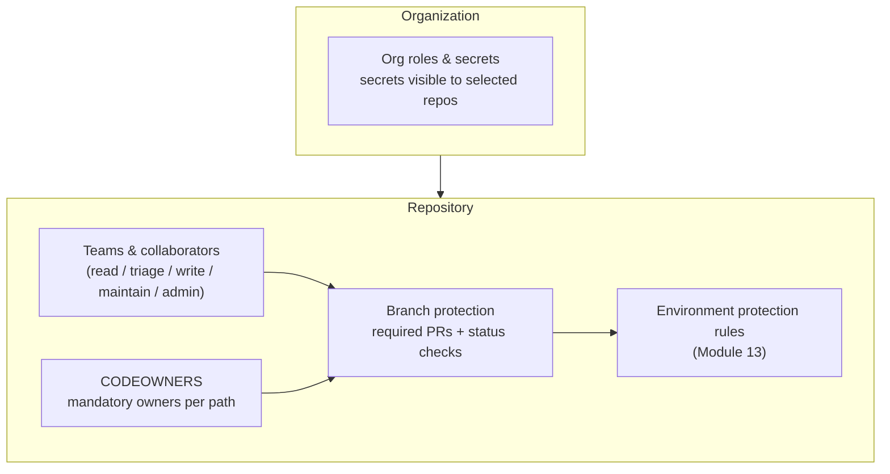
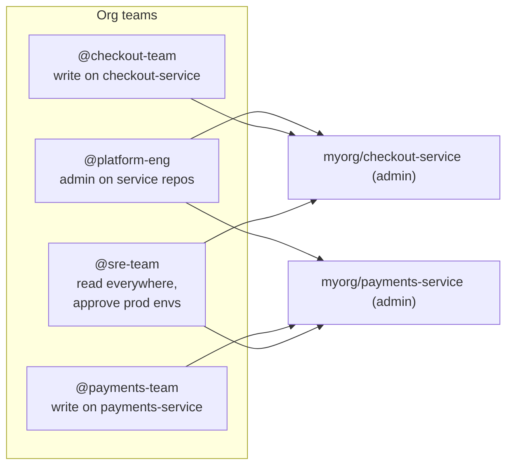
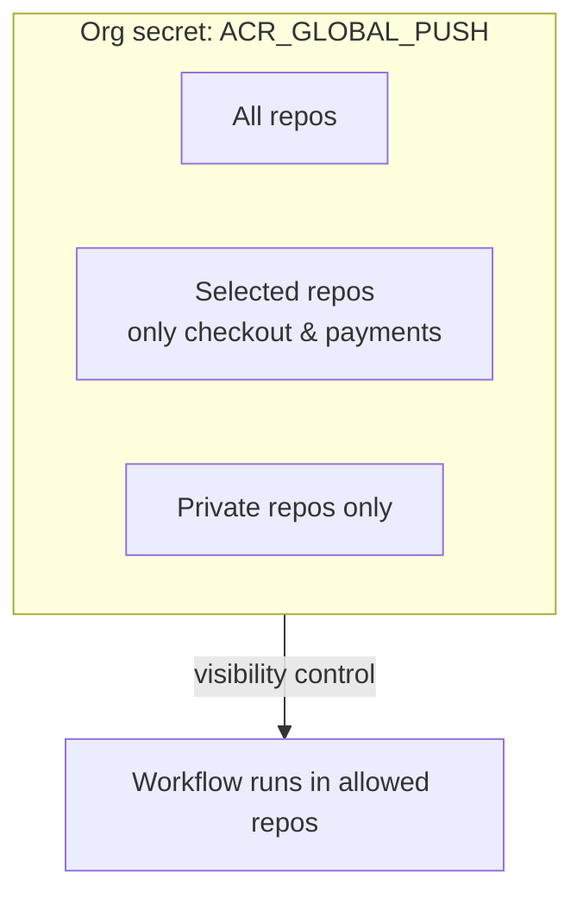
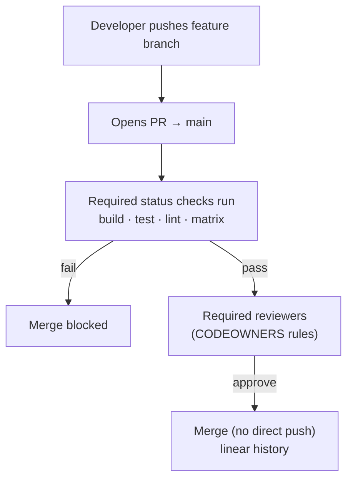
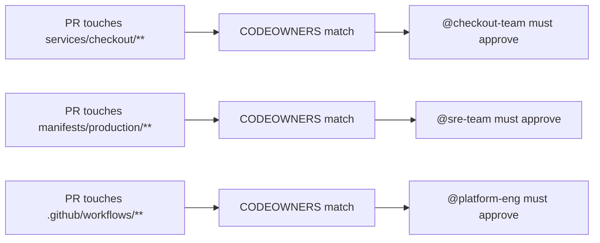
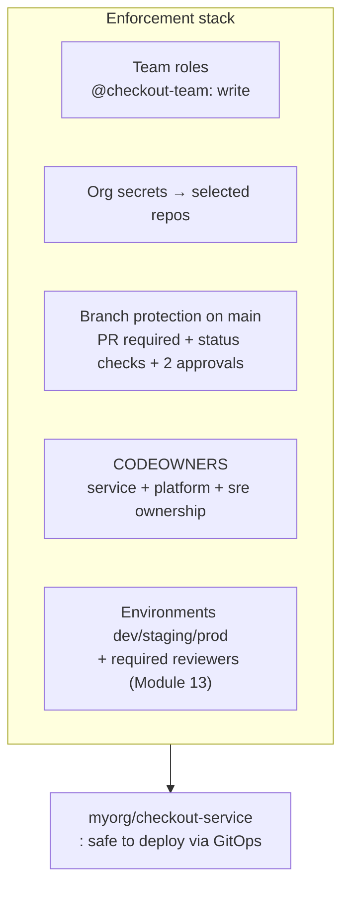

# Module 14 — Team-Based Access Control

> **Confidential · Stalwart Learning**
> GitHub Actions — CI/CD Enablement & Migration · Session 3 · Module 14
> Level: Beginner → Intermediate. Repository, environment, and organisation-scoped secrets and permissions; branch protection rules and required status checks; CODEOWNERS for enforcing review ownership by team/service; and mapping ADO service connections / variable groups to GitHub equivalents (overview).

---

## 1. Overview

"Who can do what" in GitHub has *layers*. In Azure DevOps you configure **project permissions**, **git permissions**, **branch policies**, and **service-connection/variable-group security** in different blades. GitHub compresses this into a smaller, sharper model — and it's the model that protects your production manifests and deployments (Modules 11–13 depend on it).



| Azure DevOps | GitHub Actions |
|---|---|
| Project-level permissions / teams | **Organization teams** + repo roles |
| Git permissions (branch security) | **Branch protection rules** |
| Branch policies (build validation, reviewers) | **Required status checks** + CODEOWNERS |
| Service connection permissions | **Environment protection rules** + secrets visibility (Modules 12–13) |
| Library variable-group permissions | **Org-level secrets** (selected repositories) |

---

## 2. Teams & roles — the base layer

GitHub teams map to ADO security groups. Assign a **team** a role on a repo; every member inherits it. The roles you actually use:

| Role | Can | Used for |
|---|---|---|
| `read` | view code/issues, trigger some workflows | auditors, consumers |
| `triage` | manage issues/PRs (no code) | support teams |
| `write` | push, open/merge PRs | **service owners** (default dev role) |
| `maintain` | manage repo settings short of admin | platform engineers |
| `admin` | everything incl. branch protection & env config | platform/DevOps leads |



> **ADO mapping:** `@team` role on a repo ≈ ADO "git repository permission" for a security group. The big win: **teams, not individuals** — permissions follow the team, so onboarding/offboarding stops being a per-repo chore.

---

## 3. Organisation-scoped secrets & permissions

Secrets (and variables) exist at three scopes (Module 06 §4). The org scope is where team-based control gets interesting: an org secret can be visible to **only selected repositories**, and environment secrets (Module 13) are per-repo but gated by protection rules.



- **Org secrets** — shared config/credentials, with a visibility whitelist. The replacement for ADO *variable groups* shared across projects.
- **Org-level permissions** — who can *manage* org secrets vs. use them. Keep secret administration with `@platform-eng`.
- **Environment secrets** — scoped by environment + protection rules (Module 13), so `PROD_ACR_PASSWORD` is only injected into runs that pass the production gate.

```bash
# Org secret visible only to two repos (the ADO variable-group migration pattern)
gh secret set ACR_GLOBAL_PUSH --org myorg \
  --visibility selected \
  --repos myorg/checkout-service,myorg/payments-service
```

> **ADO mapping:** org secrets (selected repos) ≈ variable group with *Pipeline permissions* restricting which pipelines can consume it. Migrate shared variable groups → org variables/secrets; keep environment-specific ones → environment secrets.

---

## 4. Branch protection rules & required status checks

Branch protection is how you stop a merge (or a direct push) unless CI — and people — say so. This is the repo-level gate that sits *in front of* the deployment gates from Modules 11–13.



Key rules to enable (for `main` — and, ideally, for `prod/*` branches):

| Rule | Effect | ADO equivalent |
|---|---|---|
| **Require PRs before merging** | no direct pushes | "Require pull request reviews" branch policy |
| **Require approvals** (count) | N approvals needed | Min number of reviewers |
| **Require status checks** | CI must be green (build, test, lint — the job names) | Build validation policy |
| **Require conversation resolution** | resolved comments only | n/a |
| **Require linear history** | no merge commits, clean `git log` | No merge commits |
| **Block force pushes / deletions** | history can't be rewritten | Protect branch |

```yaml
# Repo-level (not workflow) — configured in Settings → Branches → Add rule.
# Status checks reference the JOB IDs in your workflows:
#   "build (ubuntu-latest)", "test (ubuntu-latest)", "lint"
```

> **The critical link to CI:** status checks match your **job names**. If you rename a job, branch protection silently stops waiting for it — a common "why did the merge go through?" bug. Keep a curated list of required checks.

---

## 5. CODEOWNERS — enforcing review ownership by team/service

CODEOWNERS is a file (`.github/CODEOWNERS`) that says *"changes under these paths must be approved by these people/teams."* For a microservices repo it encodes service ownership directly.

```text
# .github/CODEOWNERS
# Default: everything needs platform-eng
* @myorg/platform-eng

# Service boundaries — team owns its code
/services/checkout/** @myorg/checkout-team
/services/payments/** @myorg/payments-team

# Pipeline changes are platform-owned
/.github/workflows/** @myorg/platform-eng

# Production manifests (GitOps) are SRE-owned — from Module 11
/manifests/production/** @myorg/sre-team
```



Rules of thumb:

- **Teams in CODEOWNERS are better than individuals** — review follows the team, not one person's calendar.
- **Minimum-reviews rule:** set branch protection to require CODEOWNER approval; otherwise CODEOWNERS is advisory only.
- **Use it for the GitOps hand-off (Module 11):** production manifest bumps from the CI bot land as PRs that *must* be approved by `@sre-team` — the human gate sits exactly where Flux picks up.
- CODEOWNERS **replaces ADO's "Required reviewers by path"** — same intent, file-based and versioned with the code.

---

## 6. Putting it together — a protected, service-scoped repo



The full chain: **teams** define *who can act* → **branch protection + status checks** define *what merges* → **CODEOWNERS** defines *who must approve what* → **environments** define *who may deploy where* → **OIDC** defines *which identity deploys* (Module 12). Each layer fails closed.

---

## 7. Migration playbook (ADO → GitHub) — overview level

| ADO concept | GitHub replacement | Migration step |
|---|---|---|
| Project teams & permissions | Org teams + repo roles | Create org teams, assign roles by repo |
| Git branch policies | Branch protection rules | Recreate required checks/reviewers per branch |
| Required reviewers by path | CODEOWNERS | Author `.github/CODEOWNERS` |
| Service connections (ACR/Azure) | OIDC federated credentials (Module 12) | Build OIDC trust, delete SPN secrets |
| Variable groups | Org variables/secrets (selected repos) | `gh variable set` / `gh secret set --org` |
| Environment approvals | Environments + required reviewers (Module 13) | Create environments, add reviewers |
| Build validation | Required status checks | Match workflow job names to checks |

---

## 8. Copilot checkpoint

> "Create a `.github/CODEOWNERS` for a monorepo with `services/checkout/**` owned by `@checkout-team`, `services/payments/**` by `@payments-team`, `/.github/workflows/**` by `@platform-eng`, and `manifests/production/**` by `@sre-team`. Then list the branch-protection rules I should enable on `main` so CODEOWNER approval and the build/test status checks are required."

Review Copilot's output: are the teams correct? Does it include the "require CODEOWNER review" toggle (otherwise ownership is advisory)? Are status-check names aligned with your workflow job names?

---

## 9. Beginner pitfalls

1. **Renaming a job breaks required checks** — branch protection looks up checks by exact job name.
2. **CODEOWNERS without "require CODEOWNER reviews"** — advisory only; the merge won't actually block.
3. **Individual-based permissions/CODEOWNERS** — review belongs to a person; use teams.
4. **Personal tokens for GitOps bot commits** — should be a bot/App token (Module 11 §4).
5. **Broad org-secret visibility (`All repositories`)** — a new repo silently inherits every org secret; use *selected repositories* for sensitive cloud creds.
6. **Environment reviewers bypassed by branch protection** — the two gates are complementary; don't assume one covers the other.

---

## 10. What's next

Access control governs *people*. **Module 15** turns the lens on the *machine* — the `GITHUB_TOKEN` the workflow itself uses, the third-party actions it runs, and the secrets it handles. That's the last hardening layer before Session 4 (monitoring & troubleshooting).

---

## 11. References

- About roles for organizations / teams — https://docs.github.com/en/organizations/managing-peoples-access-to-your-organization-with-roles
- Managing secrets at org level — https://docs.github.com/en/actions/security-guides/using-secrets-in-github-actions#using-organization-secrets
- About branch protection rules — https://docs.github.com/en/repositories/configuring-branches-and-merges-in-your-repository/managing-protected-branches/about-protected-branches
- Required status checks — https://docs.github.com/en/pull-requests/collaborating-with-pull-requests/collaborating-on-repositories-with-code-quality-features/about-status-checks
- About CODEOWNERS — https://docs.github.com/en/repositories/managing-your-repositorys-settings-and-features/customizing-your-repository/about-code-owners
- ADO equivalent: branch policies — https://learn.microsoft.com/en-us/azure/devops/repos/git/branch-policies
- ADO equivalent: service connections & libraries — https://learn.microsoft.com/en-us/azure/devops/pipelines/library/service-endpoints