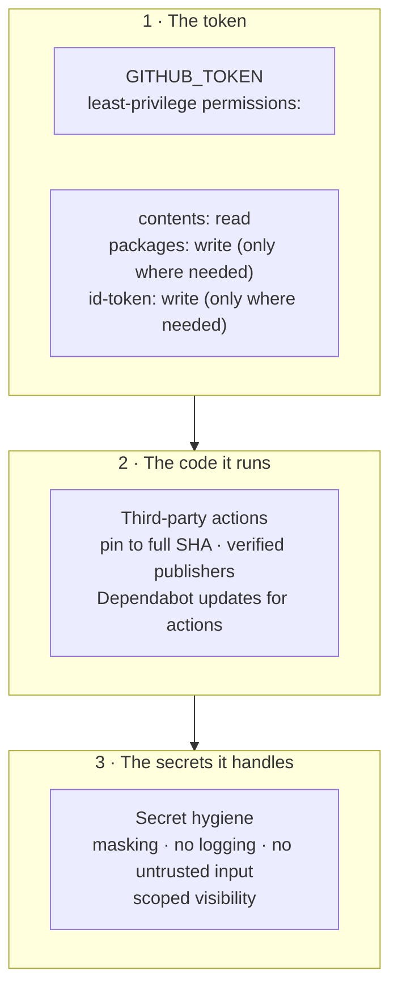
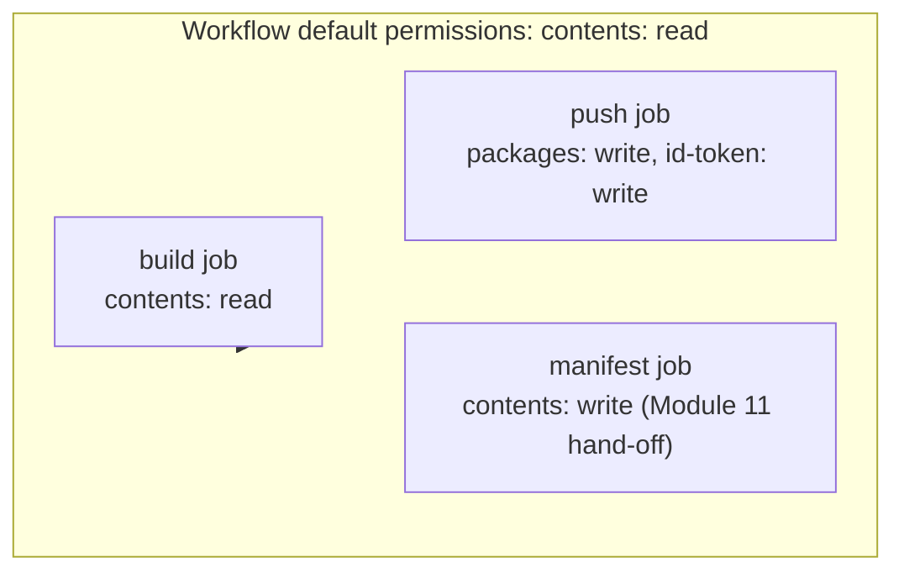
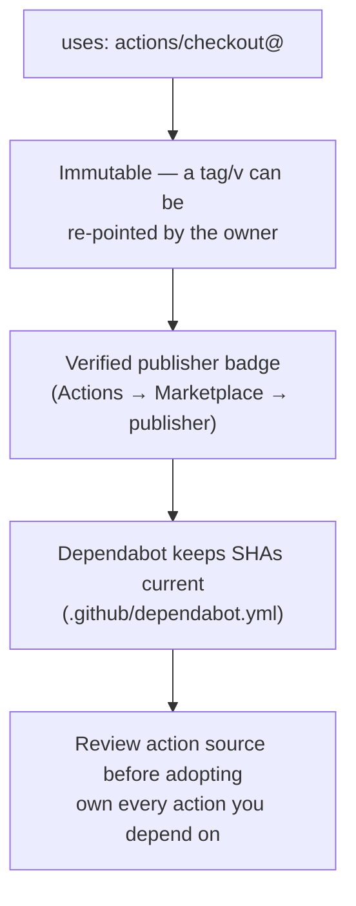
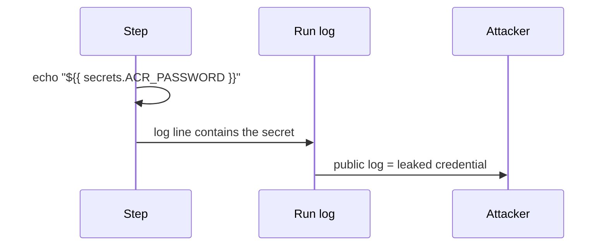
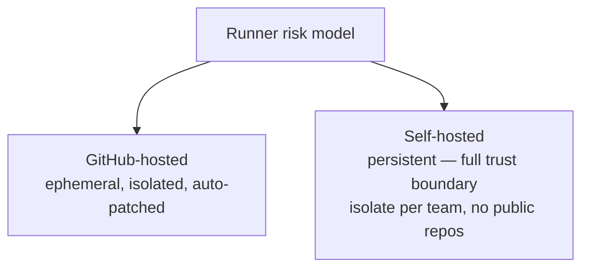

# Module 15 — Securing the Workflow Itself

> **Confidential · Stalwart Learning**
> GitHub Actions — CI/CD Enablement & Migration · Session 3 · Module 15
> Level: Beginner → Intermediate. Least-privilege `GITHUB_TOKEN` permissions, a secure supply chain (pinning actions, verified publishers), and secret hygiene — the hardening that protects the pipeline as a *machine*.

---

## 1. Overview

Modules 12–14 secured *who can deploy*. This module secures **the workflow as an execution environment**: the token it runs with, the third-party code it executes, and the secrets it touches. Three concentric circles:



| Azure DevOps | GitHub Actions |
|---|---|
| Pipeline `$(System.AccessToken)` / OAuth token | **`GITHUB_TOKEN`** (auto-created per run) |
| Token scopes set via project security | **`permissions:` block** on workflow/job |
| Marketplace extensions (pinned? often not) | Actions pinned to **full-length SHA** |
| Variable groups / secret masking | **Secret masking** (`***`) + environment scoping |
| Agent pool access control | Self-hosted runner trust (see §6) |

---

## 2. Least-privilege `GITHUB_TOKEN`

Every workflow run gets a `GITHUB_TOKEN` — a short-lived token for that repo, with a **default permission set** (`contents: read` on most plans; historically `contents: write` for public repos before the change). The `permissions:` block overrides it. **Rule: declare the minimum, at the most specific scope (job > workflow).**

```yaml
# Workflow-level — the minimum a CI-only workflow needs
permissions:
  contents: read

jobs:
  build:
    runs-on: ubuntu-latest
    permissions:
      contents: read
    steps:
      - uses: actions/checkout@v4

  push-image:
    runs-on: ubuntu-latest
    permissions:
      contents: read
      packages: write          # only this job pushes GHCR (Module 09)
      id-token: write          # only this job does OIDC (Module 12)
```



Permission cheat-sheet:

| Action needed | Permission | Notes |
|---|---|---|
| Checkout code | `contents: read` | default; keep it |
| Push GHCR image | `packages: write` | only the push job |
| OIDC (Azure/cloud) | `id-token: write` | only the login job (Module 12) |
| Create releases/issues/comments | `contents: write` / `issues: write` | scope narrowly |
| GitOps manifest commit (Module 11) | `contents: write` | only the hand-off job; consider a separate bot token instead |

> **ADO mapping:** ADO's `$(System.AccessToken)` defaulted to full project build-service scopes. GitHub's `permissions:` block is more explicit *and* per-job — migrate by copying each task's scope needs into the matching job block.

**Two extra levers:**

- **`GITHUB_TOKEN` expiry & rotation** — it dies at run end; you never store it. That's a feature, not a bug (contrast: ADO PATs that outlive pipelines).
- **`pull_request` vs `pull_request_target`** — a workflow triggered from a **fork** runs with *write* privileges if you use `pull_request_target`, and `GITHUB_TOKEN` can be abused by untrusted PR code. Default to `pull_request`; only use `pull_request_target` with extreme care (never check out PR code into the token-bearing job).

---

## 3. Secure supply chain — pinning third-party actions

Every `uses: owner/action@version` executes **third-party code on your runner with your token's privileges**. Hardening rules:



**Pinning to a full-length SHA** (not a tag, not a short SHA):

```yaml
# ❌ mutable — the tag can be moved
- uses: actions/checkout@v4

# ✅ immutable — this exact code, forever
- uses: actions/checkout@b4ffde65f46336ab88eb53be808477a3936bae11
```

Add the version comment so humans can see the intent:

```yaml
- uses: actions/checkout@b4ffde65f46336ab88eb53be808477a3936bae11 # v4
```

**Keep pinned versions current with Dependabot** (`.github/dependabot.yml`):

```yaml
version: 2
updates:
  - package-ecosystem: "github-actions"
    directory: "/"
    schedule:
      interval: "weekly"
    groups:
      actions:
        patterns: ["*"]
```

| Supply-chain control | What it stops | ADO equivalent |
|---|---|---|
| SHA pinning | Owner re-points `v4` to malicious code | (ADO extensions were not SHA-pinned) |
| Verified publishers | Typosquatted / untrusted actions | Marketplace trust gap |
| Dependabot for actions | Stale, vulnerable action versions | Extension updates |
| Minimal action set | Smaller attack surface | Fewer tasks/agents |

---

## 4. Secret hygiene & avoiding exposure in logs

Secrets are masked **only after first reference** (Module 06 §4). The workflow itself can leak them before GitHub ever sees them — and attackers grep logs.



Hardening checklist:

1. **Never `echo` secrets.** Not in debug steps, not in `run:` commands. `echo "$SECRET"` is the #1 leak.
2. **Never write secrets into files that persist** — use `$GITHUB_ENV`/`$GITHUB_OUTPUT` only for non-secret values; keep secrets in `env:` on the step that needs them.
3. **Mask extra values explicitly** — `add-mask` for any value GitHub hasn't auto-masked (e.g. API keys with unusual formats).
4. **No untrusted input in `run:`** — a PR title/branch name interpolated into a shell command is command injection. Sanitise or avoid.
5. **Scoped secrets** — environment secrets (Module 13) and org secrets (Module 14) so a leak is bounded.
6. **Secrets scanning** — enable secret scanning on the repo; block pushes containing secrets; rotate on any leak.
7. **No secrets in the manifest repo** — GitOps manifests must not contain credentials; Flux pulls images, it shouldn't pull passwords from YAML.

```yaml
# Good — secret flows to a step's env, never to the log
- name: Deploy with token
  env:
    TOKEN: ${{ secrets.DEPLOY_TOKEN }}
  run: tool --token "$TOKEN" deploy

# Bad — interpolated straight into a command string; may echo itself
- run: tool --token ${{ secrets.DEPLOY_TOKEN }} deploy
```

---

## 5. Hardening the runner & the fork-PR path

Two attack vectors specific to Actions:

**Forks & `pull_request` from unknown actors:**

```yaml
# Only run PR workflows on first-time contributions after approval,
# and never let PR code carry write privileges.
on:
  pull_request:

permissions:
  contents: read            # PR workflows must be read-only

jobs:
  build:
    runs-on: ubuntu-latest
    if: github.actor != 'dependabot[bot]'
    permissions:
      contents: read
```

**Self-hosted runners are a *trust boundary*:** anyone who can push to a repo that uses self-hosted runners can execute arbitrary code on that host. Treat self-hosted runners like production servers — separate from developer machines, and *never* attached to public-repo workflows without strict controls.



---

## 6. A production-hardened workflow skeleton

```yaml
name: Hardened CI/CD
on:
  push:
    branches: [main]
  pull_request:

permissions:
  contents: read                    # workflow-wide floor

jobs:
  build:
    runs-on: ubuntu-latest
    permissions:
      contents: read
    steps:
      - uses: actions/checkout@b4ffde65f46336ab88eb53be808477a3936bae11 # v4
      - run: make build test lint

  push-image:
    if: github.event_name == 'push' && github.ref == 'refs/heads/main'
    needs: build
    runs-on: ubuntu-latest
    permissions:
      contents: read
      packages: write                # GHCR only here
      id-token: write                # OIDC only here
    steps:
      - uses: actions/checkout@b4ffde65f46336ab88eb53be808477a3936bae11 # v4
      - uses: docker/login-action@9780b0c442fbb1117ed29e0efdff1e18412f7567 # v3
      - uses: docker/build-push-action@4a13e500e55cf31b7a5d59a38ab2040ab0f42f56 # v6

  gitops-handoff:
    needs: push-image
    runs-on: ubuntu-latest
    environment: production          # Module 13 gate
    permissions:
      contents: write                # minimal, this job only
    steps:
      - name: Update manifest
        run: ...                     # Module 11 hand-off
        env:
          BOT_TOKEN: ${{ secrets.GITOPS_APP_TOKEN }}   # never in the log
```

---

## 7. Copilot checkpoint

> "Review this workflow for security: enforce least-privilege `permissions:` (workflow-level `contents: read`), pin every third-party action to a full-length SHA with a version comment, add Dependabot `github-actions` updates, and check every `run:` for secret interpolation or untrusted input. Point out any `pull_request_target` usage."

Verify Copilot's changes: are `permissions:` now explicit and per-job? Are all `uses:` pinned to 40-char SHAs? Did it flag any echo-of-secret pattern? Did it avoid inventing permissions?

---

## 8. Beginner pitfalls

1. **`permissions:` at workflow level only** — a job can still override; set per-job where scopes differ.
2. **Tag-pinned actions (`@v4`)** — mutable. Pin SHAs; add Dependabot to stay current.
3. **`pull_request_target` for convenience** — the #1 way forks escalate privileges. Avoid.
4. **Echoing secrets "just to debug"** — masking is after-first-reference; the leak is real and greppable.
5. **Self-hosted runners on public repos** — arbitrary code execution on a persistent host. Don't.
6. **`secrets.GITHUB_TOKEN` treated as a secret to guard** — it's automatically rotated and run-scoped; the risk is *scope*, controlled by `permissions:`.
7. **No Dependabot for actions** — your pinned SHAs go stale and miss security fixes.

---

## 9. What's next

The workflow is now secured end-to-end (Modules 11–15). **Session 4** switches to *operating* it: reading logs and run history, diagnosing/re-running failed jobs, alerting, and using Copilot to troubleshoot failures.

---

## 10. References

- Security hardening for GitHub Actions — https://docs.github.com/en/actions/security-guides/security-hardening-for-github-actions
- Using secrets in GitHub Actions — https://docs.github.com/en/actions/security-guides/using-secrets-in-github-actions
- `permissions` syntax & token — https://docs.github.com/en/actions/using-workflows/workflow-syntax-for-github-actions#permissions
- Pinning actions to full-length SHA — https://docs.github.com/en/actions/security-guides/security-hardening-for-github-actions#using-third-party-actions
- Verified publishers — https://docs.github.com/en/actions/publishing-actions/adding-a-verification-badge-to-your-publishing-account
- Dependabot version updates for Actions — https://docs.github.com/en/code-security/dependabot/dependabot-version-updates/configuring-dependabot-version-updates
- `pull_request_target` guidance — https://securitylab.github.com/research/github-actions-preventing-pwn-requests/
- ADO equivalent: best practices for secure pipelines — https://learn.microsoft.com/en-us/azure/devops/pipelines/security/overview