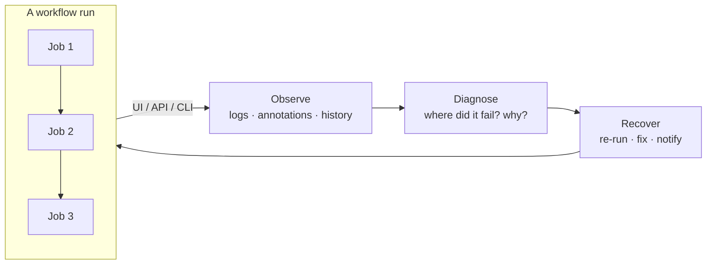
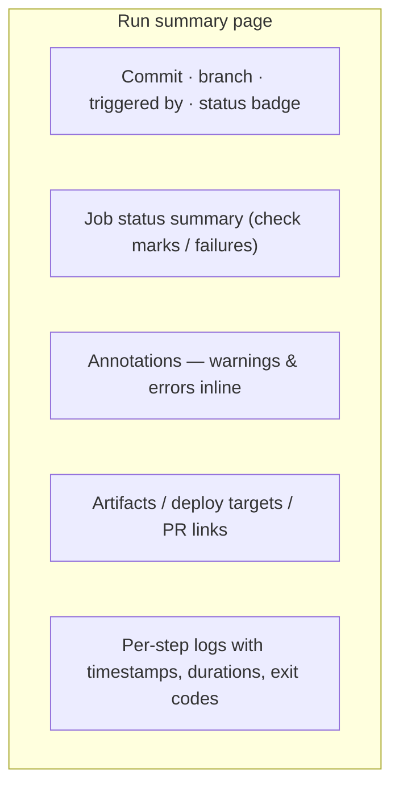
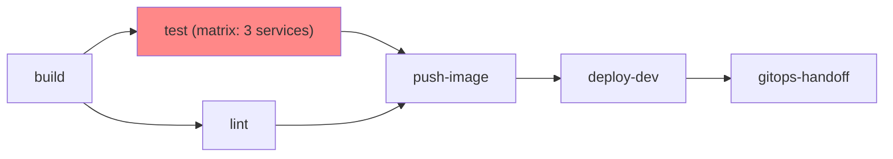
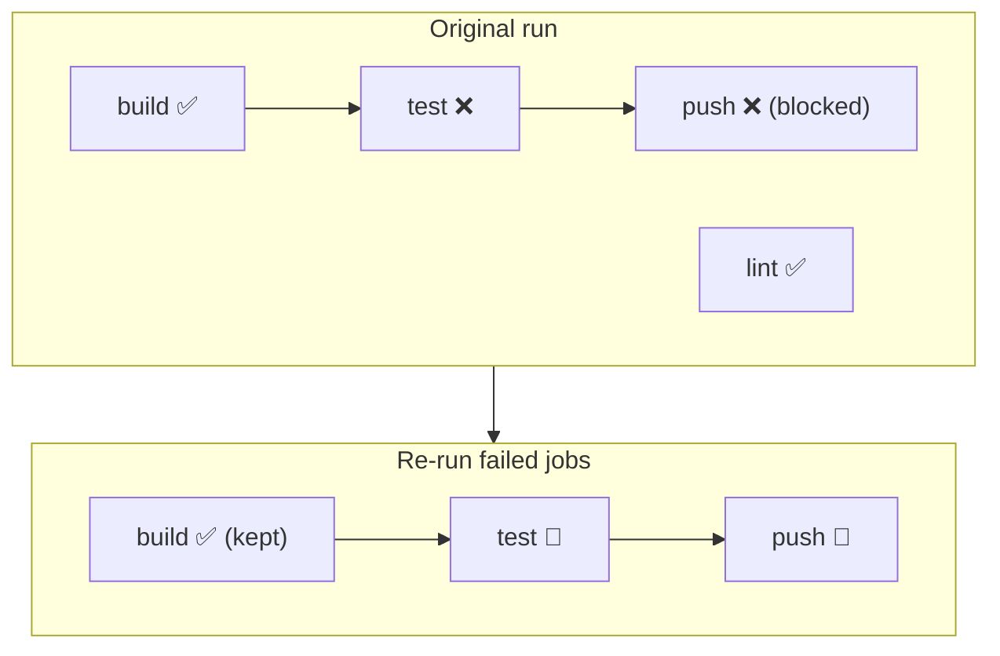
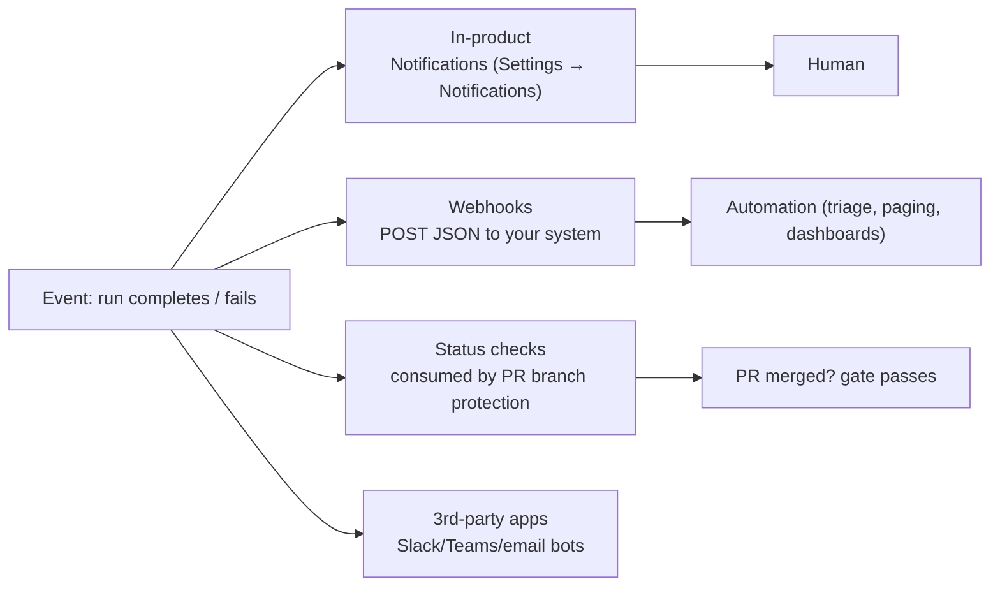

# Module 16 — Monitoring & Debugging

> **Confidential · Stalwart Learning**
> GitHub Actions — CI/CD Enablement & Migration · Session 4 · Module 16
> Level: Intermediate. Reading workflow logs and run history, diagnosing and re-running failed jobs (including matrix reruns), and notifications/alerting on workflow status — operating pipelines day-to-day.

---

## 1. Overview

Modules 1–15 built and secured the pipeline. This module starts **Session 4 — operating it**. Monitoring and debugging is the difference between a pipeline you *trust* and a pipeline you *fear*. Two halves:

1. **Observability** — where the truth lives: the Actions UI, run history, job/step logs, annotations, and statuses.
2. **Recovery** — diagnosing a failure, re-running jobs, and alerting the right people the right way.



| Azure DevOps | GitHub Actions |
|---|---|
| Pipeline runs + task logs | **Workflow runs + job/step logs** |
| Timelines/tests tab | Run summary, annotations, deploy/artifact links |
| "Re-run failed jobs" on a stage | **Re-run failed jobs** (or full workflow / failed jobs only) |
| Notifications via email/teams/webhooks | **Repository/org notifications** + Actions webhooks + status checks |
| Logs retained by retention policy | Per-repo retention (default 90 days) + download/export |

---

## 2. Anatomy of a run — where the truth lives

Every push/PR/trigger creates a **run**; a run contains **jobs**; each job contains **steps**. The *Run summary* page is the control centre:



Key reading skills:

- **Step → log drill-down** — each step is a collapsible log entry. Failures are marked; the failing command's exit code is the ground truth.
- **Annotations** — GitHub surfaces common problems (e.g. secrets in logs, cancelled jobs) as inline warnings *without* failing the run.
- **Timing** — per-step duration highlights slow steps (cache misses, image pulls) before they become outages.
- **Statuses are visible on the PR** — the checks widget lets a reviewer see CI results without leaving the PR.

> **ADO mapping:** ADO's *Runs → job logs* and the test/timeline tab map directly to Actions' run summary + job logs. The difference is the **PR checks widget**: Actions status is first-class on the pull request, which is exactly what your branch-protection required status checks (Module 14) consume.

---

## 3. Reading the run graph — dependencies & parallelism

The **job graph** is the fastest way to see *shape*: which jobs ran in parallel, which depended on which, and where the chain broke.



Reading the graph answers three questions in seconds:

1. **What failed?** — the red node (here: `test`).
2. **What did it block?** — everything downstream (`push-image`, `deploy-dev`, `gitops-handoff`).
3. **What still ran?** — parallel branches (here: `lint`) are unaffected and don't need re-running.

> **Tip:** failed runs show the graph at the failure point; successful runs show the full graph. A cancelled run (grey) is *not* a failure — a human stopped it (or the timeout hit, Module 07 §4).

---

## 4. Re-running failed jobs

GitHub offers three re-run granularities on a failed/cancelled run:

| Action | What it does | When to use |
|---|---|---|
| **Re-run all jobs** | Full fresh run | Non-deterministic failure, or want a clean full pass |
| **Re-run failed jobs** | Only the failed (and dependent) jobs re-execute; successful parallel jobs are *not* repeated | Fast recovery from a flaky test or a transient network blip |
| **Re-run from failed step** | The job replays from the first failing step, skipping earlier (already-successful) steps | Fast iteration while debugging a fix on the runner |



> **ADO mapping:** this is closer than ADO's single "re-run" — ADO re-runs the whole stage. Actions' granularity is one of the biggest day-to-day quality-of-life wins.

**Matrix reruns.** With a matrix (Module 07), a failure usually means *one or two cells* failed, not all. Re-run failed jobs only replays the failed cells — the green cells are preserved.

```yaml
jobs:
  test:
    strategy:
      fail-fast: false        # Module 07 — keep other cells running
      matrix:
        service: [orders, payments, inventory]
```

> **`fail-fast` matters for debugging:** with `fail-fast: false`, a red cell doesn't cancel its siblings, and you get all failures in one run instead of one-at-a-time. For a *merge gate* you may prefer `fail-fast: true` (cancel siblings, fail fast, save minutes). Choose per workflow, not globally.

---

## 5. Logs — tips that save hours

- **Download logs** — *Run summary → ⚙ → Download logs* gives a zip you can grep locally for post-mortems.
- **Grep the right step** — don't read 2,000 lines; open the failing step, then the last 50 lines. The error is almost always in the tail.
- **Timestamps on by default** — correlate slow steps with infra events (cache, runner provisioning).
- **Search within logs** — the UI search box is per-step; download when you need cross-step search.
- **`debug: true`** — re-run with *Runner diagnostic logging* and *Step debug logging* enabled (Settings → Actions → General) to get full diagnostic output. Turn it back off — debug logs are verbose and (with secrets risk, Module 15) should not be left on.

> **Copilot tie-in:** copy the failing step's log tail into Copilot Chat (Module 17) — this is the workflow that turns a wall of text into a fix.

---

## 6. Notifications & alerting

Being alerted the *right way* — notified before users are, and not spammed into ignoring alerts.



**Notification layers:**

1. **GitHub in-product notifications** — per repo/org: notify on failed runs, successful runs, or all. This is the zero-setup baseline.
2. **Actions webhooks** — the `workflow_run` event (and `workflow_job`) POSTs structured JSON to any endpoint. This is how you build *real* alerting (dashboards, PagerDuty, Teams cards) — and how **workflow triggers** consume other workflows (Module 18).
3. **Status checks** — the *pass/fail state* itself is the notification for branch protection (Module 14): a red check literally blocks the merge.
4. **Third-party apps** — Slack/Teams/email bots subscribe to `workflow_run` and post rich cards with links back to the failing run.

```yaml
# Example: a workflow that reacts to another workflow completing (Module 18)
name: Notify on failure
on:
  workflow_run:
    workflows: ["CI"]
    types: [completed]
permissions:
  actions: read
jobs:
  alert:
    runs-on: ubuntu-latest
    if: github.event.workflow_run.conclusion == 'failure'
    steps:
      - name: Post failure card
        run: curl -X POST "${{ secrets.TEAMS_WEBHOOK }}" \
             -d "{\"text\": \"CI failed: ${{ github.event.workflow_run.html_url }}\"}"
```

> **ADO mapping:** ADO *notifications* (email per run outcome) ≈ GitHub in-product notifications. ADO *service hooks* (webhooks to Slack/Teams) ≈ Actions `workflow_run` webhooks. The mindset shift: in Actions, notification logic lives in **workflows/`workflow_run`**, not in a separate service-hook configuration UI.

**Alerting design rules:**

- **Alert on *negative transitions* only** — failing is news; succeeding after failing (recovery) is news; a green run is not news.
- **One alert per failure type** — avoid the same broken step paging everyone five times.
- **Include the fix path** — every alert should link to the run *and* name the failing job.
- **Escalate by severity** — env-gated production hand-offs (Module 13) deserve human paging; CI noise deserves a Slack thread.

---

## 7. Common failure classes & their fingerprints

| Symptom | Likely cause | Where to look | Module |
|---|---|---|---|
| Step fails after 30s, exit 1, no detail | Command genuinely failed | Last 50 lines of the failing step | 01 |
| Random failure, passes on re-run | Flaky test / transient network | Matrix re-run, wait-timer, retry logic | 07, 16 |
| Image pull/push fails | Registry auth / OIDC misconfig | Login step, registry settings | 09, 12 |
| Job cancelled immediately | `timeout-minutes` hit | Job graph, timeout setting | 07 |
| Secrets masked as `***` | Workflow referenced a secret | Run-level settings → secrets | 06, 15 |
| Job skipped (grey) | `if:` condition false / branch filter | Job graph, event payload | 02, 07 |
| Stuck "waiting" for approval | Required reviewer hasn't approved | Environment page (Module 13) | 13 |
| Runner "queued" forever | No matching runner / concurrent jobs full | Runner list, concurrency settings | 03 |

---

## 8. Copilot checkpoint

> "I have a failed GitHub Actions run. The failing job is `test`, matrix cell `service: payments`. Explain how to read the run summary and job graph to confirm the failure scope, then re-run only the failed jobs, then enable step debug logging. Write the exact UI path for each action, and the curl/webhook shape I'd use to get a Teams card when any workflow fails."

Verify: does the answer distinguish *re-run failed jobs* from *re-run all*? Does it correctly describe matrix cell reruns? Does it include the notification layer (webhook vs in-product) rather than only the UI clicks?

---

## 9. Beginner pitfalls

1. **Re-running all jobs when one cell failed** — wastes minutes and churns the run history. Use *re-run failed jobs*; keep matrix cells isolated with `fail-fast: false` where debugging matters.
2. **Reading the whole log instead of the failing step** — the answer is in the tail of the failing step, not in 2,000 lines of build output.
3. **Treating a cancelled run as a failure** — grey ≠ red. A human or a timeout cancelled it; investigate the *why* before "fixing" the pipeline.
4. **Alerting on every completion** — green-run spam trains humans to ignore the alerts. Alert on failures and recoveries only.
5. **Leaving debug logging on** — verbose logs, slower runs, and a bigger secret-exposure surface (Module 15). Turn it off after debugging.
6. **Skipping the job graph** — the graph tells you scope (what's blocked, what ran in parallel) in one glance. Diagnose shape before symptoms.

---

## 10. What's next

Reading and re-running gets you 80% of the way. **Module 17** supercharges the diagnosis step: handing the failing log to **GitHub Copilot** and getting back a diagnosis *and* a PR-ready fix.

---

## 11. References

- Viewing workflow run history — https://docs.github.com/en/actions/monitoring-and-troubleshooting-workflows/viewing-workflow-run-history
- Using the workflow execution graph — https://docs.github.com/en/actions/monitoring-and-troubleshooting-workflows/using-the-visualization-graph
- Using workflow run logs — https://docs.github.com/en/actions/monitoring-and-troubleshooting-workflows/using-workflow-run-logs
- Re-running workflows and jobs — https://docs.github.com/en/actions/monitoring-and-troubleshooting-workflows/re-running-workflows-and-jobs
- Enabling debug logging — https://docs.github.com/en/actions/monitoring-and-troubleshooting-workflows/enabling-debug-logging
- Configuring notifications for GitHub Actions — https://docs.github.com/en/actions/monitoring-and-troubleshooting-workflows/notifications-for-workflow-runs
- `workflow_run` event (webhooks/triggers) — https://docs.github.com/en/actions/using-workflows/events-that-trigger-workflows#workflow_run
- ADO equivalent: run logs & service hooks — https://learn.microsoft.com/en-us/azure/devops/pipelines/troubleshooting/review-logs