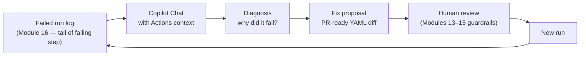
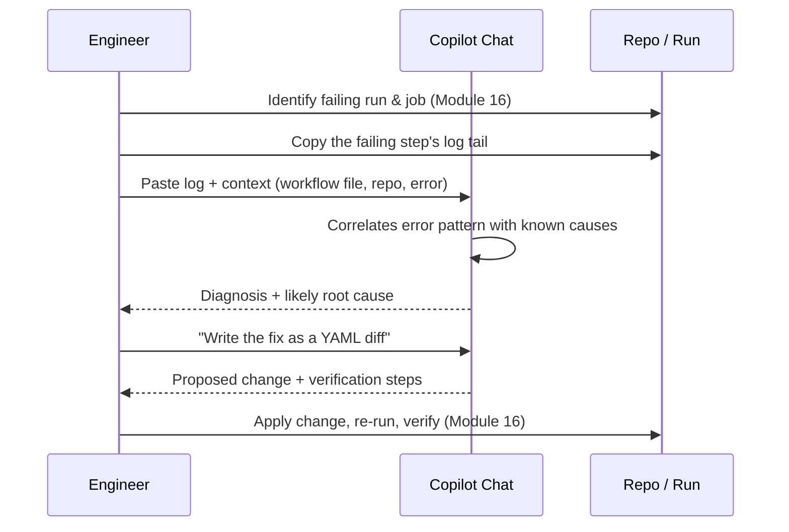
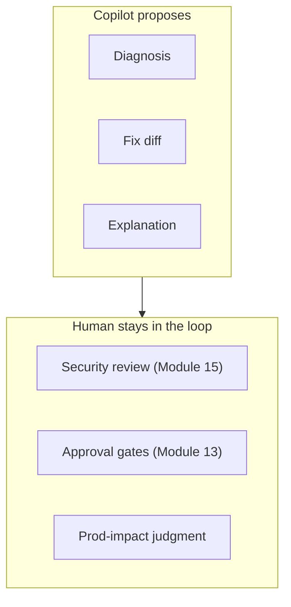
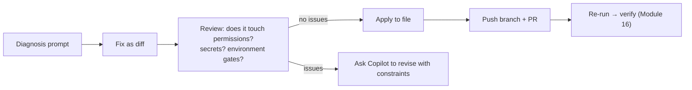

# Module 17 — Troubleshooting with GitHub Copilot

> **Confidential · Stalwart Learning**
> GitHub Actions — CI/CD Enablement & Migration · Session 4 · Module 17
> Level: Intermediate. Using Copilot Chat to diagnose a failed run's log and propose a PR-ready YAML fix — closing the loop between Module 5 (authoring) and Module 16 (debugging).

---

## 1. Overview

Module 16 taught you to *read* a failure. This module teaches you to let **Copilot read it for you**. Copilot is used in two distinct roles in this course:

1. **Authoring aid** (Module 5) — scaffolding and refactoring workflows.
2. **Troubleshooting aid** (this module) — diagnosis, root cause, and PR-ready fixes from a failing log.



> **Why Copilot for troubleshooting works here:** the failure *is* a text artifact (a log). Text → LLM is a natural fit. The discipline is the same as for authoring — Copilot proposes, a trained engineer disposes. Every fix still passes the security review from Module 15 and the approval gates from Module 13.

---

## 2. The troubleshooting workflow — step by step



**The prompt formula** that produces good results:

```
Paste the failing log tail.

Add context:
- The workflow file (or relevant job) so Copilot sees the YAML.
- The repo/service name and what the step was trying to do.
- Any constraints (self-hosted runner, registry, OIDC config).

Ask for:
1. Diagnosis — what failed and why (one paragraph).
2. Root cause — is it the workflow, the code, or the environment?
3. Fix — a specific, minimal YAML change, as a diff.
4. Verification — how to confirm the fix.
```

**Context is the whole game.** A log alone is ambiguous; log + workflow file + repo = a fix Copilot can be held accountable for. Copilot Chat can read files from the workspace — point it at `.github/workflows/`, the failing action's source, and the repo layout.

---

## 3. What Copilot is good at (and what it is not)

| Copilot is strong at | Copilot is weak at / not for |
|---|---|
| Explaining cryptic error text (exit codes, action errors) | Knowing the *current* state of a live cluster/registry |
| Spotting YAML syntax/schema errors (indentation, bad keys) | Live debugging on a self-hosted runner |
| Matching a log pattern to a *known* cause (cache miss, auth, timeout) | Ops judgment — "is this safe to deploy?" |
| Suggesting the idiomatic action/pattern to replace a hack | Final sign-off on security/permissions (Module 15) |
| Generating a diff you can review | Knowing your org's approval rules (Module 13/14) |



> **Rule of thumb:** Copilot compresses *time to hypothesis* from minutes to seconds. It does not compress the *responsibility* for the change. The `permissions:` block, the pinned SHAs, and the environment gate are still reviewed by a human — by design.

---

## 4. Worked example — diagnosing a failed job

**Log tail:**

```
Error response from daemon: Get "https://acrdemo.azurecr.io/v2/": unauthorized: authentication required
Error: Process completed with exit code 1.
```

**Prompt:**

```
My GitHub Actions run failed in the `push-image` job. Log tail:
<paste log>

The workflow uses docker/build-push-action against acrdemo.azurecr.io.
We use OIDC to Azure (Module 12) with a federated credential pinned to
the environment. The login step ran before this step and seemed to pass.

What is the most likely root cause? Show me the exact workflow change
that would fix it, and what I should verify in the Azure federated
credential settings.
```

**What Copilot should converge on:** the failure is at the *push* step, so the image was built but the registry rejected the token — either the `id-token: write` permission is missing on the job, the federated credential subject claim doesn't match the job's `environment:` (Module 13 §7), or the token scope lacks `AcrPush`. The fix: add `id-token: write` + `permissions` to the job, or align the federated credential subject with the environment, or assign the `AcrPush` role to the principal.

```yaml
jobs:
  push-image:
    runs-on: ubuntu-latest
    permissions:
      contents: read
      id-token: write          # ← missing in the original — Copilot flags this
    steps:
      - uses: actions/checkout@v4
      - uses: azure/login@v2
        with:
          client-id: ${{ secrets.AZURE_CLIENT_ID }}
          tenant-id: ${{ secrets.AZURE_TENANT_ID }}
          subscription-id: ${{ secrets.AZURE_SUBSCRIPTION_ID }}
      - uses: docker/login-action@v3
        with:
          registry: ${{ vars.ACR }}
          username: ${{ secrets.ACR_USERNAME }}
          password: ${{ secrets.ACR_PASSWORD }}
```

> **The habit to build:** never paste a log without context, and never apply a Copilot fix without asking *why* it's the right fix. The diagnosis quality is directly proportional to the context you provide.

---

## 5. From diagnosis to PR-ready change

Copilot Chat can generate the change *as a diff against your file*, or you can ask it to edit the file directly (Copilot *edit* / inline suggestion). The pipeline: **diagnose → propose → review → apply → verify**.



**Review checklist before merging a Copilot fix (revisit Module 15):**

- Did Copilot change `permissions:`? Is it still least-privilege?
- Did it touch a `uses:` pin? Is it still SHA-pinned / verified publisher?
- Did it introduce `pull_request_target`? (Should be a red flag.)
- Does the change match the *actual* root cause, or is it a workaround?
- Will this fix *only* this failure, or mask a deeper issue?

---

## 6. Copilot guardrails & the "explain first" habit

**Prompt discipline that keeps you in control:**

1. **Ask for the diagnosis *before* the fix.** A fix without a diagnosis is a guess. The habit: "Explain why this failed first, then propose a fix."
2. **Make Copilot justify against the repo.** "Check the workflow file and the action source before answering." Copilot reads the workspace — make it use it.
3. **Ask for alternatives, then choose.** "Give me two approaches and their trade-offs." You decide; Copilot executes.
4. **Escalate unknowns.** If Copilot *cannot* explain an error confidently, that's a signal to check the environment (registry, runner, OIDC config) rather than the workflow.
5. **Never paste secrets into the prompt.** Redact anything masked or sensitive from the log before pasting (Module 15).

> **ADO mapping:** there is no ADO equivalent — this is a Copilot-native workflow. The closest analogue is a teammate you can paste a log to and get a reasoned reply back in seconds. The skill is in *giving it the context* a good teammate would ask for.

---

## 7. Copilot checkpoint

> "Review the failing workflow in this repo and the attached run log. Do not change anything yet. First diagnose: what failed, where in the pipeline, and what the root cause most likely is. Then propose a minimal YAML fix as a diff, and state what it does NOT change (security, permissions, or approval gates). Finally, tell me how to verify the fix."

Verify: did it separate diagnosis from fix? Did it cite the actual log lines and workflow file? Did it flag any security-relevant change rather than quietly making one?

---

## 8. Beginner pitfalls

1. **Pasting the log without context** — Copilot can't correlate with your workflow/repo. Always attach the file and the failing job.
2. **Skipping diagnosis and asking for a fix** — you get a plausible patch for the wrong problem. Diagnosis first.
3. **Applying the fix without a review** — Copilot's changes to `permissions:` or `uses:` pins must pass the Module 15 checklist before merge.
4. **Pasting secrets into the prompt** — redact masked/sensitive values first; treat the chat transcript as a leak surface (Module 15).
5. **Trusting a confident-but-wrong explanation** — Copilot guesses when context is thin. When the explanation feels generic, check the environment before trusting the workflow change.
6. **Not verifying the fix** — the loop closes with a re-run (Module 16). A fix that doesn't rerun green is a hypothesis, not a fix.

---

## 9. What's next

Troubleshooting closes the *operate* loop. **Module 18** pushes the authoring craft further — dynamic/generated workflows and driving the GitHub API from inside a workflow — the patterns that make pipelines adaptive rather than hard-coded.

---

## 10. References

- GitHub Copilot in VS Code (Chat, inline, edit) — https://code.visualstudio.com/docs/copilot/overview
- Copilot chat for GitHub Actions — https://docs.github.com/en/copilot/using-github-copilot/using-github-copilot-chat
- Writing effective Copilot prompts — https://docs.github.com/en/copilot/using-github-copilot/using-copilot-chat/using-github-copilot-chat
- Enabling debug logging for troubleshooting — https://docs.github.com/en/actions/monitoring-and-troubleshooting-workflows/enabling-debug-logging
- ADO mapping: troubleshooting pipelines (no Copilot equivalent) — https://learn.microsoft.com/en-us/azure/devops/pipelines/troubleshooting/review-logs