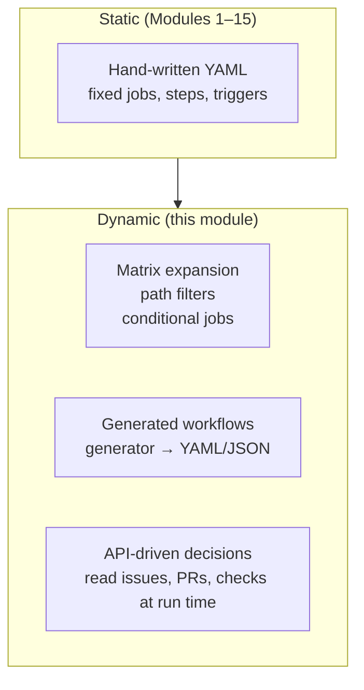
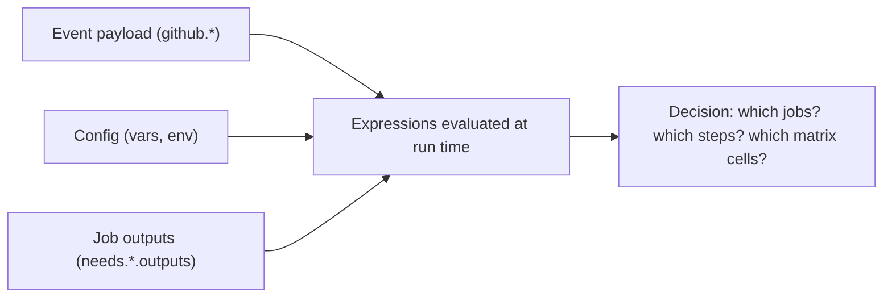
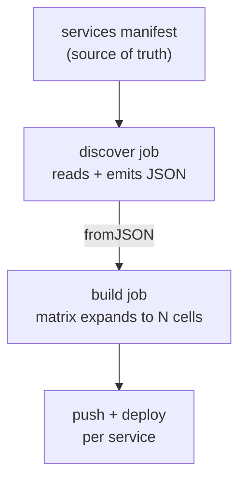
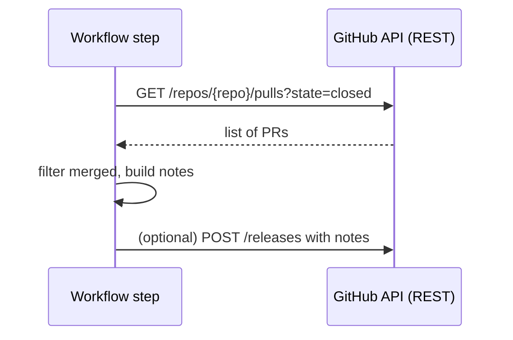

# Module 18 — Advanced Authoring

> **Confidential · Stalwart Learning**
> GitHub Actions — CI/CD Enablement & Migration · Session 4 · Module 18
> Level: Intermediate → Advanced. Dynamic/generated workflow patterns and using the GitHub API from within a workflow — moving from hand-written pipelines to pipelines that adapt.

---

## 1. Overview

So far every workflow has been static — the YAML is fixed at commit time. This module covers the patterns where the workflow *adapts*:

1. **Dynamic workflows** — matrix expansion, path filtering, conditional inclusion.
2. **Generated workflows** — a generator produces workflow YAML (or JSON payloads) from data rather than from a human typing it.
3. **The GitHub API inside workflows** — querying issues, PRs, checks, and repos at run time to make decisions.



| Azure DevOps | GitHub Actions |
|---|---|
| Template expressions + `${{ }}` at definition time | **Expression evaluation at run time** (contexts, Module 06) |
| Matrix via strategy (limited) | **`strategy.matrix`** — full cartesian expansion (Module 07) |
| Dynamic variables via scripts | **Outputs + `fromJSON` + environment `vars`** |
| REST API via Invoke-RestMethod tasks | **`gh` CLI + `actions/github-script`** — first-class |
| `dependsOn`/conditions | `if:` conditions + `needs` outputs |

---

## 2. Dynamic patterns already in your toolkit

Several "advanced" techniques are actually Modules 06–07 recast: *make the workflow a function of its inputs*.

```yaml
# 1. Matrix from a static list (Module 07)
strategy:
  matrix:
    service: [orders, payments, inventory]

# 2. Matrix from JSON at run time — includes/excludes compute a dynamic shape
strategy:
  matrix:
    include:
      - service: orders
        test-cmd: ./test orders
      - service: payments
        test-cmd: ./test payments -tags=integration

# 3. Conditional job — only present when it matters
jobs:
  deploy:
    if: github.ref == 'refs/heads/main' && github.event_name == 'push'

# 4. Conditional steps with the same idea at step level
- if: steps.check.outputs.changed == 'true'
  run: ./build-changed-only.sh
```

The unifying idea: **expressions are evaluated when the run executes, not when the file is committed.** `github`, `needs`, `env`, `vars`, `secrets`, and `matrix` contexts (Module 06) are all *live* values.



---

## 3. The three real "advanced" patterns

### Pattern A — dynamically generated matrix (from a script)

Instead of typing the matrix, a job *computes* it. Any job that runs early can emit a JSON matrix via an output; a later job consumes it with `fromJSON`.

```yaml
jobs:
  discover:
    runs-on: ubuntu-latest
    outputs:
      matrix: ${{ steps.gen.outputs.matrix }}
    steps:
      - id: gen
        run: |
          # read services from a manifest file or repo API
          echo "matrix=$(python gen_matrix.py)" >> "$GITHUB_OUTPUT"

  build:
    needs: discover
    runs-on: ubuntu-latest
    strategy:
      matrix: ${{ fromJSON(needs.discover.outputs.matrix) }}
    steps:
      - uses: actions/checkout@v4
      - run: ./build --service ${{ matrix.service }}
```

**Why it matters:** new microservices are added to a manifest, and the pipeline *grows itself*. No workflow edit required — the generator stays the single source of truth.



### Pattern B — generated workflows (workflow `yml` produced by a generator)

When every repo in an org needs the *same* pipeline shape, don't hand-copy YAML — **generate it**. A generator (script or Copilot-assisted) emits `.github/workflows/*.yml` from a template + per-service config. The result is *standardised* — which is exactly what Module 10's reusable workflows also achieve, but generation adds per-service *parameterisation* at authoring time.

> **When to generate vs. reuse (Module 10):** a reusable workflow parameterises at *run time* and is ideal when the same shape runs everywhere. Generation is for when repos differ enough (different services, different build steps) that a reusable workflow's `with:` surface becomes awkward. In practice most teams: **reusable workflow for the 80% common path, generation for the org-wide scaffold.**

### Pattern C — the GitHub API inside a workflow

Three ways to call the GitHub API from a step, in order of preference:

1. **`gh` CLI** (preinstalled on GitHub-hosted runners) — `gh api`, `gh pr`, `gh run`.
2. **`actions/github-script`** — a JS step with a typed `github` client; best for logic heavier than one call.
3. **Raw `curl`** to `api.github.com` with `GITHUB_TOKEN` — last resort.

```yaml
jobs:
  pr-info:
    runs-on: ubuntu-latest
    permissions:
      contents: read
      issues: read
    steps:
      - uses: actions/github-script@v7
        with:
          script: |
            const pr = await github.rest.pulls.get({
              owner: context.repo.owner,
              repo: context.repo.repo,
              pull_number: context.issue.number,
            });
            core.info(`PR title: ${pr.data.title}`);

      - run: gh api repos/${{ github.repository }}/issues --jq '.[].title'
```

**API-driven decisions in practice:**

- **Semantic version bumping** — read tags, compute next version, tag the image.
- **Changelog/labels** — derive release notes from merged PRs by label.
- **Dynamic environment selection** — read an issue's labels to pick the deploy target.
- **Driving other pipelines** — POST `repository_dispatch` (Module 02) or check another workflow's status via `workflow_run`.

> **ADO mapping:** ADO's REST API exists but was rarely called *from* the pipeline; you used script tasks. In Actions, `gh` + `github-script` are first-class citizen steps with a typed client and the run's own token — the API is part of the workflow language, not an add-on.

---

## 4. `github-script` vs `gh` vs `curl` — choosing

| Need | Use | Why |
|---|---|---|
| One-off API read | `gh api` | Zero boilerplate, jq built in |
| Logic + multiple calls | `actions/github-script` | JS control flow, typed `github` client, `core.*` helpers |
| Files/PR/release automation | `gh pr`, `gh release` | Purpose-built commands |
| Very unusual endpoint | `curl` + `GITHUB_TOKEN` | Escape hatch; remember `Accept: application/vnd.github+json` |

```yaml
permissions:                      # Module 15 — least privilege per need
  contents: read
  issues: read
  pull-requests: read
```

> Every API call inherits the `GITHUB_TOKEN`'s permissions — keep them narrow (Module 15) and put API calls in the job that actually needs them.

---

## 5. A worked pattern — API-driven versioning + deployment metadata

```yaml
name: Release metadata
on:
  push:
    tags: ["v*"]

permissions:
  contents: read
  issues: read

jobs:
  release:
    runs-on: ubuntu-latest
    steps:
      - uses: actions/github-script@v7
        id: meta
        with:
          script: |
            const { data: prs } = await github.rest.pulls.list({
              owner: context.repo.owner,
              repo: context.repo.repo,
              state: "closed",
              base: "main",
              per_page: 50,
            });
            const merged = prs.filter(p => p.merged_at);
            const notes = merged.map(p => `- ${p.title} (#${p.number})`).join("\n");
            core.setOutput("notes", notes);
      - name: Show release notes
        run: echo "${{ steps.meta.outputs.notes }}"
```



---

## 6. Copilot checkpoint

> "Refactor this static workflow into a generated one: read the services from `services.json` in the repo, emit a matrix via a `discover` job, then build/push each service with `fromJSON`. Add a step that fetches the latest release tag via `gh api` to compute the next patch version, and write it with `actions/github-script`. Keep permissions least-privilege and pin actions to SHAs."

Verify: did it use a `discover` job with an `outputs:` block correctly? Is `fromJSON(needs...outputs...)` in the right place? Did it keep `permissions:` narrow and the API calls scoped? Does it explain *why* generation beats a reusable workflow for this shape?

---

## 7. Beginner pitfalls

1. **`fromJSON` on a non-JSON output** — the `discover` job must emit *valid* JSON (no trailing commas, no log noise in the line). Test the generator in isolation first.
2. **Over-nesting matrices** — a 3×3×3 matrix is 27 cells; watch runner minutes and parallel-runner limits.
3. **API calls with too-broad permissions** — give the API job only the scopes it needs (`issues: read`, `contents: read`), never blanket `write` (Module 15).
4. **Calling the API for data you already have** — `github` context and `needs` outputs often answer the question without a network call.
5. **Hard-coding a value the API could compute** — version numbers, env lists, and service sets should come from the repo, not from the YAML.
6. **Debugging generated YAML blind** — dump the generated workflow/JSON with `echo` into `$GITHUB_OUTPUT` / a log and inspect it before wiring `fromJSON`.

---

## 8. What's next

The patterns in this module are the raw material for **Module 19** — the end-to-end guided lab that chains everything from trigger to matrix build to container push to OIDC to an environment-gated GitOps hand-off.

---

## 9. References

- `strategy.matrix` & `fromJSON` — https://docs.github.com/en/actions/using-jobs/using-a-matrix-for-your-jobs
- Contexts and expressions — https://docs.github.com/en/actions/learn-github-actions/contexts
- `actions/github-script` — https://github.com/actions/github-script
- `gh` CLI (REST API) — https://cli.github.com/manual/gh_api
- GitHub REST API — https://docs.github.com/en/rest
- `workflow_run` / `repository_dispatch` triggers — https://docs.github.com/en/actions/using-workflows/events-that-trigger-workflows
- ADO equivalent: REST API — https://learn.microsoft.com/en-us/rest/api/azure/devops/