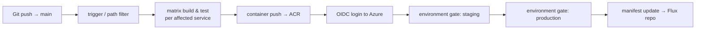
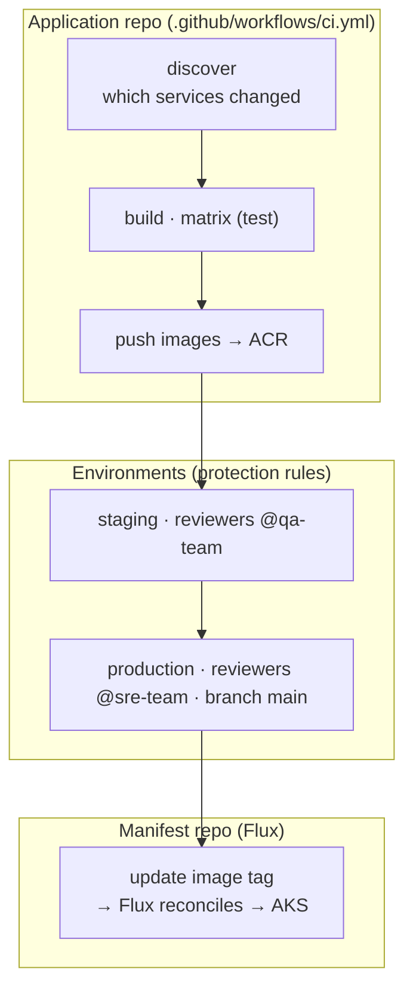

# Module 19 — Guided Lab: End-to-End Pipeline

> **Confidential · Stalwart Learning**
> GitHub Actions — CI/CD Enablement & Migration · Session 4 · Module 19
> Level: Intermediate → Advanced. Instructor-led build of a complete pipeline — trigger → matrix build → container push → OIDC auth → environment-gated hand-off to GitOps — the capstone tying Sessions 1–4 together.

---

## 1. Lab objective

Build, live, the full pipeline the course has assembled module-by-module. One workflow that a production microservices team would actually ship: **a change on `main` builds and tests the affected microservices, pushes container images, authenticates to Azure keylessly via OIDC, and hands off to the existing Flux GitOps flow behind an environment approval gate.**



> **Delivery mode:** the instructor drives each build step live; participants follow along in their own repository where environment access allows (per the course outline's guided-lab model).

---

## 2. What we are building

| Stage | Covers (module) | Outcome |
|---|---|---|
| 1. Trigger | Events & triggers (02), path filters (07) | Workflow fires on `push → main`, only for changed services |
| 2. Matrix build | Multi-service repos (07), artifacts/caching (08) | Build + test each affected service in parallel cells |
| 3. Container push | Container pipelines (09) | Image built, tagged, pushed to ACR |
| 4. OIDC auth | Keyless auth (12) | No long-lived credentials; federated identity |
| 5. Environment gates | Environments (13) | Approval-protected promotion staging → production |
| 6. GitOps hand-off | Deployment integration (11) | Manifest reference updated; Flux takes over |

The workflow is **secured end-to-end** (Module 15): least-privilege `permissions:`, SHA-pinned actions, no secrets in the log.



---

## 3. Prerequisites (from `labs/setup/`)

- Repository + Actions enabled — `labs/setup/02-repository-and-actions.md`
- Docker Desktop — `labs/setup/05-docker-desktop.md`
- AKS cluster (targets the OIDC walkthrough) — `labs/setup/09-aks-cluster.md`
- GitOps repo with Flux — `labs/setup/10-flux-setup.md`
- ACR + OIDC federated credential — `labs/setup/11-acr.md`, `labs/setup/12-oidc.md`
- Copilot in VS Code — `labs/setup/03-vscode-and-git.md`, `labs/setup/04-github-copilot.md`

---

## 4. Step-by-step build

### Step 1 — trigger & path filter (Modules 02, 07)

Run on push to `main`, but only rebuild what changed. Path filters (Module 07) keep the matrix small.

```yaml
name: E2E Pipeline
on:
  push:
    branches: [main]
    paths:
      - "services/**"
      - ".github/workflows/**"
```

### Step 2 — discover + matrix (Modules 07, 18)

A `discover` job emits the affected services as JSON; the build job expands it with `fromJSON` (Module 18). This is the dynamic pattern, used live.

```yaml
jobs:
  discover:
    runs-on: ubuntu-latest
    outputs:
      matrix: ${{ steps.svc.outputs.matrix }}
    steps:
      - uses: actions/checkout@v4
      - id: svc
        run: |
          MATRIX=$(python3 .github/scripts/changed_services.py main HEAD)
          echo "matrix=$MATRIX" >> "$GITHUB_OUTPUT"

  build:
    needs: discover
    runs-on: ubuntu-latest
    strategy:
      fail-fast: false
      matrix: ${{ fromJSON(needs.discover.outputs.matrix) }}
    steps:
      - uses: actions/checkout@v4
      - run: ./build.sh --service "${{ matrix.service }}"
      - run: ./test.sh --service "${{ matrix.service }}"
```

### Step 3 — build & push the container (Module 09)

```yaml
  push:
    needs: build
    runs-on: ubuntu-latest
    permissions:
      contents: read
      id-token: write            # Module 12
    steps:
      - uses: actions/checkout@v4
      - uses: azure/login@v2      # OIDC login — no stored credentials
        with:
          client-id: ${{ secrets.AZURE_CLIENT_ID }}
          tenant-id: ${{ secrets.AZURE_TENANT_ID }}
          subscription-id: ${{ secrets.AZURE_SUBSCRIPTION_ID }}
      - uses: docker/login-action@v3
        with:
          registry: ${{ vars.ACR }}
          username: ${{ secrets.ACR_USERNAME }}
          password: ${{ secrets.ACR_PASSWORD }}
      - uses: docker/build-push-action@v6
        with:
          push: true
          tags: "${{ vars.ACR }}/${{ matrix.service }}:${{ github.sha }}"
```

### Step 4 — environment-gated hand-off (Modules 11, 13)

Two promotion jobs, each behind its own environment gate. The *production* job waits for `@sre-team` approval and only runs from `main`. The hand-off is **manifest-only** — Flux reconciles the actual deployment (Module 11 boundary).

```yaml
  deploy-staging:
    needs: push
    runs-on: ubuntu-latest
    environment:
      name: staging
      url: https://staging.${{ vars.APP_DOMAIN }}
    steps:
      - name: Update staging manifest
        run: |
          gh api repos/${{ vars.GITOPS_REPO }}/contents/... -X PUT \
            -f message="bump ${{ matrix.service }} to ${{ github.sha }}" \
            -f content="$B64"        # manifest-only; Flux does the deploy

  deploy-production:
    needs: deploy-staging
    runs-on: ubuntu-latest
    environment:
      name: production
      url: https://app.${{ vars.APP_DOMAIN }}
    steps:
      - name: Update production manifest
        run: ...                     # same manifest-update pattern
```

### Step 5 — verify (Module 16)

Push a change to a service, watch the run, and check: did `discover` compute the right matrix? Did the image land in ACR? Did the approval pause `deploy-production`? Did Flux reconcile from the updated manifest?

---

## 5. Security hardening pass (Module 15)

Before merging, audit the workflow:

1. `permissions:` — workflow-wide floor `contents: read`; `id-token: write` only on the push job.
2. Every `uses:` pinned to a full-length SHA with a version comment.
3. No secret echoed in any `run:`; secrets flow via step `env:`.
4. `pull_request` (not `pull_request_target`) anywhere a fork could trigger it.
5. Dependabot enabled for `github-actions` updates.

> **Copilot assist:** ask Copilot to review the assembled workflow against the Module 15 checklist (Module 17 troubleshooting discipline).

---

## 6. Deliverable checklist

- [ ] Trigger runs on `push → main` with path filter
- [ ] `discover` emits a correct JSON matrix; `build` expands it
- [ ] Images tagged `sha-<commit>` and pushed to ACR
- [ ] OIDC login with zero stored credentials in the repo
- [ ] Staging deploy auto-passes; production waits for `@sre-team` approval
- [ ] Manifest repo updated (image ref bumped); Flux reconciling
- [ ] Least-privilege `permissions:` + SHA pins reviewed

---

## 7. Copilot checkpoint

> "Given this repo's services and the Flux GitOps setup, generate the `.github/workflows/ci.yml` for the lab: path-filtered trigger, discover+fromJSON matrix, docker build/push to ACR with OIDC azure/login, and staging/production environment-gated manifest updates. Pin actions to SHAs, keep permissions least-privilege, and add a comment for the reviewer explaining each stage. Do not add kubectl or helm steps."

Verify: each stage maps to the module that taught it. Does it use the GitOps hand-off (manifest update) rather than a direct deployment? Are the security rules intact?

---

## 8. Beginner pitfalls

1. **Direct deployment instead of GitOps hand-off** — the course boundary (Module 11) is *manifest update*; Flux owns the deployment.
2. **`fromJSON` failing on malformed JSON** — test `discover` output standalone; log it before wiring the matrix.
3. **Missing `id-token: write` on the OIDC job** — the login silently fails; check the job's `permissions:` block first (Module 15).
4. **Environment on the workflow instead of the job** — `environment:` is job-level (Module 13).
5. **`needs:` chain skipping a gate** — `deploy-production` must depend on `deploy-staging`, or the approval chain breaks.
6. **Forgetting Flux reconcile timing** — the manifest bump is async; verify via `flux` events / AKS rollout, not by assuming instant deploy.

---

## 9. What's next

The lab is the proof that the course works. **Module 20** closes the programme: the migration approach for moving your real Azure DevOps pipelines to GitHub Actions, plus wrap-up and open Q&A.

---

## 10. References

- Lab setup (accounts, Actions, Copilot, Docker) — `labs/setup/`
- Matrix strategy — https://docs.github.com/en/actions/using-jobs/using-a-matrix-for-your-jobs
- Building & pushing Docker images — https://docs.github.com/en/actions/automating-builds-and-tests/building-and-testing-python
- `azure/login` OIDC — https://github.com/Azure/login
- Environments & protection rules — https://docs.github.com/en/actions/deployment/using-environments-for-deployment
- GitOps hand-off boundary (Flux out of scope) — `guides/module-11-deployment-integration.md`
- Troubleshooting failed runs — `guides/module-16-monitoring-and-debugging.md`