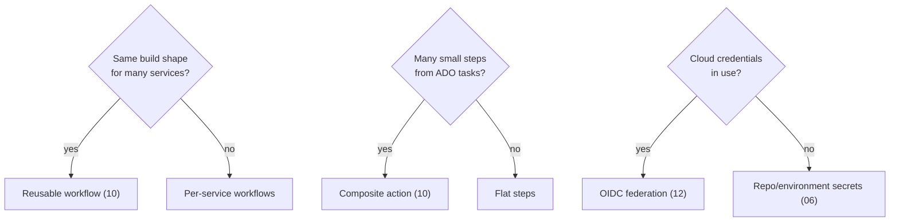
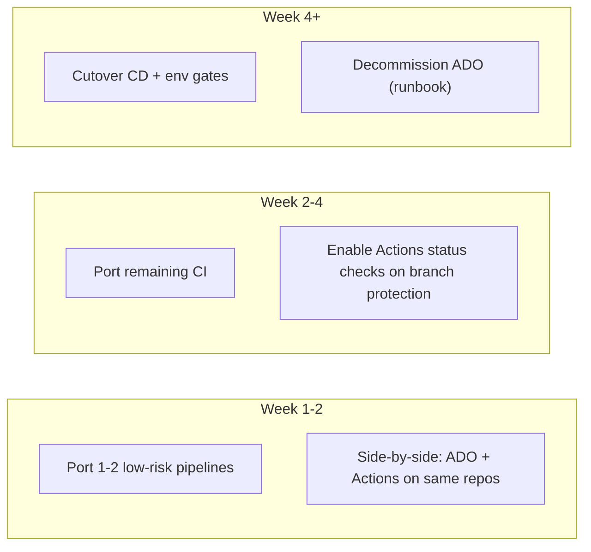
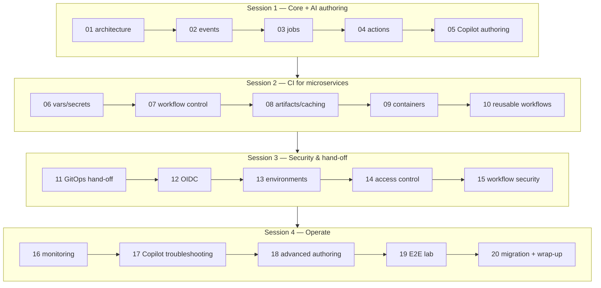

# Module 20 — Migration Approach & Wrap-Up

> **Confidential · Stalwart Learning**
> GitHub Actions — CI/CD Enablement & Migration · Session 4 · Module 20
> Level: Intermediate → Advanced. A high-level migration checklist for moving pipelines from Azure DevOps to GitHub Actions (overview level), plus course wrap-up and open Q&A against participants' real pipelines.

---

## 1. Overview

The course is complete: you can author, secure, and operate GitHub Actions workflows for containerised microservices (Modules 1–15), monitor and debug them, use Copilot to troubleshoot (16–17), and extend them with dynamic patterns (18). The final module is about **the actual move** — taking the Azure DevOps estate and landing it on GitHub Actions — and what happens *after* the course.

> **Scope note (from the outline):** this is an **overview-level** module. ADO is referenced only for concept mapping and the hand-off boundary. The point is a *checklist you can run with*, not a full migration manual.

---

## 2. The migration checklist (7 phases)

### Phase 1 — Inventory

What do you actually run?

- Enumerate ADO pipelines, stages, tasks, variables, variable groups, service connections, agents/pools, approvals, and release gates.
- Classify by risk: build-only vs deploy-capable, CI vs CD, production-touching or not.
- Map each pipeline to its owning repo/service.

### Phase 2 — Concept mapping

The ADO → GitHub Actions map built across Sessions 1–4:

| Azure DevOps | GitHub Actions | Where covered |
|---|---|---|
| Pipeline / stage / task | Workflow / job / step | 01, 03 |
| Triggers (CI, PR, schedule) | `on:` triggers | 02 |
| Agent pools / self-hosted | Runners, self-hosted runners | 03 |
| Tasks / marketplace extensions | Actions (Marketplace) | 04 |
| Variable groups & lib variables | `vars` + secrets (repo/env/org) | 06, 14 |
| YAML templates | Reusable workflows & composite actions | 10 |
| Artifacts / caching | `actions/upload-artifact`, `actions/cache` | 08 |
| Container build tasks | docker/build-push-action | 09 |
| Service connections (Azure) | OIDC federated identity | 12 |
| Environments + approvals | Environments, required reviewers | 13 |
| Pipeline permissions / RBAC | `permissions:`, branch protection, CODEOWNERS | 14, 15 |
| Task logs / re-run | Run logs, re-run failed jobs | 16 |
| Service hooks / notifications | `workflow_run` webhooks, notifications | 16 |

### Phase 3 — Design target state

- **One workflow per service** (path-filtered) vs **monorepo + matrix** — pick per repo shape (Modules 07, 19).
- **Reusable workflow library** for the common build/push pattern across microservices (Module 10).
- **Environment model** — dev/staging/production with the right reviewers (Module 13).
- **Secret strategy** — org secrets for shared credentials, env secrets for scoped ones (Modules 06, 14).

### Phase 4 — Lift & shift (1:1)

- Port pipeline YAML task-by-task to Actions steps using the mapping table.
- Keep behaviour identical *first*; optimise later. A 1:1 port is the safest first cut — the goal is parity, then improvement.
- Do it repo-by-repo; run ADO and Actions side-by-side during transition.

### Phase 5 — Harden

The security pass from Module 15 becomes part of the migration, not an afterthought:

- Least-privilege `permissions:` on every workflow.
- SHA-pin all third-party actions; verified publishers only.
- Dependabot for `github-actions`.
- No long-lived cloud credentials — OIDC everywhere (Module 12).
- Secret scanning + no secrets in logs.

### Phase 6 — Optimise & standardise

- Replace one-off YAML with the reusable workflow (Module 10).
- Add caching (08), matrix builds (07), dynamic generation where it pays off (18).
- Wire notifications and alerting (16).

### Phase 7 — Cutover & operate

- Move branch protection + required status checks (14).
- Decommission the ADO pipelines behind a documented runbook.
- Train on monitoring/debugging (16) and Copilot troubleshooting (17).
- Define who owns the Actions estate (reviewers, environment approvers, action upgrades).

---

## 3. Migration decision points

**Key decisions to make *before* writing YAML:**

1. **Reusable workflow vs generated vs per-service YAML** (Modules 10, 18).
2. **OIDC adoption** — replaces every Azure service connection (Module 12).
3. **Environment gate ownership** — who approves production (Module 13).
4. **Repo topology** — monorepo matrix vs many repos (Module 07).
5. **Self-hosted runners** — do you need them at all? (Module 03; AKS proximity).

---

## 4. Parallel-run & cutover strategy

The safest migration is **not a big-bang**. Keep ADO alive while Actions proves itself:

- **Compare runs** — run both pipelines on the same commit; diff the artifact/result. Parity before cutover.
- **Champion per team** — the first team to migrate owns the template the others copy.
- **Rollback path** — a reverted branch-protection rule restores ADO as the gate in minutes.

---

## 5. The course in one diagram

**What you can now do** (course learning objectives):

- Author, secure, and operate GitHub Actions workflows for containerised microservices.
- Apply team-based access control (environments, branch protection, CODEOWNERS).
- Use GitHub Copilot to accelerate workflow design and debugging.

---

## 6. Copilot checkpoint

> "Act as a migration consultant. Given these three Azure DevOps pipelines (paste them), produce: (1) an ADO→GitHub Actions concept map for each, (2) a target workflow file for each following the module patterns (reusable workflow for the common shape), (3) a phased cutover plan with a rollback path, and (4) a hardening checklist applying least-privilege permissions, SHA-pinned actions, and OIDC. Flag anything out of scope for this course (Flux mechanics, deployment strategies, IaC)."

Verify: does it respect the course boundaries (no Flux deep-dive, no blue-green/canary, no Terraform)? Does it keep the GitOps hand-off at the manifest-update boundary (Module 11)? Is the hardening pass present and concrete?

---

## 7. Wrap-up — owning the Actions estate

After the course, the team owns a platform, not just workflows:

- **Governance** — who approves environments (13), who owns actions versions/Dependabot (15), which repos are exempt.
- **Telemetry** — the monitoring discipline from Module 16 must run in the first week, not the first incident.
- **Continuous improvement** — every flaky test / slow job is a Copilot-suggested refactor (17); every new service is a templated addition (18).
- **The GitOps boundary is sacred** — Actions builds and pushes; Flux deploys. Keep the hand-off clean (11).

---

## 8. Beginner pitfalls

1. **Migrating everything at once** — big-bang cutover without parity checks invites an outage. Go repo-by-repo, side-by-side.
2. **Copying ADO YAML literally** — the mapping is *conceptual*, not textual. Reusable workflows and `permissions:` have no ADO equivalent — design for the new model.
3. **Bringing PATs / service connections across** — replace with OIDC (12) and org/env secrets (06, 14). Long-lived cloud credentials are the thing the migration should *remove*.
4. **Skipping the hardening pass** — a 1:1 port that ignores `permissions:` and SHA-pinning migrates ADO's security debt wholesale (15).
5. **Ignoring the GitOps boundary** — adding direct `kubectl`/`helm` deploy steps reintroduces what Flux was built to own (11).
6. **No rollback plan** — keep ADO alive until branch protection is fully moved; define the revert runbook in advance.

---

## 9. References

- Course outline (source of truth) — `courseOutline/GitHub_Actions_Course_Outline.pdf`
- ADO → GitHub Actions migration guide (Microsoft) — https://learn.microsoft.com/en-us/azure/devops/pipelines/migrate/from-azure-pipelines
- GitHub Actions migration planning — https://docs.github.com/en/actions/migrating-to-github-actions/upgrading-github-actions
- Concept mapping: pipeline features — https://docs.github.com/en/actions/migrating-to-github-actions/migrating-from-azure-pipelines-to-github-actions
- All module guides — `guides/module-01…module-20`
- Lab setup & guided labs — `labs/`
- Open Q&A — bring your real pipelines; the instructor maps them against this checklist live.