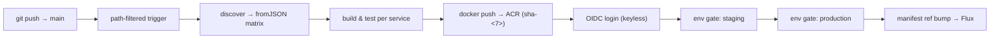

# Lab 19 · Guided Lab — End-to-End Pipeline (Capstone)

> **Confidential · Stalwart Learning**
> Module 19 · Guided lab · Session 4
> Companion: `guides/module-19-guided-lab-end-to-end-pipeline.md` · Visualization: `module-19-visualization.html`

| | |
|---|---|
| **Objective** | Build, live with the instructor, the complete pipeline the course has assembled module-by-module: trigger → path-filtered discover → matrix build → container push to ACR (keyless) → environment-gated GitOps hand-off to Flux |
| **Time** | ~90 min (guided) — the session's capstone |
| **Prerequisites** | Setups 02, 03, 04, 05, 08 (GitOps repo), 09 (AKS), 10 (Flux), 11 (ACR), 12 (OIDC). Labs 11, 13, 16, 18 green. `ci-demo` with 2+ services under `services/` |
| **Files you create** | `.github/workflows/e2e-pipeline.yml`; reuses `.github/scripts/changed_services.py` from Lab 18 |

---

## Step 1 · What we are building

Open visualization **19.1** and click all six stages. Your end state:



The **GitOps boundary (Module 11) is sacred**: Actions writes to git and the registry; Flux writes to the cluster. No `kubectl`, no `helm`, anywhere in this workflow.

## Step 2 · Stage 1 — trigger with path filter

Start `.github/workflows/e2e-pipeline.yml`. Run on push to `main`, but only rebuild what changed (Module 07):

```yaml
name: E2E Pipeline
on:
  push:
    branches: [main]
    paths:
      - "services/**"
      - ".github/workflows/**"

permissions:
  contents: read                      # workflow-wide floor (Module 15)
```

## Step 3 · Stage 2 — discover + matrix

Reuse Lab 18's generator (or copy it if you skipped Lab 18). The `discover` job emits JSON; `build` expands it:

```yaml
jobs:
  discover:
    runs-on: ubuntu-latest
    outputs:
      matrix: ${{ steps.gen.outputs.matrix }}
    steps:
      - uses: actions/checkout@v4
        with:
          fetch-depth: 0
      - id: gen
        run: |
          echo "matrix=$(python3 .github/scripts/changed_services.py origin/main HEAD)" >> "$GITHUB_OUTPUT"

  build:
    needs: discover
    runs-on: ubuntu-latest
    strategy:
      fail-fast: false
      matrix: ${{ fromJSON(needs.discover.outputs.matrix) }}
    steps:
      - uses: actions/checkout@v4
      - run: ./build.sh --service ${{ matrix.service }}    # or your real build command
      - run: ./test.sh --service ${{ matrix.service }}
```

## Step 4 · Stage 3 & 4 — push to ACR, keyless via OIDC

The `push` job needs `id-token: write` **on this job only** (Modules 12, 15). The tag is immutable — `sha-<7>`:

```yaml
  push:
    needs: build
    runs-on: ubuntu-latest
    permissions:
      contents: read
      id-token: write                  # OIDC only here
    steps:
      - uses: actions/checkout@v4
      - uses: azure/login@v2           # keyless — no stored credentials
        with:
          client-id: ${{ secrets.AZURE_CLIENT_ID }}
          tenant-id: ${{ vars.AZURE_TENANT_ID }}
          subscription-id: ${{ vars.AZURE_SUBSCRIPTION_ID }}
      - uses: docker/login-action@v3
        with:
          registry: ${{ vars.ACR_NAME }}.azurecr.io
          username: ${{ secrets.AZURE_CLIENT_ID }}
          password: ${{ secrets.AZURE_CLIENT_ID }}
      - uses: docker/build-push-action@v6
        with:
          context: services/${{ matrix.service }}
          file: services/${{ matrix.service }}/Dockerfile
          push: true
          tags: ${{ vars.ACR_NAME }}.azurecr.io/${{ matrix.service }}:sha-${{ github.sha }}
```

> **Verify mid-lab:** after the first green run, confirm the tag exists — `az acr repository show-tags --name $ACR_NAME --repository checkout-service --top 3`.

## Step 5 · Stage 5 — environment-gated promotion

Two promotion jobs, each declaring a *different* environment (Module 13). Production waits for `@sre-team` approval and only runs from `main`:

```yaml
  deploy-staging:
    needs: push
    runs-on: ubuntu-latest
    environment:
      name: staging
      url: https://staging.${{ vars.APP_DOMAIN }}
    steps:
      - name: Update staging manifest
        run: |
          gh api repos/${{ vars.GITOPS_REPO }}/contents/apps/checkout-service/overlays/staging/deployment.yaml \
            -X PUT -f message="bump to sha-${{ github.sha }}" \
            -f content="$(git show HEAD:services/checkout/Dockerfile | base64)" || true
```

> If you don't have a real `ci-gitops` manifests layout yet, keep the *shape* (manifest-only write, bot token) and simplify the content to a version file. The instructor will demo against the full Setup 08/10 layout; follow with what you have.

```yaml
  deploy-production:
    needs: deploy-staging               # promotion chain (Module 13)
    runs-on: ubuntu-latest
    environment:
      name: production
      url: https://app.${{ vars.APP_DOMAIN }}
    steps:
      - name: Update production manifest
        run: ...                        # same manifest-update pattern
```

Configure the environment in the UI: *Settings → Environments → production → Required reviewers: @sre-team* and *Deployment branches: main* (Module 13). Leave `staging` frictionless.

## Step 6 · Watch the full chain

Push a change to one service:

```bash
echo "# change" >> services/orders/README.md
git add -A && git commit -m "lab19: end-to-end run" && git push
```

Watch the run (Module 16 skills):

1. **discover** computes the matrix → **build** cells run in parallel.
2. **push** logs into ACR keylessly, tag `sha-<7>` appears.
3. **deploy-staging** auto-passes and bumps the staging manifest.
4. **deploy-production** pauses — `Settings → Environments → production` shows a pending approval. Approve it.
5. In `ci-gitops`, the production manifest now references `sha-<7>`; Flux reconciles AKS (observe — don't deploy from Actions).

## Step 7 · The hardening pass

Open visualization **19.3** and audit your workflow against all six items:

1. Least-privilege `permissions:` (workflow floor + per-job `id-token: write`).
2. SHA-pinned `uses:` with version comments.
3. No secrets in `run:` strings — flow via step `env:`.
4. No `pull_request_target`.
5. Dependabot watching `github-actions`.
6. Zero long-lived cloud credentials (OIDC only).

Then close the loop with Copilot:

> "Review my e2e-pipeline.yml against the Module 15 checklist: least-privilege permissions per job, SHA-pinned actions, no secret interpolation in run:, no pull_request_target. Confirm the GitOps hand-off is manifest-only (no kubectl/helm) and the OIDC login is keyless."

## Step 8 · Deliverable checklist

Open visualization **19.4** and tick items as the instructor verifies each:

- [ ] Trigger runs on `push → main` with path filter
- [ ] `discover` emits correct JSON; `build` expands it
- [ ] Images tagged `sha-<7>` and pushed to ACR
- [ ] OIDC login with zero stored credentials in the repo
- [ ] Staging auto-deploys; production waits for `@sre-team`
- [ ] Manifest repo updated; Flux reconciling
- [ ] Least-privilege `permissions:` + SHA pins reviewed

---

## Expected outcome

- A single workflow proving every module of the course: trigger (02/07), discover/matrix (07/18), push (09), OIDC (12), environments (13), GitOps hand-off (11), secured (15), and observable (16).
- A change on `main` reaches AKS **through Flux**, with Actions' responsibility ending at the manifest bump.

## Key takeaways

- **The hand-off is a git write** — Actions never touches the cluster (Module 11).
- **`id-token: write` is the only cloud credential you'll ever store** — and you don't store it, you declare it (Module 12).
- **The pipeline grows itself** — new services under `services/` join the matrix with zero workflow edits (Module 18).

## Troubleshooting

| Symptom | Fix |
|---|---|
| ACR push `401` | OIDC subject mismatch (Setup 12 §3) or principal lacks `AcrPush`; also confirm `id-token: write` on the push job |
| `fromJSON` strategy error | Invalid JSON from `discover` — run the generator standalone (Lab 18 Step 3) |
| `deploy-production` never starts | `needs: deploy-staging` must pass *and* approval granted — check Environments → production pending reviews |
| Manifest commit doesn't reconcile | Flux interval (Setup 10 §5): wait up to `--interval`; verify the image ref actually changed (`git -C ci-gitops show`) |
| Push job "permission denied" | `GITOPS_APP_TOKEN`/bot token lacks Contents read+write on `ci-gitops` (Setup 08 §4) |
| Direct `kubectl` crept into the YAML | Remove it — that's the Flux boundary (Module 11); the workflow ends at the manifest write |

## What's next

The capstone proves the course works. **Lab 20** closes the programme: run the migration checklist against your *real* ADO pipelines and map your estate to GitHub Actions.